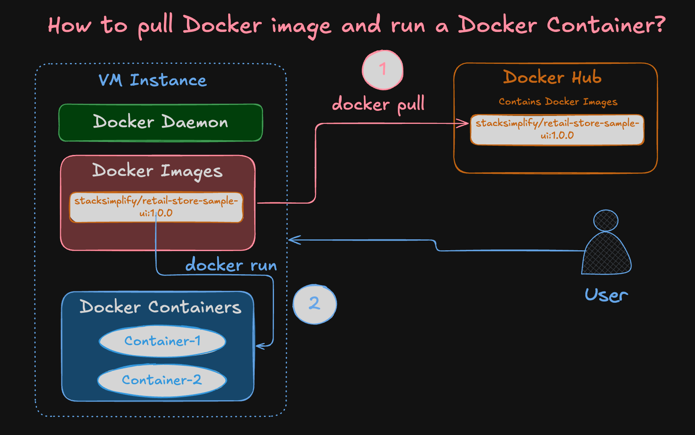
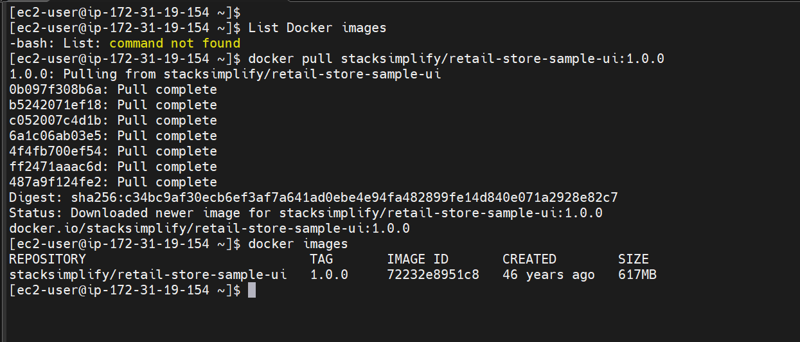
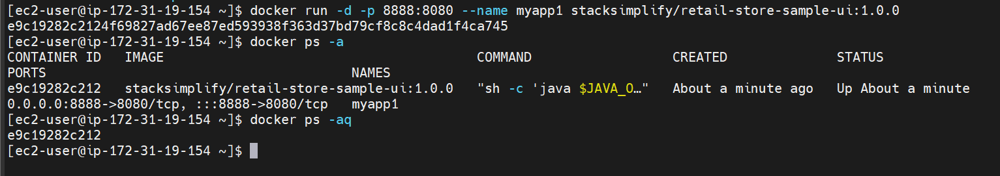
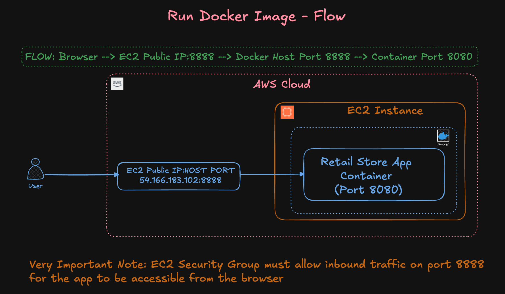
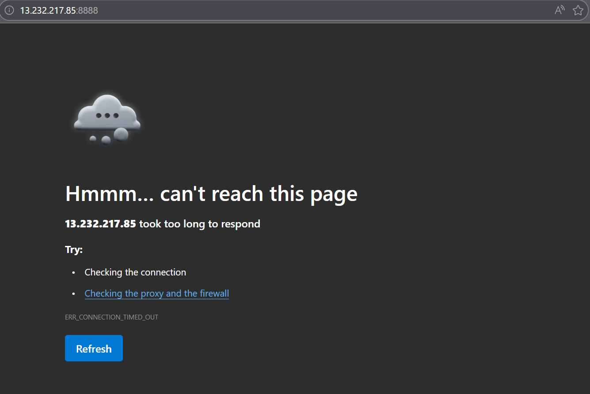
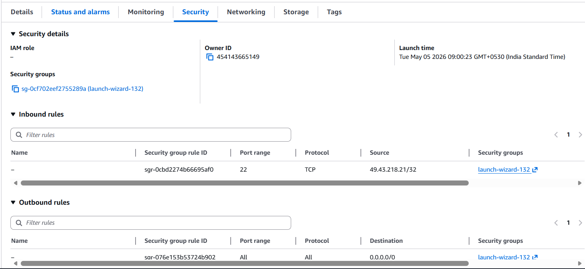
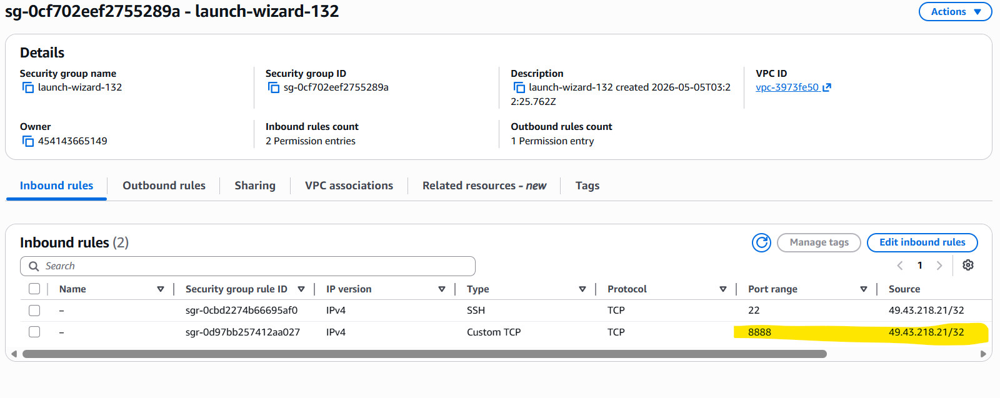
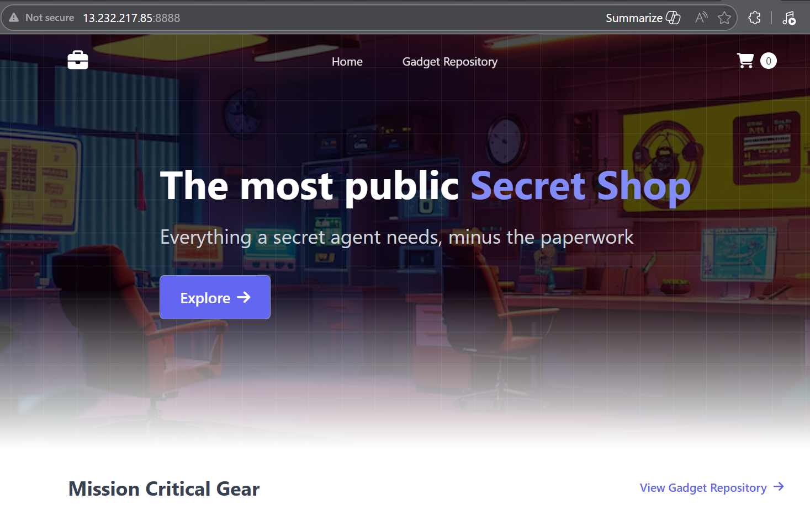

# Pull Docker image from DockerHub, run container and Access the application
Learn how to pull Docker images from Docker Hub and run them. Here we learn pulling images, running containers, starting and stopping containers, and removing images.


## Introduction
In this section, we will:
    1. Pull Docker images from Docker Hub.
    2. Run Docker containers using the pulled images.
    3. Start and stop Docker containers.
    4. Remove Docker images.
    5. Important Note: Docker Hub sign-in is not needed for downloading public images. In this case, the Docker image stacksimplify/retail-store-sample-ui is public and does not require authentication.



---

## Step 1: Pull Docker Image from Docker Hub

```bash
# List Docker images (should be empty if none are pulled yet)
docker images

# Pull Docker image from Docker Hub
docker pull stacksimplify/retail-store-sample-ui:1.0.0

# Alternatively, pull from GitHub Packages (no download limits)
docker pull ghcr.io/stacksimplify/retail-store-sample-ui:1.0.0

# List Docker images to confirm the image is pulled
docker images
```



---

## Step 2: Run the Downloaded Docker Image
- Copy the Docker image name from Docker Hub or GitHub Packages.
- HOST_PORT: The port number on your host machine where you want to receive traffic (port 8888).
- CONTAINER_PORT: The port number within the container that's listening for connections (port 8080).

```bash
# Run Docker Container
docker run --name <CONTAINER-NAME> -p <HOST_PORT>:<CONTAINER_PORT> -d <IMAGE_NAME>:<TAG>

docker run --name myapp1 -p 8888:8080 -d stacksimplify/retail-store-sample-ui:1.0.0
or
docker run -d -p 8888:8080 --name myapp1 stacksimplify/retail-store-sample-ui:1.0.0

# Or using GitHub Packages image:
docker run --name myapp1 -p 8888:80 -d ghcr.io/stacksimplify/retail-store-sample-ui:1.0.0
```



### Application access flow


### Access the application
- Open your browser and navigate to http://EC2-Instance-Public-IP:8888/

### Application not accessible


### Reason - Security groups not allowed port 8888


### Added inbound rule for port 8888 from my ip address


### Application is accessible


---

## Step3:  