# Build Docker image and Push to DockerHub

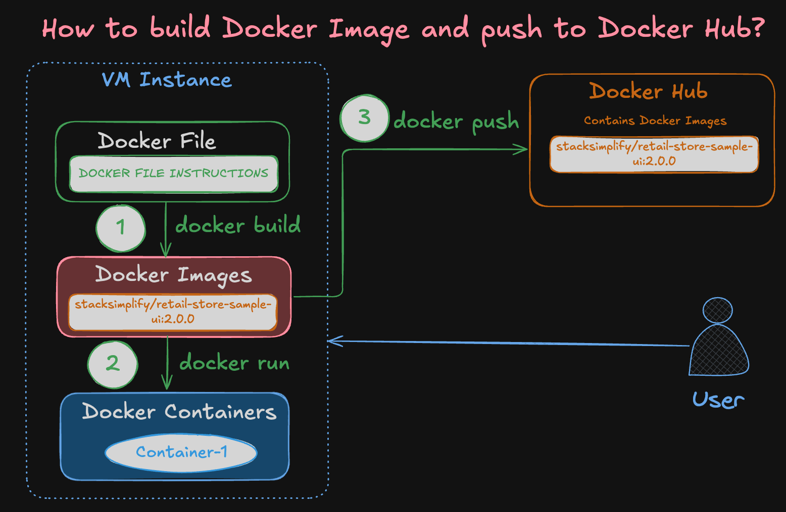

---

## Step-01: Create Docker Hub Account

Docker Hub account and repo created
repo link: https://hub.docker.com/repository/docker/rammahi123/devops_bootcamp

---

## Step-02: Verify Docker Version and Log In via Command Line

```bash
# Check Docker version
docker version

# Log in to Docker Hub
docker login

# To Logout from Docker Hub
docker logout
```
### Docker Hub logged in
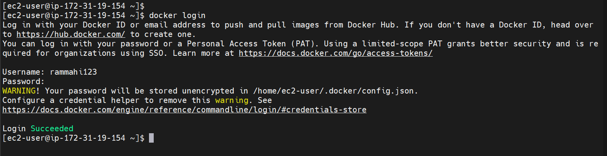

---

## Step-03: Download the code for which Docker Image to be built
```bash
# Create a Folder
mkdir demo-docker-build
cd demo-docker-build

# Download the Application Source
wget https://github.com/aws-containers/retail-store-sample-app/archive/refs/tags/v1.2.4.zip

# Unzip Application Source
unzip v1.2.4.zip

# Make change to file
cd /home/ec2-user/demo-docker-build/retail-store-sample-app-1.2.4/src/ui/src/main/resources/templates
File name: home.html
We are making a change for UI stating V2 at line 

# List to Verify if we are at that file
ls home.html
ls -lrt

# Changes we are doing 
## Before
          The most public <span class="text-primary-400">Secret Shop</span>

## After
          The most public <span class="text-primary-400">Secret Shop - V2 Version</span>          


# Command to Make That Change via Terminal (No Manual Editing)
sed -i 's/Secret Shop<\/span>/Secret Shop - V2 Version<\/span>/' home.html

# Verify It Worked:
grep 'Secret Shop' home.html
```

### Code downloaded, unzipped and made a change
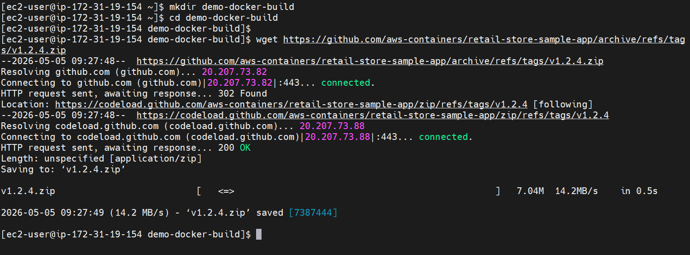
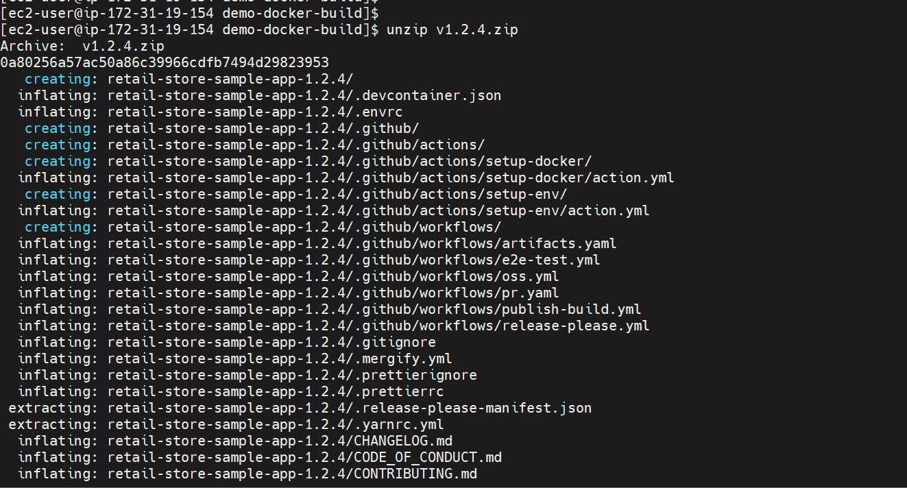
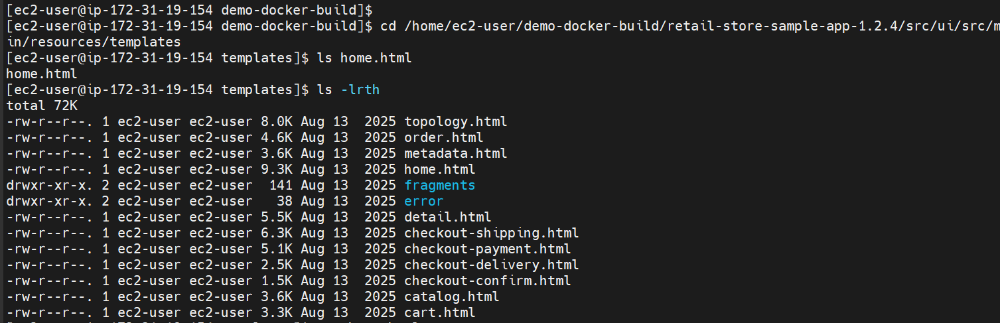
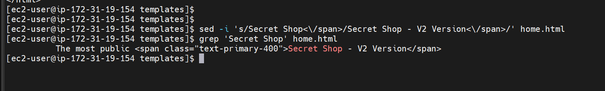

---

## Step-04: Build Docker Image and Run It

```bash
# Change to the directory containing your Dockerfile
cd /home/ec2-user/demo-docker-build/retail-store-sample-app-1.2.4/src/ui

# Verify Dockerfile before starting the build
ls -lrt Dockerfile
cat Dockerfile

# Build the Docker image
docker build -t <IMAGE_NAME>:<TAG> .

# Example:
docker build -t retail-store-sample-ui:2.0.0 .

# List Docker images
docker images

# Run the Docker container and verify
docker run --name <CONTAINER-NAME> -p <HOST_PORT>:<CONTAINER_PORT> -d <IMAGE_NAME>:<TAG>

# Example:
docker run --name myapp1-v2 -p 8889:8080 -d retail-store-sample-ui:2.0.0

# Access the application in your browser
http://<EC2-Instance-Public-IP>:8889

## RUN Container: 1.0.0 version on Host port 8888 (TO COMPARE WITH 2.0.0)
# Example using Docker Hub image:
docker run --name myapp1 -p 8888:8080 -d stacksimplify/retail-store-sample-ui:1.0.0

# Or using GitHub Packages image:
docker run --name myapp1 -p 8888:80 -d ghcr.io/stacksimplify/retail-store-sample-ui:1.0.0
```

### Move to UI directory and build the image
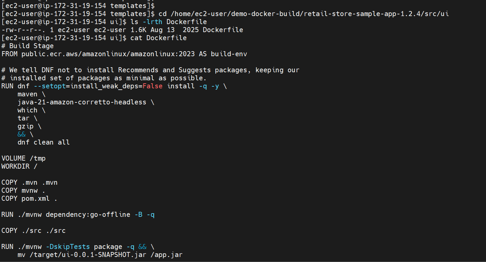
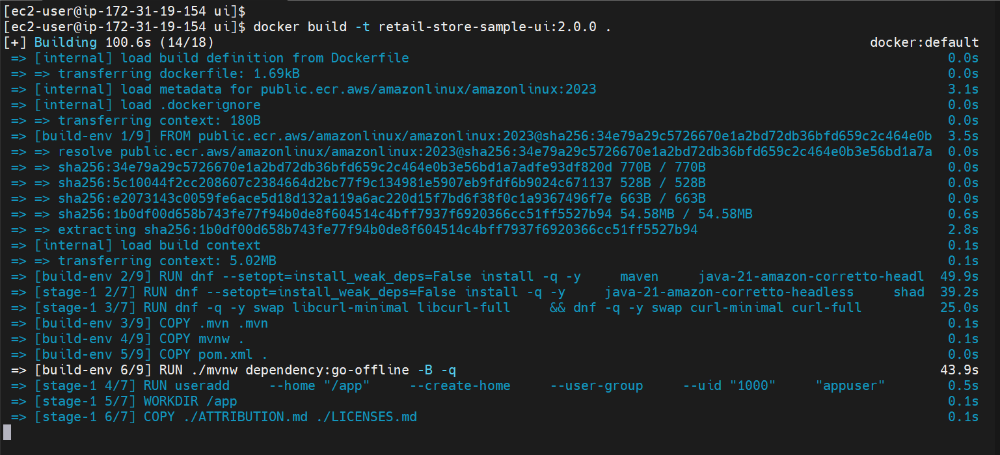
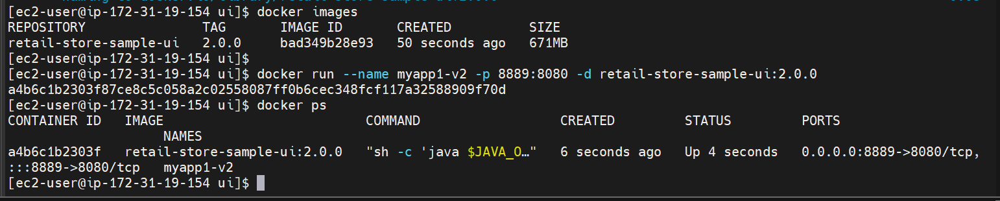

### Access the application on port 8889 (add inbound rule in SG)
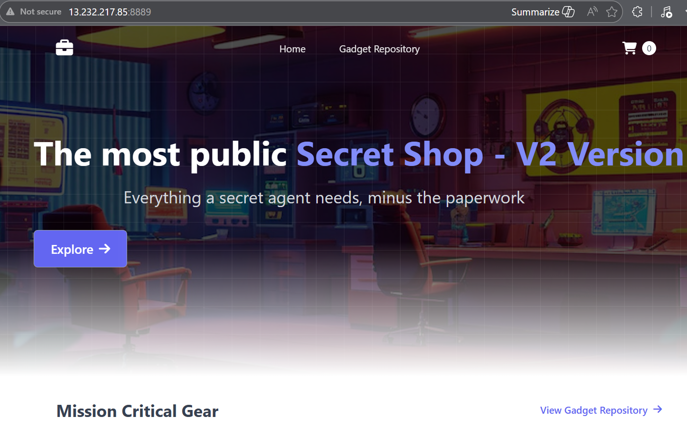

---

## Section-04: Tag and Push the Docker Image to Docker Hub

```bash
# List Docker images
docker images

# Tag the Docker image
docker tag retail-store-sample-ui:2.0.0 YOUR_DOCKER_USERNAME/mynginx-custom:2.0.0

# Example with 'stacksimplify':
docker tag retail-store-sample-ui:2.0.0 stacksimplify/retail-store-sample-ui:2.0.0

# Push the Docker image to Docker Hub
docker push YOUR_DOCKER_USERNAME/retail-store-sample-ui:2.0.0

# Example with 'stacksimplify':
docker push stacksimplify/retail-store-sample-ui:2.0.0
```

### Image is tagged and pushed to Docker Hub
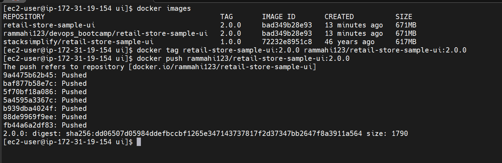

### Image is visible in Docker Hub
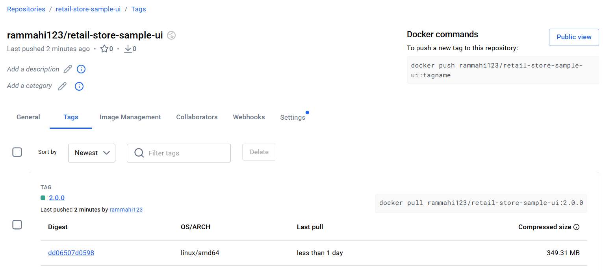


## Author
Ramesh Mahipathi

