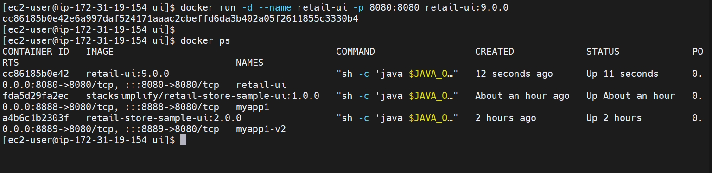
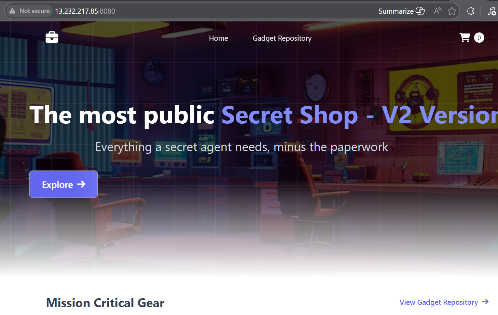
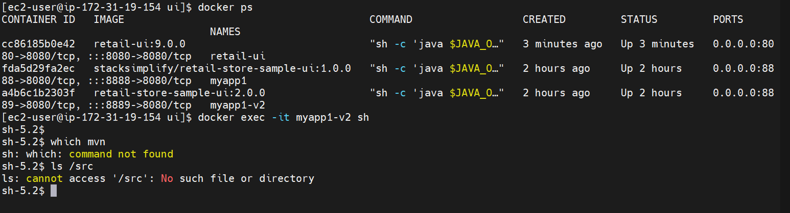
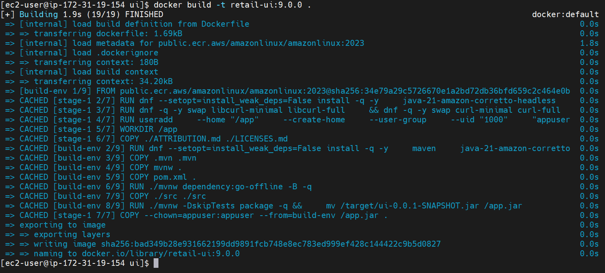
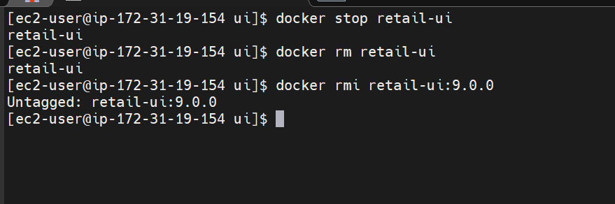

# Dockerfiles & Multi stage image Build

---

## Understanding Dockerfile

A Dockerfile is used to **create a custom image** for our application.

Instead of manually installing dependencies every time, we define everything in a file and Docker builds it step by step.

---

## Key Instructions (My understanding)

- **FROM** → Defines the base image (starting point)
- **RUN** → Executes commands while building image
- **COPY** → Copies files from local system into image
- **WORKDIR** → Sets working directory inside container
- **ENV** → Defines environment variables
- **EXPOSE** → Defines application port
- **USER** → Runs container as non-root (security)
- **ENTRYPOINT** → Defines startup command

Each instruction creates a **layer** in the image

---

## Important Insight

Docker does not rebuild everything every time.  
It builds in **layers**, which helps in caching and faster builds.

---

# Multi-Stage Build

Instead of building everything in one image, we split into stages:

---

## Build Stage

- Contains:
  - Source code
  - Maven
  - Build tools
- Purpose:
  - Compile the application  
  - Generate `.jar` file

---

## Package (Runtime) Stage

- Contains only:
  - JDK (runtime)
  - Application JAR

- Does NOT include:
  - Source code
  - Maven
  - Build tools

---

## Why this is important

- Smaller image size
- More secure (no extra tools)
- Faster deployment
- Production-ready

---

## Flow I Understood

```text
Source Code → Build Stage → JAR File → Runtime Stage → Final Image
```

----

## Build Docker Image

```bash
docker build -t retail-ui:9.0.0 .
```


### What happens internally:
- Docker reads Dockerfile
- Executes instructions step-by-step
- Creates layers
- Generates final image

## Run Container
```bash
docker run -d --name retail-ui -p 8080:8080 retail-ui:9.0.0
```
## Verification
```bash
docker ps
```


### Access the application
http://<EC2-IP>:8080



## Validation I Performed
```bash
# List Docker containers
docker ps

# Connect to Docker Container
docker exec -it retail-ui sh

# Inside the container
which mvn          # → should return "sh: which: command not found"
ls /src            # → should say "No such file or directory"
```



### Observations
- No Maven installed
- No source code present
- Only runtime files exist


## Docker Layer Caching
- When I rebuild:
```bash
docker build -t retail-ui:9.0.0 .
```


-  Docker reused previous layers
- Build completed very fast


## Cleanup Commands
```bash
docker stop retail-ui
docker rm retail-ui
docker rmi retail-ui:9.0.0
```


## Cache cleanup
```bash
docker builder prune
docker builder prune --all
docker system prune -a --volumes
```
### Below is the output
```txt
[ec2-user@ip-172-31-19-154 ui]$ docker rmi retail-ui:9.0.0
Untagged: retail-ui:9.0.0
[ec2-user@ip-172-31-19-154 ui]$
[ec2-user@ip-172-31-19-154 ui]$
[ec2-user@ip-172-31-19-154 ui]$ docker builder prune
WARNING! This will remove all dangling build cache. Are you sure you want to continue? [y/N] y
ID                                              RECLAIMABLE     SIZE            LAST ACCESSED
4uedmwq2itsjh8cbuesrkyovy*                      true            82.62MB         2 hours ago
xbrzmu4f0zfj53mxkkdlx3075*                      true    1.591kB         3 minutes ago
u7yal92nadnd8ajhzijtb9kjc*                      true    4.987MB         3 minutes ago
eq72wivii5hyvcyxtxdgghytp*                      true    81B             3 minutes ago
xdwuew1qhdmp3o5g72yhogges                       true    2.658MB         2 hours ago
q3hyihbikrl62s1w8ilt43xys                       true    215.7MB         2 hours ago
vtxdxcusqgk7ryldeob8c3aqz                       true    9.072kB         2 hours ago
rqe6r8lcxep7j6towpa5s4w29                       true    10.66kB         2 hours ago
u71mosb89c7dml2vbel9qkh2m                       true    951B            2 hours ago
d4z4k4hhxzyqfr4ve723o6fus                       true    567.5MB         2 hours ago
Total:  873.5MB
[ec2-user@ip-172-31-19-154 ui]$ docker builder prune --all
WARNING! This will remove all build cache. Are you sure you want to continue? [y/N] y
ID                                              RECLAIMABLE     SIZE            LAST ACCESSED
ak6qo2y7u6ut0gwfwxp3vi59k                       true            61.61MB         3 minutes ago
fozvx2lj8js61ezlcxo81cvow                       true    2.308MB         2 hours ago
w9mnntwre7l3z4361szpx7h5g                       true    0B              2 hours ago
s3qu5z5zwjjiqdpmnnu4423wi                       true    3.464kB         2 hours ago
anl8jfx3ujlcpffgqj65vsqak                       true    151.3MB         2 hours ago
mb56xz03i0azh75irgtxercld                       true    305.5MB         2 hours ago
ze651pxoojd81rgjfbscng7vv                       true    0B              2 hours ago
Total:  520.6MB
[ec2-user@ip-172-31-19-154 ui]$ docker system prune -a --volumes
WARNING! This will remove:
  - all stopped containers
  - all networks not used by at least one container
  - all anonymous volumes not used by at least one container
  - all images without at least one container associated to them
  - all build cache

Are you sure you want to continue? [y/N] y
Deleted Images:
untagged: retail-store-sample-ui:2.0.0
untagged: rammahi123/devops_bootcamp/retail-store-sample-ui:2.0.0

Total reclaimed space: 0B
```

### It removed
- unused images
- containers
- volumes
- build cache


## Author
Ramesh Mahipathi