# Docker Compose

## Step-01 What is Docker Compose?

Docker Compose is a tool for:
- Defining multi-container apps in a single YAML file
- Managing networks, volumes, dependencies
- Running all services with docker compose up
- Testing, tearing down, and rebuilding environments easily

### Retail Store Application - Architecture Overview

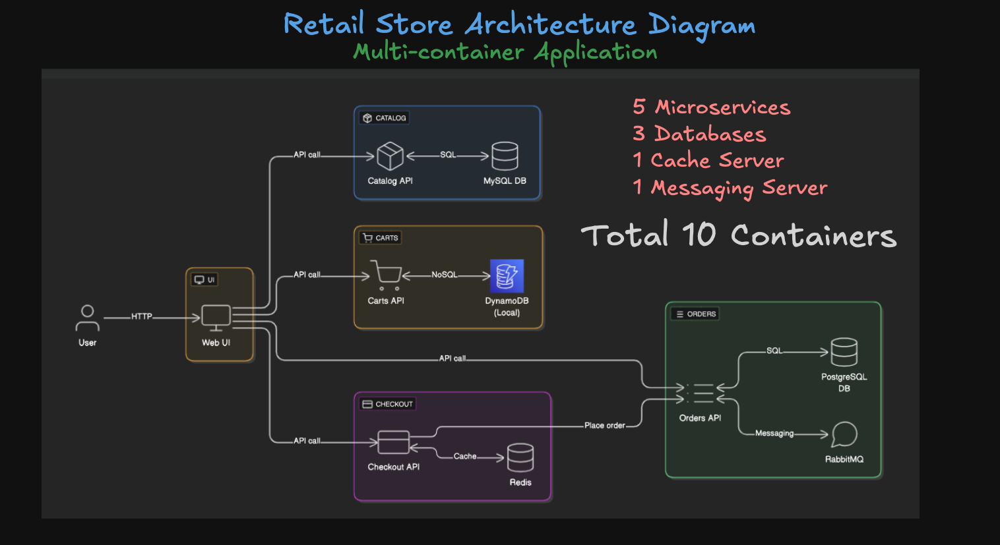

### Problems Without Docker Compose

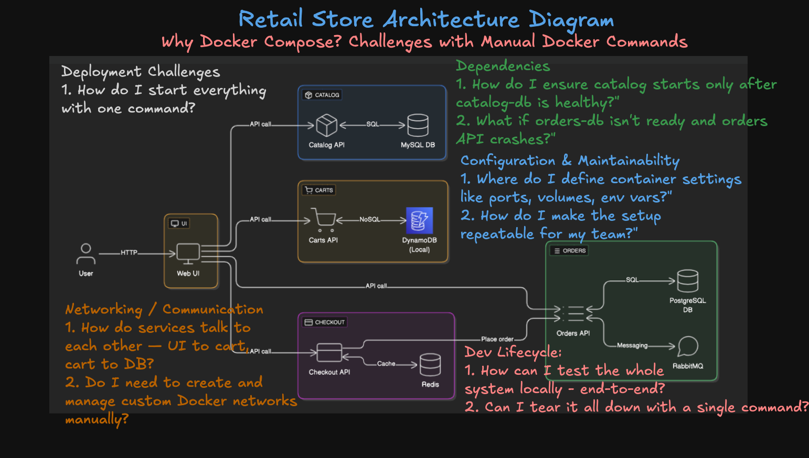

### How Docker Compose Solves It?

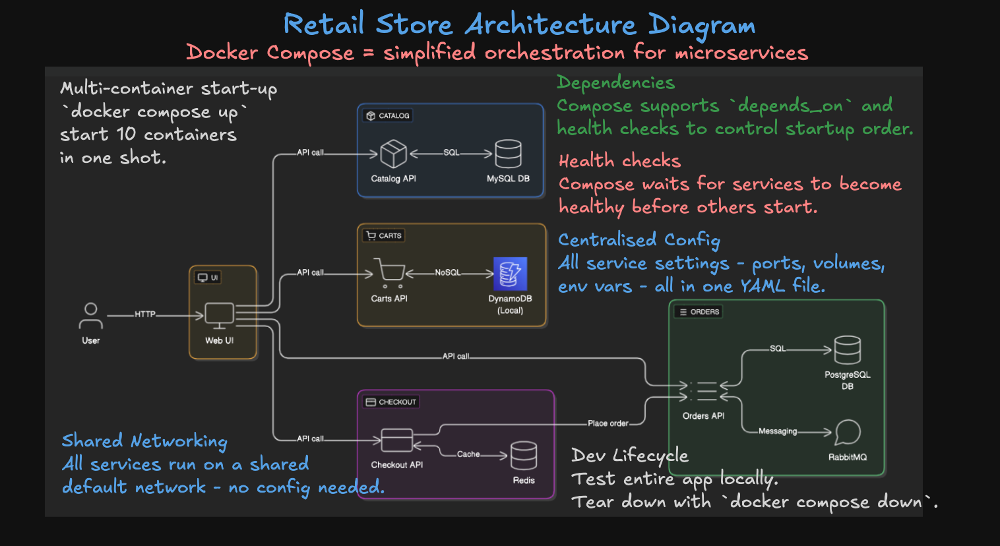


## Step-02 Install Docker Compose

```bash
# Create the CLI plugin directory
sudo mkdir -p /usr/local/lib/docker/cli-plugins

# Download the latest Docker Compose v2 binary (always pulls the newest release)
wget https://github.com/docker/compose/releases/latest/download/docker-compose-linux-x86_64 -O docker-compose

# Make it executable
chmod +x docker-compose

# Move it to the CLI plugins directory
sudo mv docker-compose /usr/local/lib/docker/cli-plugins/docker-compose

# Verify install
docker compose version
```
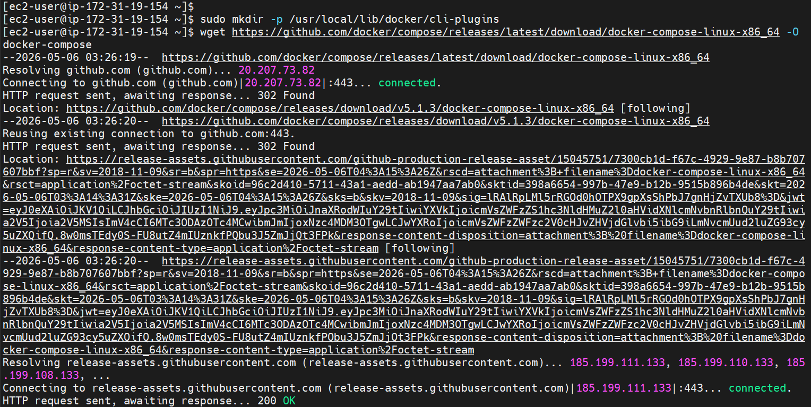
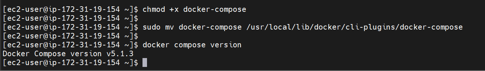


## Step-03 Compose Up / Down / Logs

```bash
# Create Directory
mkdir demo-compose
cd demo-compose

# Download the Docker Compose file
wget https://github.com/aws-containers/retail-store-sample-app/releases/download/v1.3.0/docker-compose.yaml

# Set environment variable
export DB_PASSWORD='mydbkalyan101'

# Start all services
## Important Note:  if your file name is docker-compose.yaml dont need to specify -f with file
docker compose -f docker-compose.yaml up
docker compose up 

# OR start in detached mode (background)
docker compose -f docker-compose.yaml up -d
docker compose up -d

# Stop all services (gracefully) (NOT NEEDED NOW - JUST FOR REFERENCE)
docker compose down
```

### Download docker compose file
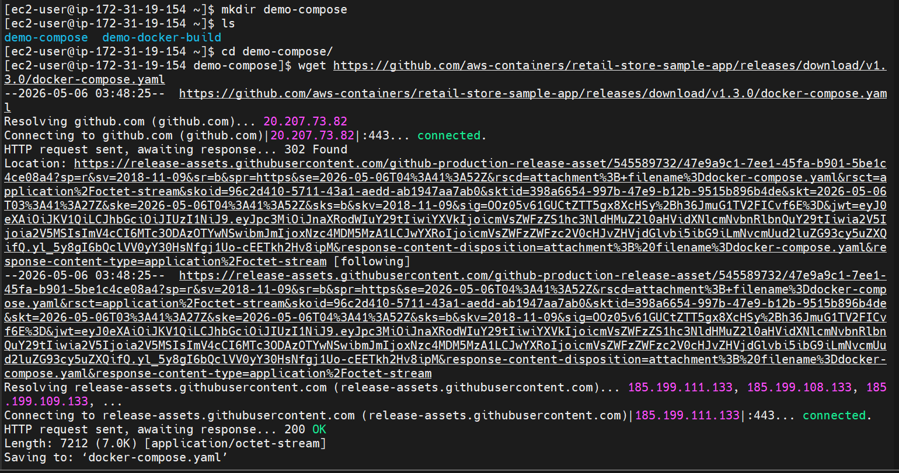

### Set DB password and start all services
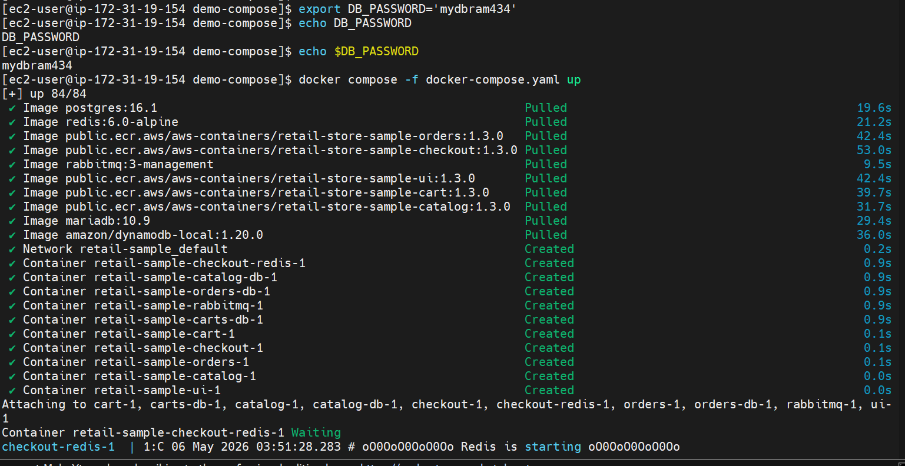
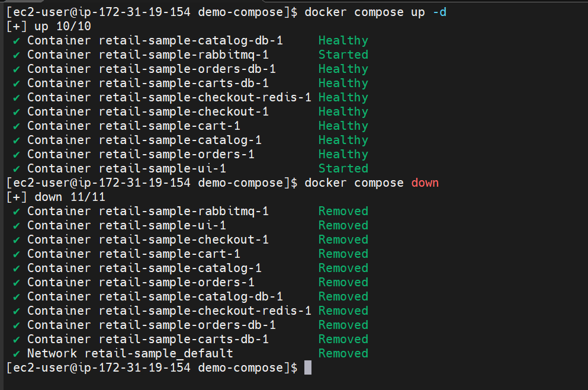


## Docker Compose Commands

### List Running Services
```bash
# List Services 
docker compose ps

# Also verify Docker images it downloaed
docker images
```
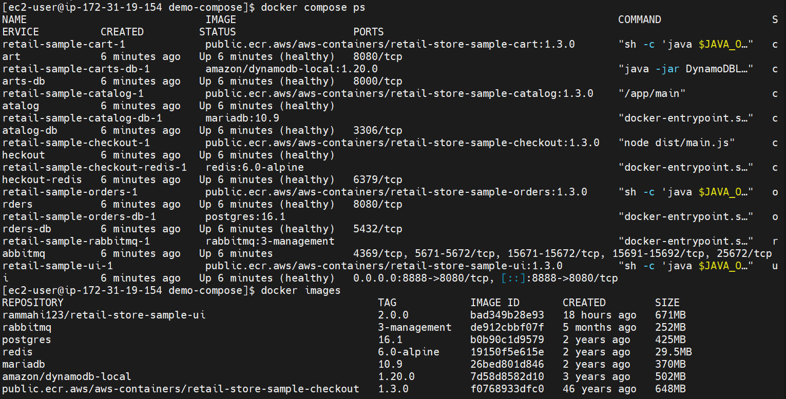

### Stop / Start a Single Service
```bash
# Stop a Service
docker compose stop orders

# Verify if service is stopped
docker compose ps
docker compose ps -a

# Start a Service
docker compose start orders
```
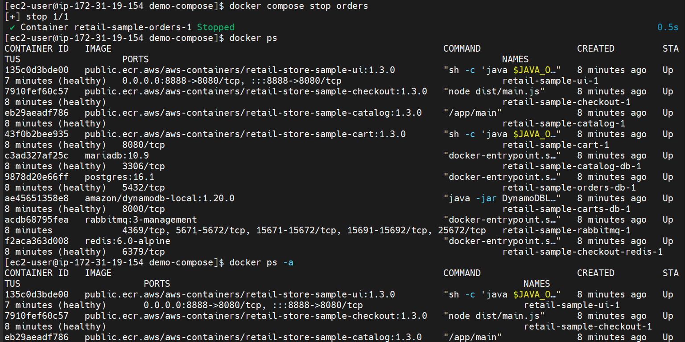

### Restart a Service
```bash
# Restart a Service
docker compose restart cart

# Verify if service restarted
docker compose ps
```
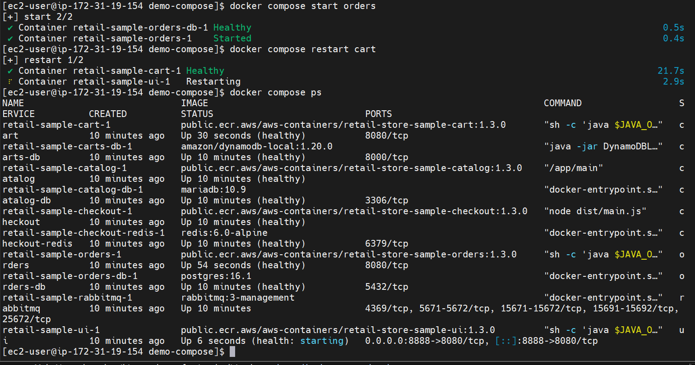

### View Logs
```bash
# Logs for all services
docker compose logs

# Logs for a specific service
docker compose logs checkout

# Follow logs
docker compose logs -f checkout
```

### Run Commands Inside a Container
```bash
# Connect to a Container
docker compose exec ui sh

# Commands to run in container
ls
id
uname -m
uname -n
env
cat /etc/hostname
cat /etc/os-release 
cat /etc/os-release | sed -n '1,6p' 
curl http://localhost:8080
curl http://localhost:8080/topology
curl http://localhost:8080/actuator/health
exit
```

### Docker Compose Stats
Display a live stream of container(s) resource usage statistics

```bash
# Stats 
docker compose stats

# Specific Containers
docker compose stats ui
```
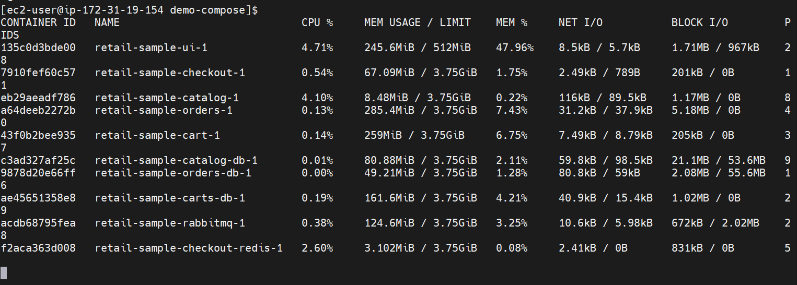

### Display the running process in a container
```bash
# Display the running process of all service containers
docker compose top

# Specific containers
docker compose top ui
docker compose top checkout
```
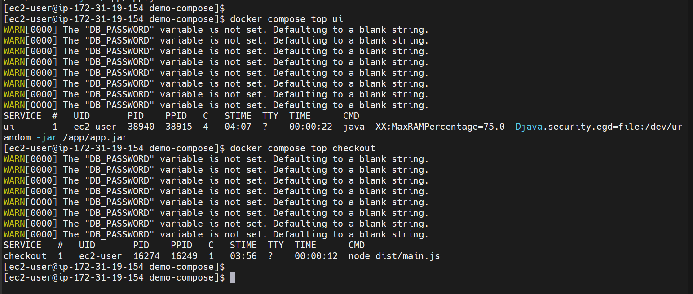


## Author
Ramesh Mahipathi


