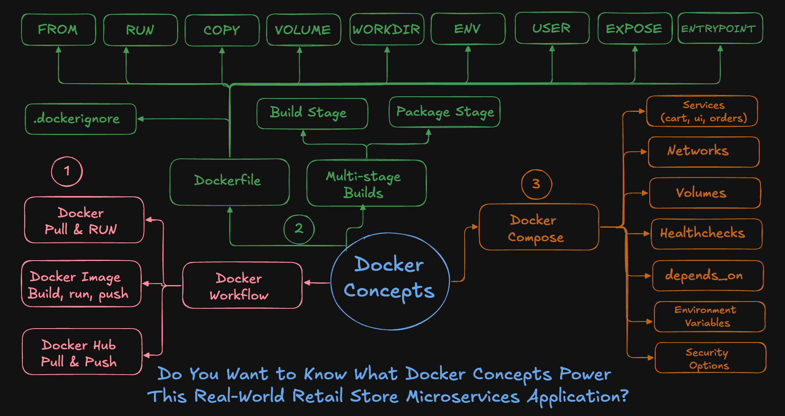
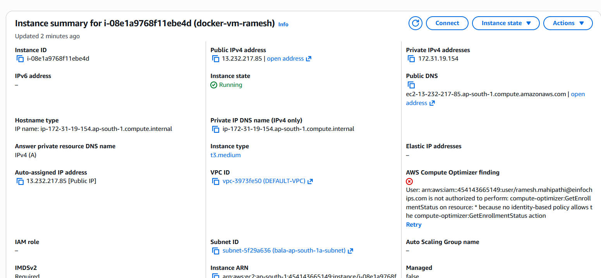
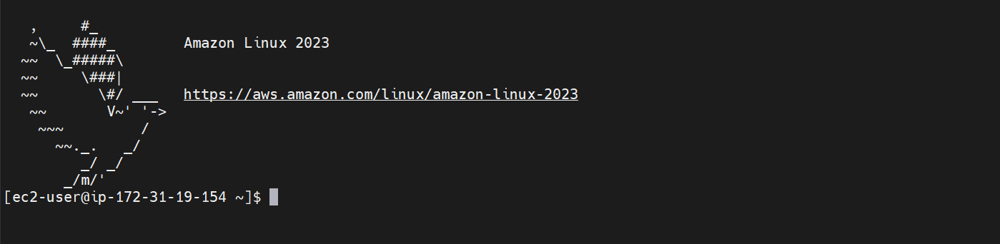
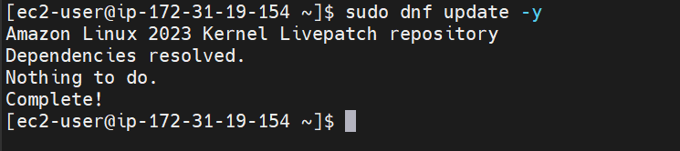
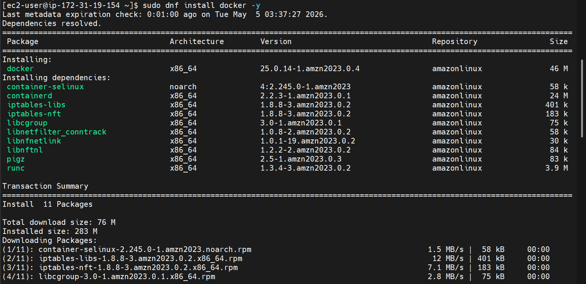
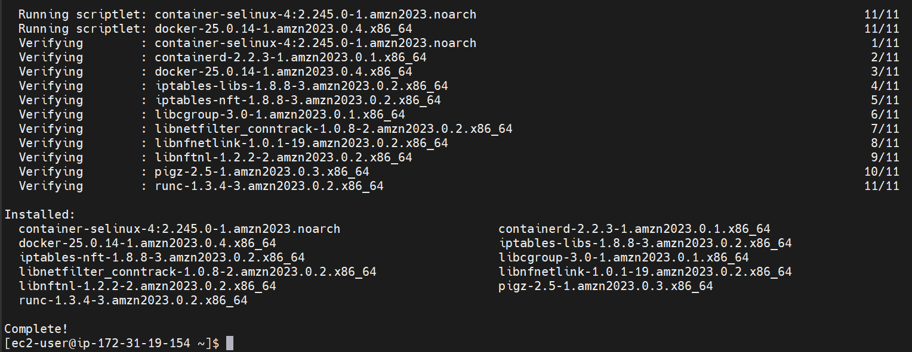
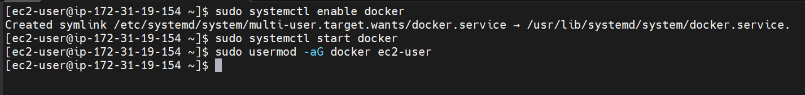
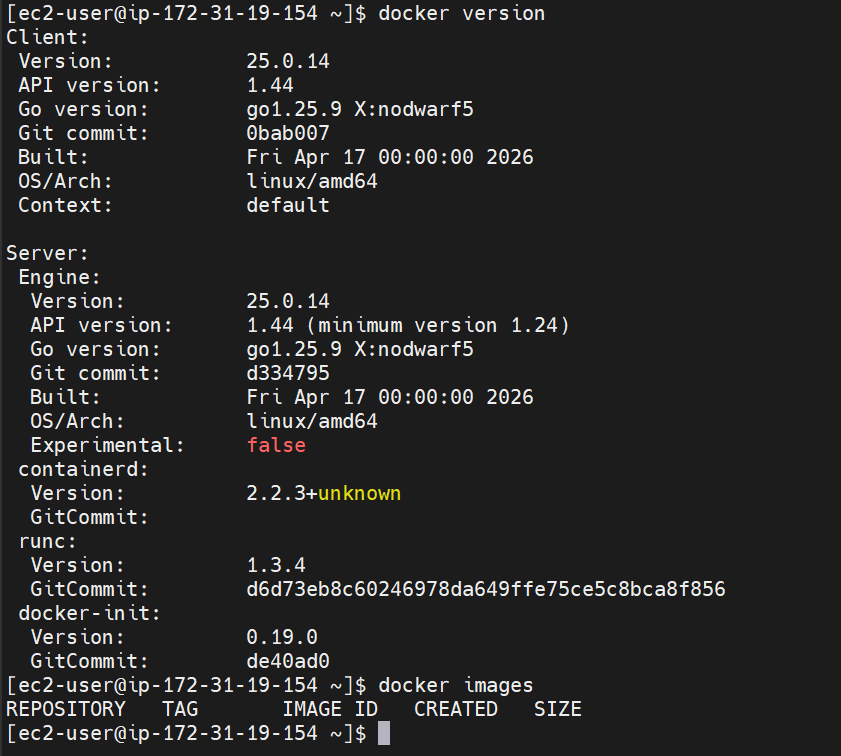
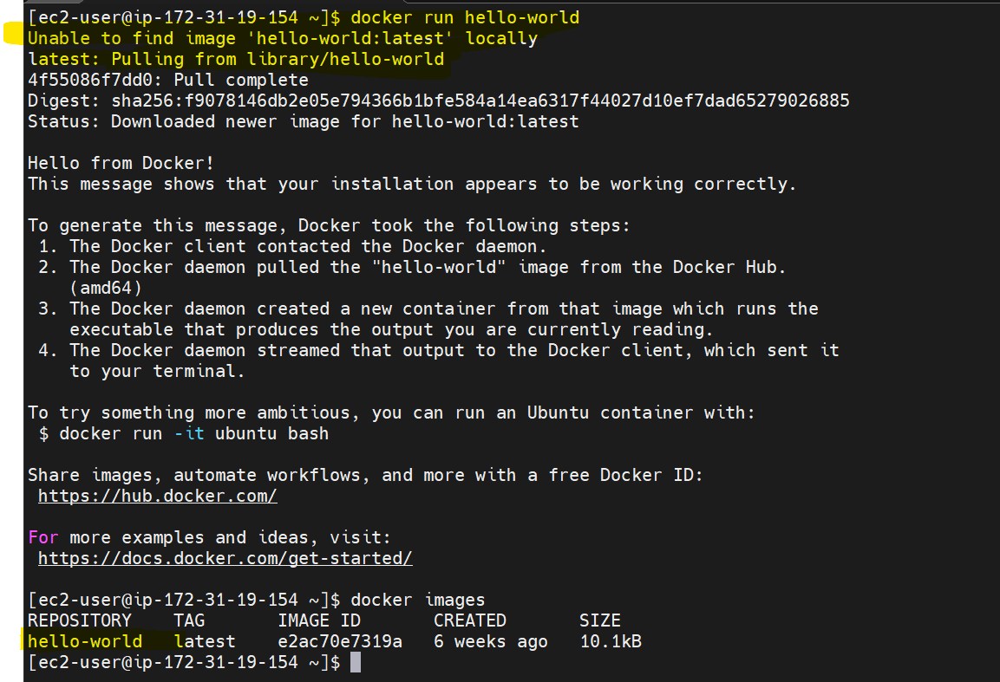

# Docker Setup and Fundamentals

## Docker Concepts Overview



### Understanding the Flow

The Docker workflow consists of three main stages:

1. **Docker Pull & Run**
   - Pull images from Docker Hub
   - Run containers

2. **Docker Image Build Workflow**
   - Create custom images using Dockerfile
   - Build → Run → Push to Docker Hub

3. **Docker Compose**
   - Manage multi-container applications
   - Define services, networks, volumes

---

### Dockerfile Key Instructions

- FROM → Base image
- RUN → Execute commands
- COPY → Copy files
- WORKDIR → Set working directory
- ENV → Environment variables
- EXPOSE → Define ports
- CMD / ENTRYPOINT → Container startup command

---

### Advanced Concepts

- Multi-stage builds → optimized images
- .dockerignore → exclude unnecessary files
- Build stages → build + package separation


---

### Steps Performed

1. Logged into AWS Console
2. Selected **Mumbai region**
3. Navigated to EC2 service
4. Created an EC2 instance:
   - Instance Type: t3.medium
   - Storage: 30 GB
   - OS: Amazon Linux

### EC2 instance created


---

### Why Docker?

Docker allows us to:
- Run applications in isolated containers
- Ensure consistency across environments
- Simplify deployment process

---

### Steps Performed

```bash
sudo dnf update -y
sudo dnf install docker -y
sudo systemctl enable docker
sudo systemctl start docker
sudo usermod -aG docker ec2-user
```

### Docker Installed







### Verify Docker installation
```bash
docker version
docker images (shows no images initially)
```




### Run a test container
```bash
docker run hello-world (no images in local, so it pulls from the docker library)
docker images (new hello-worls image is created)
```



---

### List and remove containers

```bash
docker ps (lists running containers)
docker ps -a (lists all container running and exited)
docker ps -aq (lists all container ids)
docker rm $(docker ps -aq) --> removes all containers
```


### List and remove images
```bash
docker images --> lists all images
docker images -q --> lists all image ids
docker rmi $(docker images -q)
```


---


## Author
Ramesh Mahipathi
