# Multi-Arch Docker build on Amazon Linux -> Push to Docker Hub

Create and push a single tag that contains AMD64 + ARM64 images for your Retail Store UI microservice, using Buildx + QEMU on an x86_64 (amd64) EC2 with Amazon Linux VM—and publish to Docker Hub.

## Step-01: What we'll do
1. Host sanity check /
2. Install Docker Engine and enable Buildx /
3. Install binfmt/QEMU for cross-arch builds /
4. Create a containerized Buildx builder (multi-arch) /
5. Log in to Docker Hub /
6. Build & push a multi-platform manifest (linux/amd64,linux/arm64) /
7. Verify manifest and run containers /
8. Access the app in your browser on ports 8888 /

### Problem: How to build Multi-Platform Docker Images?
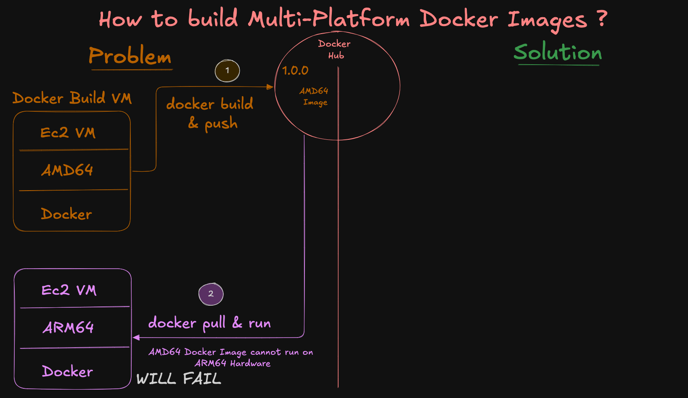

### Solution: How to build Multi-Platform Docker Images?
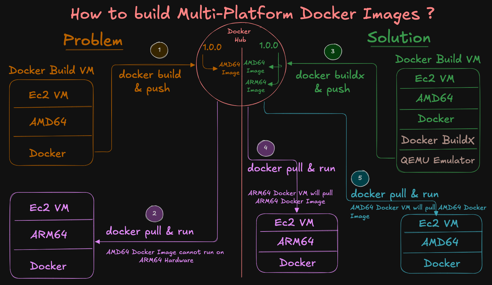


## Step-02: Host sanity check
```bash
cat /etc/os-release | sed -n '1,6p'     # Amazon Linux 
uname -m                                 # expect: x86_64
```
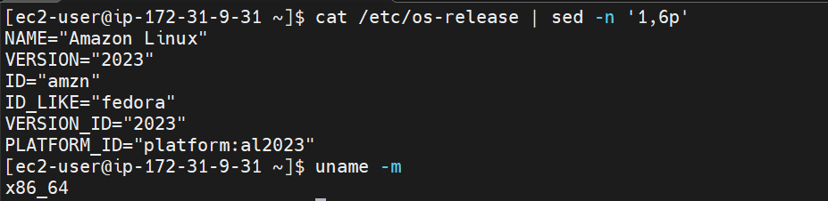

## Step-03: Install Docker Engine (on Amazon Linux)
```bash
# Install Docker Engine
sudo dnf update -y
sudo dnf install docker -y
sudo systemctl enable docker
sudo systemctl start docker
sudo usermod -aG docker ec2-user
docker --version

# Exit and Relogin
exit and relogin

# Run Test container
docker run hello-world
```
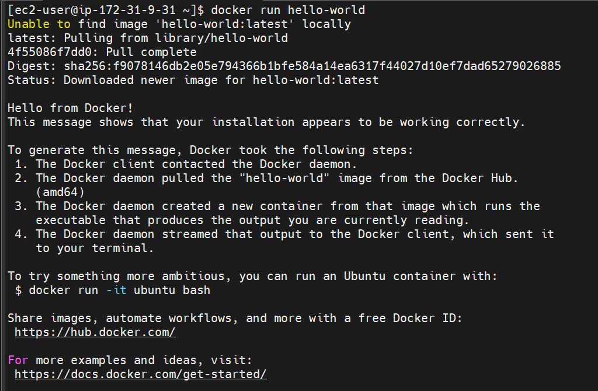

## Step-04: Ensure Buildx/BuildKit is available
```bash
export DOCKER_BUILDKIT=1
docker buildx version
```
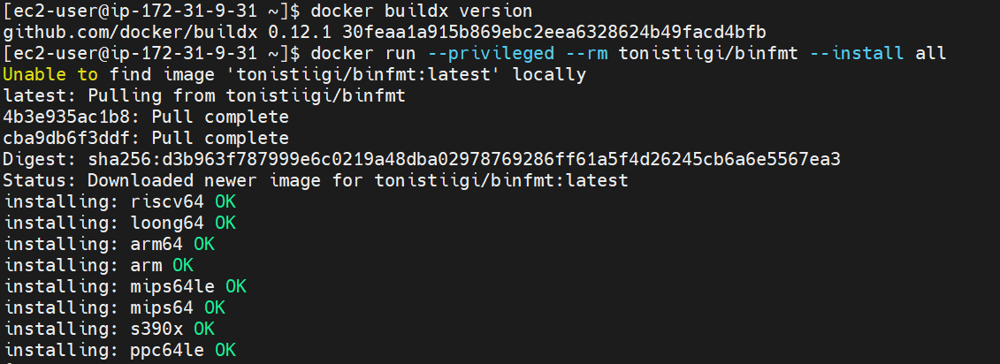

## Step-05: Install binfmt/QEMU emulators (cross-arch)
```bash
# Reinstall QEMU binfmt handlers
docker run --privileged --rm tonistiigi/binfmt --install all

# OR explicitly for arm64 + amd64
docker run --privileged --rm tonistiigi/binfmt --install arm64,amd64
```
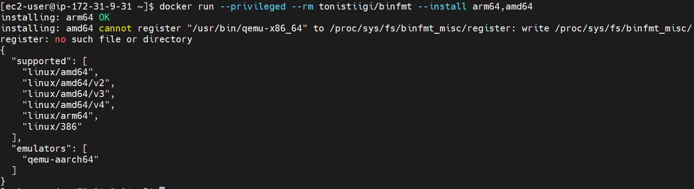

## Step-06 Create a containerized Buildx builder (multi-arch capable)
```bash
# Create a new multiarch builder that uses BuildKit in a container
docker buildx create --name multiarch --driver docker-container --use

# Bootstrap to detect all supported platforms
docker buildx inspect --bootstrap

# List Buildx Builders
docker buildx ls
```
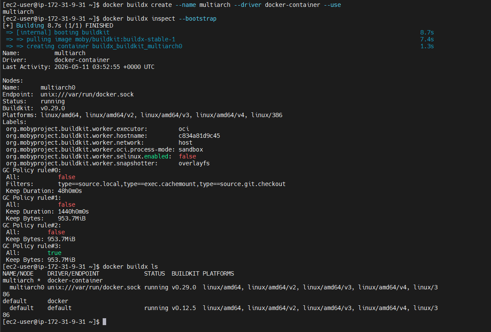

## Step-07: Docker Hub login & variables
```bash
# ---- CONFIG (edit these) ----
export DOCKERHUB_USER="your-dockerhub-username"     # CHANGE
export DH_REPO="retail-ui-multiarch"             # repo name under your namespace
export TAG="1.0.0"                                  # image tag


# UPDATED TO MY ENVIRONMENT
export DOCKERHUB_USER="stacksimplify"     # CHANGE
export DH_REPO="retail-ui-multiarch"             # repo name under your namespace
export TAG="1.0.0"                                  # image tag

# ---- DERIVED ----
export IMAGE="${DOCKERHUB_USER}/${DH_REPO}:${TAG}"
echo $IMAGE

# Login to Docker Hub (will prompt for password or PAT)
docker login -u "${DOCKERHUB_USER}"
```
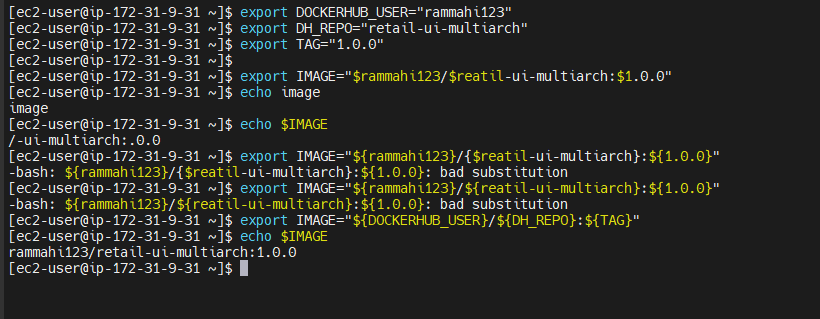

## Step-08 Download Retail-store repo and Dockerfile
```bash
# Create a Folder
mkdir demo-multiarch
cd demo-multiarch

# Download the Application Source
wget https://github.com/aws-containers/retail-store-sample-app/archive/refs/tags/v1.3.0.zip

# Unzip Application Source
unzip v1.3.0.zip

# Change Directory to UI Source folder
cd retail-store-sample-app-1.3.0/src/ui
cat Dockerfile
```
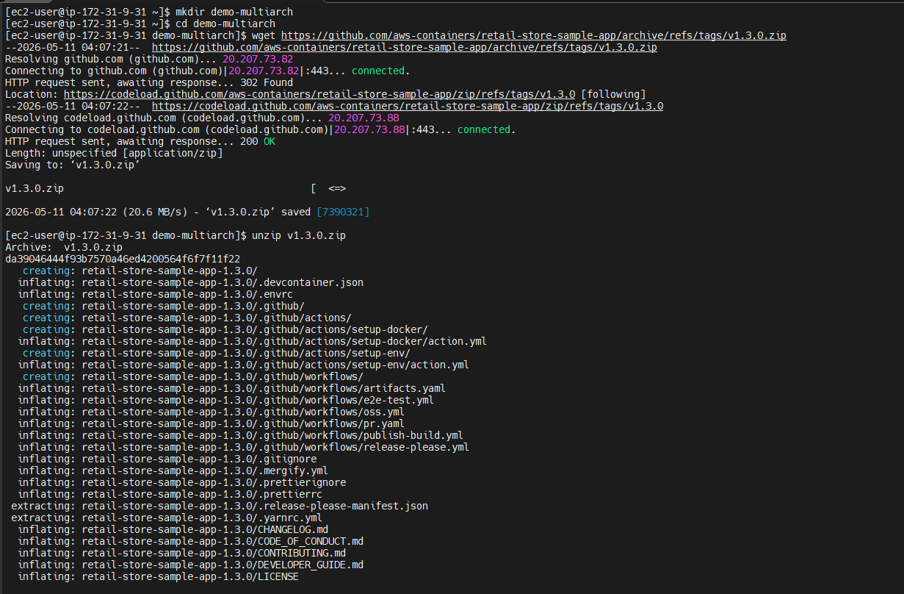

## Step-09: Build & push multi-platform image (AMD64 + ARM64)
```bash
DOCKER_BUILDKIT=1 docker buildx build \
  --platform linux/amd64,linux/arm64 \
  -t "${IMAGE}" \
  --push .
```
Output
```text
$ DOCKER_BUILDKIT=1 docker buildx build \
  --platform linux/amd64,linux/arm64 \
  -t "${IMAGE}" \
  --push .
[+] Building 1527.7s (35/35) FINISHED                                                                                                                              docker-container:multiarch
 => [internal] load build definition from Dockerfile                                                                                                                                     0.0s
 => => transferring dockerfile: 1.69kB                                                                                                                                                   0.0s
 => [linux/arm64 internal] load metadata for public.ecr.aws/amazonlinux/amazonlinux:2023                                                                                                 2.9s
 => [linux/amd64 internal] load metadata for public.ecr.aws/amazonlinux/amazonlinux:2023                                                                                                 2.7s
 => [internal] load .dockerignore                                                                                                                                                        0.0s
 => => transferring context: 180B                                                                                                                                                        0.0s
 => [linux/arm64 build-env 1/9] FROM public.ecr.aws/amazonlinux/amazonlinux:2023@sha256:0226a3ae2bed13934a5226f102c5cad90958509c3937917afe755cba8d31f4f9                                 4.7s
 => => resolve public.ecr.aws/amazonlinux/amazonlinux:2023@sha256:0226a3ae2bed13934a5226f102c5cad90958509c3937917afe755cba8d31f4f9                                                       0.0s
 => => sha256:7f8aafd5517da79fd549ae09b8d4ecfcad27d63df0ebd6d727e32239312947e8 53.46MB / 53.46MB                                                                                         0.8s
 => => extracting sha256:7f8aafd5517da79fd549ae09b8d4ecfcad27d63df0ebd6d727e32239312947e8                                                                                                3.9s
 => [internal] load build context                                                                                                                                                        0.2s
 => => transferring context: 5.03MB                                                                                                                                                      0.2s
 => [linux/amd64 build-env 1/9] FROM public.ecr.aws/amazonlinux/amazonlinux:2023@sha256:0226a3ae2bed13934a5226f102c5cad90958509c3937917afe755cba8d31f4f9                                 4.6s
 => => resolve public.ecr.aws/amazonlinux/amazonlinux:2023@sha256:0226a3ae2bed13934a5226f102c5cad90958509c3937917afe755cba8d31f4f9                                                       0.0s
 => => sha256:5322dcd62a82eeb7280add1268787825ae9f43969fccbed4a4b59acb31e38100 54.58MB / 54.58MB                                                                                         0.7s
 => => extracting sha256:5322dcd62a82eeb7280add1268787825ae9f43969fccbed4a4b59acb31e38100                                                                                                3.8s
 => [linux/amd64 stage-1 2/7] RUN dnf --setopt=install_weak_deps=False install -q -y     java-21-amazon-corretto-headless     shadow-utils     &&     dnf clean all                     78.0s
 => [linux/amd64 build-env 2/9] RUN dnf --setopt=install_weak_deps=False install -q -y     maven     java-21-amazon-corretto-headless     which     tar     gzip     &&     dnf clean   94.5s
 => [linux/arm64 build-env 2/9] RUN dnf --setopt=install_weak_deps=False install -q -y     maven     java-21-amazon-corretto-headless     which     tar     gzip     &&     dnf clean  648.8s
 => [linux/arm64 stage-1 2/7] RUN dnf --setopt=install_weak_deps=False install -q -y     java-21-amazon-corretto-headless     shadow-utils     &&     dnf clean all                    580.6s
 => [linux/amd64 stage-1 3/7] RUN dnf -q -y swap libcurl-minimal libcurl-full     && dnf -q -y swap curl-minimal curl-full                                                              55.4s
 => [linux/amd64 build-env 3/9] COPY .mvn .mvn                                                                                                                                           0.1s
 => [linux/amd64 build-env 4/9] COPY mvnw .                                                                                                                                              0.0s
 => [linux/amd64 build-env 5/9] COPY pom.xml .                                                                                                                                           0.0s
 => [linux/amd64 build-env 6/9] RUN ./mvnw dependency:go-offline -B -q                                                                                                                 203.9s
 => [linux/amd64 stage-1 4/7] RUN useradd     --home "/app"     --create-home     --user-group     --uid "1000"     "appuser"                                                            0.3s
 => [linux/amd64 stage-1 5/7] WORKDIR /app                                                                                                                                               0.1s
 => [linux/amd64 stage-1 6/7] COPY ./ATTRIBUTION.md ./LICENSES.md                                                                                                                        0.1s
 => [linux/amd64 build-env 7/9] COPY ./src ./src                                                                                                                                         0.4s
 => [linux/amd64 build-env 8/9] RUN ./mvnw -DskipTests package -q &&     mv /target/ui-0.0.1-SNAPSHOT.jar /app.jar                                                                      68.9s
 => [linux/amd64 stage-1 7/7] COPY --chown=appuser:appuser --from=build-env /app.jar .                                                                                                   0.1s
 => [linux/arm64 stage-1 3/7] RUN dnf -q -y swap libcurl-minimal libcurl-full     && dnf -q -y swap curl-minimal curl-full                                                             380.3s
 => [linux/arm64 build-env 3/9] COPY .mvn .mvn                                                                                                                                           0.1s
 => [linux/arm64 build-env 4/9] COPY mvnw .                                                                                                                                              0.0s
 => [linux/arm64 build-env 5/9] COPY pom.xml .                                                                                                                                           0.0s
 => [linux/arm64 build-env 6/9] RUN ./mvnw dependency:go-offline -B -q                                                                                                                 479.6s
 => [linux/arm64 stage-1 4/7] RUN useradd     --home "/app"     --create-home     --user-group     --uid "1000"     "appuser"                                                            0.6s
 => [linux/arm64 stage-1 5/7] WORKDIR /app                                                                                                                                               0.1s
 => [linux/arm64 stage-1 6/7] COPY ./ATTRIBUTION.md ./LICENSES.md                                                                                                                        0.0s
 => [linux/arm64 build-env 7/9] COPY ./src ./src                                                                                                                                         0.1s
 => [linux/arm64 build-env 8/9] RUN ./mvnw -DskipTests package -q &&     mv /target/ui-0.0.1-SNAPSHOT.jar /app.jar                                                                     332.6s
 => [linux/arm64 stage-1 7/7] COPY --chown=appuser:appuser --from=build-env /app.jar .                                                                                                   0.1s
 => exporting to image                                                                                                                                                                  57.9s
 => => exporting layers                                                                                                                                                                 30.2s
 => => exporting manifest sha256:9d4d75fea8be49e3f78d68a950bc1c460f0f5580cb26e8789b79fb09f3820aca                                                                                        0.0s
 => => exporting config sha256:cb3f2b0e54af411135362c2e0ac4950026184c2352df0c83fbd10106c5601acf                                                                                          0.0s
 => => exporting attestation manifest sha256:f43b4a52c19e7365eed7fc7464bbcbb0ee92d3e37e73a5ce73fa9bc2e842b53b                                                                            0.0s
 => => exporting manifest sha256:9583a11903fa304eb3f0961d4380a985e6e340f7908cf516ef745631289edc43                                                                                        0.0s
 => => exporting config sha256:00fbc2c23cceff9c6c450a35552a930128637e4a6b98766648d8b6a9c90bdb8c                                                                                          0.0s
 => => exporting attestation manifest sha256:e865d78cd0117e3543b20ddf63c0d81ec8e24aa2755792abe820176c73b48ae2                                                                            0.0s
 => => exporting manifest list sha256:0aa2bf7f8300e288c6000ce077117a9a34153143ea5382d46491cac3841c527a                                                                                   0.0s
 => => pushing layers                                                                                                                                                                   21.9s
 => => pushing manifest for docker.io/rammahi123/retail-ui-multiarch:1.0.0@sha256:0aa2bf7f8300e288c6000ce077117a9a34153143ea5382d46491cac3841c527a                                       5.7s
 => [auth] rammahi123/retail-ui-multiarch:pull,push token for registry-1.docker.io         
 ```

## Step-10: Verify the pushed manifest
```bash
docker buildx imagetools inspect "${IMAGE}"
# Look for entries for linux/amd64 and linux/arm64
```
output
```text
[ec2-user@ip-172-31-9-31 ui]$ docker buildx imagetools inspect "${IMAGE}"
Name:      docker.io/rammahi123/retail-ui-multiarch:1.0.0
MediaType: application/vnd.oci.image.index.v1+json
Digest:    sha256:0aa2bf7f8300e288c6000ce077117a9a34153143ea5382d46491cac3841c527a

Manifests:
  Name:        docker.io/rammahi123/retail-ui-multiarch:1.0.0@sha256:9d4d75fea8be49e3f78d68a950bc1c460f0f5580cb26e8789b79fb09f3820aca
  MediaType:   application/vnd.oci.image.manifest.v1+json
  Platform:    linux/amd64

  Name:        docker.io/rammahi123/retail-ui-multiarch:1.0.0@sha256:9583a11903fa304eb3f0961d4380a985e6e340f7908cf516ef745631289edc43
  MediaType:   application/vnd.oci.image.manifest.v1+json
  Platform:    linux/arm64

  Name:        docker.io/rammahi123/retail-ui-multiarch:1.0.0@sha256:f43b4a52c19e7365eed7fc7464bbcbb0ee92d3e37e73a5ce73fa9bc2e842b53b
  MediaType:   application/vnd.oci.image.manifest.v1+json
  Platform:    unknown/unknown
  Annotations:
    vnd.docker.reference.digest: sha256:9d4d75fea8be49e3f78d68a950bc1c460f0f5580cb26e8789b79fb09f3820aca
    vnd.docker.reference.type:   attestation-manifest

  Name:        docker.io/rammahi123/retail-ui-multiarch:1.0.0@sha256:e865d78cd0117e3543b20ddf63c0d81ec8e24aa2755792abe820176c73b48ae2
  MediaType:   application/vnd.oci.image.manifest.v1+json
  Platform:    unknown/unknown
  Annotations:
    vnd.docker.reference.digest: sha256:9583a11903fa304eb3f0961d4380a985e6e340f7908cf516ef745631289edc43
    vnd.docker.reference.type:   attestation-manifest
```

## Step-11: AMD64: Run and test the containers
```bash
# List Docker Containers
docker ps

# Run Docker Container using new Docker Image 
docker run --name myapp1-amd64 -p 8888:8080 -d ${IMAGE}

# List Docker Images
docker images

# List Docker Containers
docker ps

# Access in browser
http://<EC2-Public-IP>:8888
```
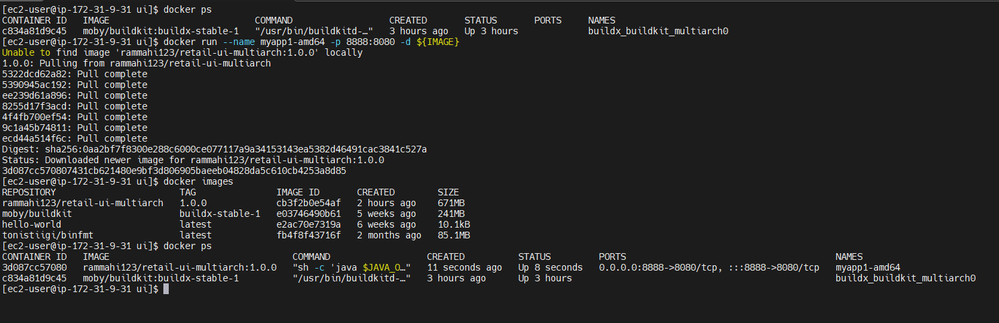
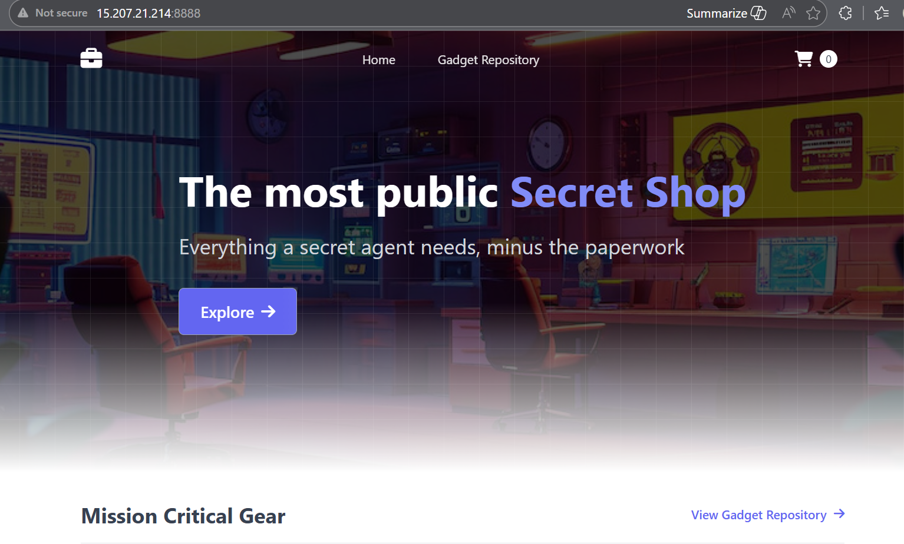


## Step-12: ARM64: Create ARM64 VM and Run and test the containers
### Step-12-01: Create Docker VM with Amazon Linux ARM64 Platform
1. Create a VM with Amazon Linux ARM64 Platform
2. Host Sanity check
```bash
cat /etc/os-release | sed -n '1,6p'     # Amazon Linux 
uname -m                                 # expect: aarch64
```
3. Install Docker in that VM
```bash
# Install Docker
sudo dnf update -y
sudo dnf install docker -y
sudo systemctl enable docker
sudo systemctl start docker
sudo usermod -aG docker ec2-user
docker --version

# Exit and Relogin to VM
exit and relogin

# Run a sample Docker Container
docker run hello-world
```
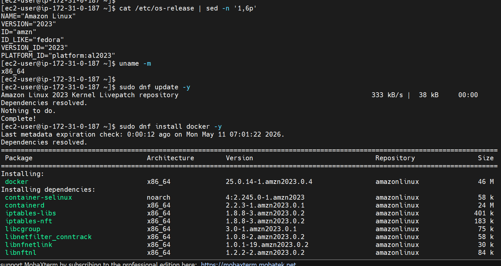

### Step-12-02: Run and test the containers
```bash
# List Docker Containers
docker ps

# Run Docker Container using new Docker Image 
docker run --name myapp1-arm64 -p 8889:8080 -d ${IMAGE}

# List Docker Images
docker images

# List Docker Containers
docker ps

# Access in browser
http://<EC2-Public-IP>:8889
```
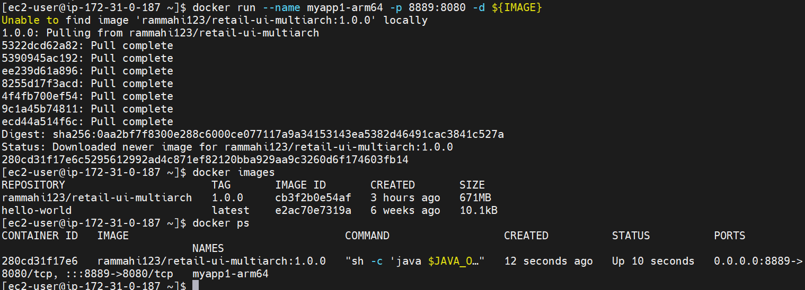
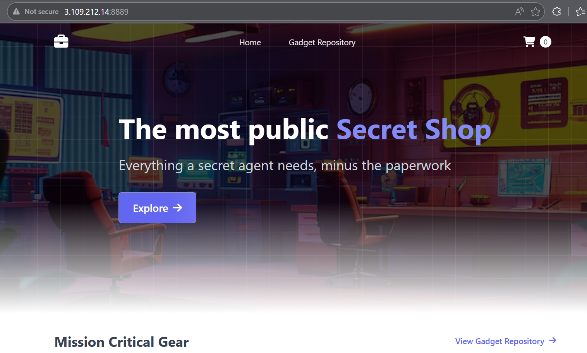


---
## Author
Ramesh Mahipathi