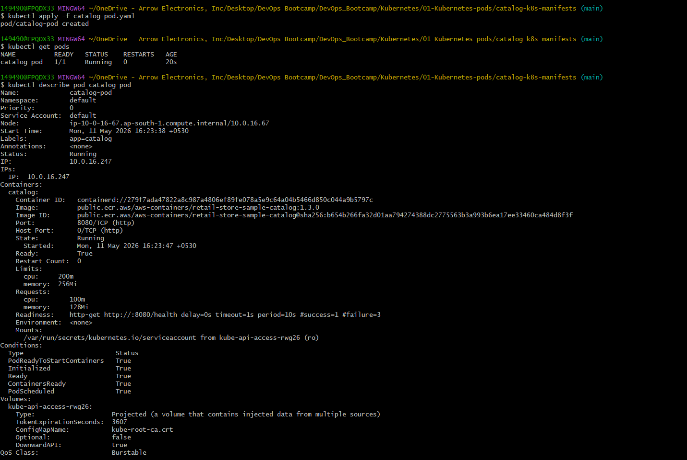
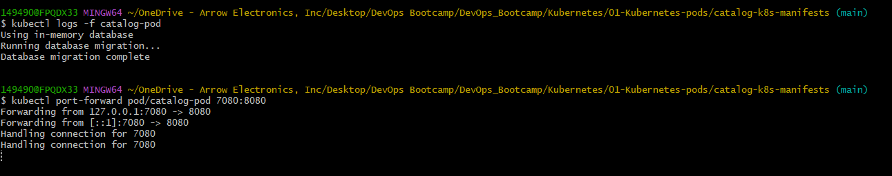
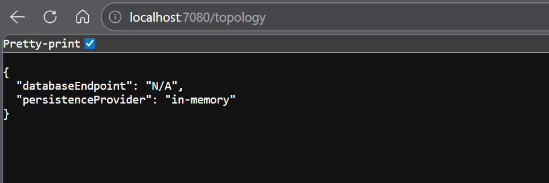
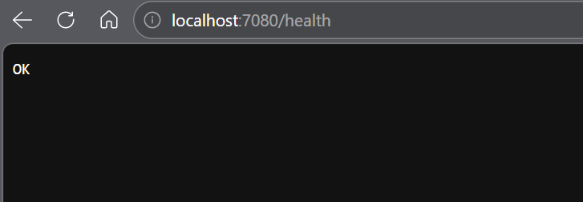
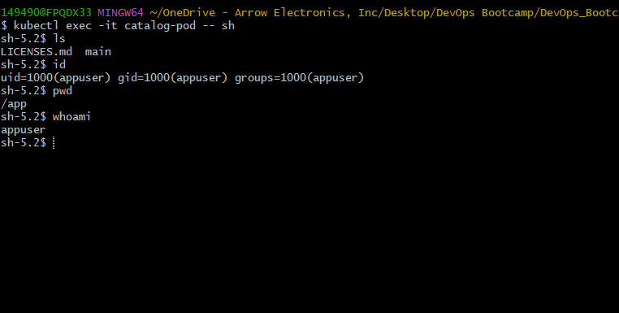
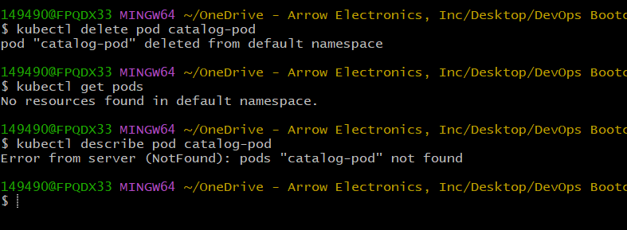

# Kubernetes Pods - Catalog Microservice
## Introduction

This project demonstrates the foundational Kubernetes concept of a Pod by deploying the Catalog microservice from the AWS Retail Store Sample Application.

The objective of this demo is to understand how Kubernetes Pods work, how containers run inside Pods, and how Kubernetes manages containerized applications.

This section focuses on:
- Pod creation
- Container configuration
- Resource management
- Readiness probes
- Log inspection
- Port forwarding
- Container shell access

---
## What is a Pod?

A Pod is the smallest deployable unit in Kubernetes.

A Pod acts as a wrapper around one or more containers and provides:
- Shared networking
- Shared storage
- Shared lifecycle management

Each Pod receives:
- A unique IP address
- Internal DNS capability
- Storage volumes
- Resource allocations

Pods are ephemeral in nature, meaning they can be recreated automatically if terminated.

---
## Project Structure

```text
01-pods/
├── manifests/
│   └── catalog-pod.yaml
├── screenshots/
└── README.md
```

---
## Pod Manifest Explanation

This is where your repo becomes strong.

Instead of only showing YAML,
explain EVERY section.

---

## Example Structure

````markdown id="qj5d9t"
## Pod Manifest Overview

The Pod manifest defines the desired state of the Catalog application Pod.

### API Version

```yaml
apiVersion: v1
```
Defines the Kubernetes API version used for the Pod resource.

### Kind
```yaml
kind: Pod
```
Specifies that this resource is a Kubernetes Pod.

### Metadata
```yaml
metadata:
  name: catalog-pod
  labels:
    app: catalog
```
Metadata contains:
- Pod name
- Labels used for identification and service discovery
Labels are key-value pairs commonly used by:
- Services
- Deployments
- Selectors

### Container Definition
```yaml
containers:
  - name: catalog
```
Defines the container running inside the Pod.

### Container Image
```yaml
image: public.ecr.aws/aws-containers/retail-store-sample-catalog:1.3.0
```
Specifies the container image pulled from Amazon ECR Public Registry.

### Container Ports
```
ports:
  - containerPort: 8080
```
Exposes application port 8080 inside the container.

### Resource Requests and Limits
```yaml
resources:
```
Defines CPU and memory allocation.

### Requests
Minimum guaranteed resources required by the container.

### Limits
Maximum resources the container can consume.

This helps Kubernetes:
- Schedule workloads efficiently
- Prevent resource starvation
- Maintain node stability

### Readiness Probe
```yaml
readinessProbe:
```
A readiness probe checks whether the application is ready to receive traffic.

If the readiness probe fails:
- rnetes removes the Pod from service endpoints
- affic is not routed to the Pod


THIS is what makes repo high quality.

---

## Deploy the Pod
```yaml
kubectl apply -f 01_catalog_pod.yaml
```
## Verify Pod Status
```yaml
kubectl get pods
```
## Describe the Pod
```yaml
kubectl describe pod catalog-pod
```


## View Pod Logs
```yaml
kubectl logs -f catalog-pod
```
## Access the Application via Port Forwarding
```yaml
# Expose the Pod locally using:
kubectl port-forward pod/catalog-pod 7080:8080

# Topology Endpoint
http://localhost:7080/topology

# Health Endpoint
http://localhost:7080/health

# Catalog - Get Products
http://localhost:7080/catalog/products

# Catalog - Get Products By ID
http://localhost:7080/catalog/products/d77f9ae6-e9a8-4a3e-86bd-b72af75cbc49

# Catalog - Get Size
http://localhost:7080/catalog/size

# Catalog - Get Tags
http://localhost:7080/catalog/tags
```




## Connect Inside the Pod
```yaml
kubectl exec -it catalog-pod -- sh
```


## CleanUp
```yaml
kubectl delete pod catalog-pod
```


---
## Author
Ramesh Mahipathi

