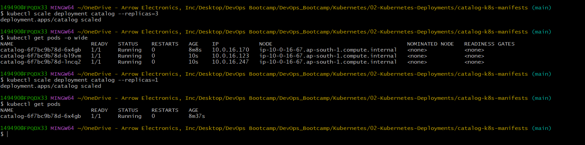

# Kubernetes Deployments - Rolling Updates, Scaling and Rollbacks
## Introduction

This section demonstrates how Kubernetes Deployments manage application Pods using ReplicaSets.

Unlike standalone Pods, Deployments provide:
- Self-healing
- Rolling updates
- Version rollback
- Horizontal scaling
- Desired state management

The Catalog microservice is deployed using a Kubernetes Deployment to simulate a production-style workload.

## ## Why Use Deployments?

Managing Pods directly is not practical in production environments because Pods are ephemeral and can terminate unexpectedly.

Deployments solve this problem by ensuring:
- Desired number of Pods are always running
- Failed Pods are recreated automatically
- Applications can be upgraded without downtime
- Rollbacks are possible if deployments fail
- Scaling operations are simplified

Deployment architecture flow:

```text
Deployment
    ↓
ReplicaSet
    ↓
Pods
```

## What is a ReplicaSet?

A ReplicaSet ensures that a specified number of identical Pods remain running at all times.

If a Pod:
- crashes
- becomes unhealthy
- gets deleted

the ReplicaSet automatically creates a replacement Pod.

Deployments internally manage ReplicaSets and use them during:
- scaling operations
- rolling updates
- rollback operations

## Deployment Manifest Overview

The deployment manifest defines the desired application state for the Catalog microservice.

It includes:
- Deployment strategy
- Replica configuration
- Security context
- Health probes
- Resource limits

### API Version

```yaml
apiVersion: apps/v1
```

Specifies the Kubernetes API group used for Deployments.

### Resource Type

```yaml
kind: Deployment
```

Defines this resource as a Kubernetes Deployment object.

### Replicas

```yaml
replicas: 1
```

Defines the number of Pod replicas Kubernetes should maintain.

If a Pod fails, Kubernetes automatically creates a replacement Pod to maintain the desired state.

### Selector

```yaml
selector:
  matchLabels:
    app.kubernetes.io/name: catalog
```

Selectors allow the Deployment to identify which Pods belong to it.

The selector must match the labels defined inside the Pod template.

### Pod Template

```yaml
template:
```

Defines the Pod specification that Kubernetes uses to create new Pods.

### Security Context

The deployment applies multiple container security best practices.

#### Run as Non-Root

```yaml
runAsNonRoot: true
```

Prevents containers from running as the root user.

---

#### Read-Only Root Filesystem

```yaml
readOnlyRootFilesystem: true
```

Prevents applications from modifying the container root filesystem.

---

#### Drop Linux Capabilities

```yaml
capabilities:
  drop:
    - ALL
```

Removes unnecessary Linux kernel privileges from the container.

---

#### File System Group

```yaml
fsGroup: 1000
```

Ensures shared mounted volumes are accessible to non-root processes.

### Readiness Probe

```yaml
readinessProbe:
```

A readiness probe determines whether a Pod is ready to receive traffic.

If the readiness probe fails:
- Kubernetes removes the Pod from Service endpoints
- Traffic is temporarily stopped

This helps avoid sending traffic to unhealthy or still-starting containers.

### Liveness Probe

```yaml
livenessProbe:
```

A liveness probe determines whether the application inside the container is still functioning correctly.

If the probe fails repeatedly:
- kubelet restarts the container automatically

This helps recover from:
- deadlocks
- hung processes
- unresponsive applications

## Readiness vs Liveness Probe

| Probe Type | Purpose | Failure Behavior |
|---|---|---|
| Readiness Probe | Checks if Pod is ready for traffic | Removes Pod from traffic routing |
| Liveness Probe | Checks if application is alive | Restarts container |

## Rolling Update Strategy

```yaml
strategy:
  type: RollingUpdate
```

Rolling updates allow Kubernetes to gradually replace old Pods with new Pods during application upgrades.

Benefits:
- Zero downtime deployments
- Controlled rollout
- Safer upgrades
- Reduced outage risk

### maxUnavailable

```yaml
maxUnavailable: 1
```

Defines how many Pods can be unavailable during the rolling update process.

This ensures application availability is maintained during upgrades.

## Deploy the Application

Apply the deployment manifest:

```bash
kubectl apply -f manifests/catalog-deployment.yaml
```

## Verify Deployment Resources

Check Deployments:

```bash
kubectl get deployment
```

Check ReplicaSets:

```bash
kubectl get replicaset
```

Check Pods:

```bash
kubectl get pods -o wide
```
![deployments-commands](screenshots/02-deployments-commands.png

These commands help verify:
- desired replicas
- Pod creation
- node placement
- ReplicaSet management

## Verify Rollout Status

```bash
kubectl rollout status deployment/catalog
```

This command monitors deployment progress and confirms whether the rollout completed successfully.

## Scaling the Deployment

Scale the application from 1 replica to 3 replicas:

```bash
kubectl scale deployment catalog --replicas=3
```

Kubernetes automatically creates additional Pods to handle increased workload demands.

### Scale Down

```bash
kubectl scale deployment catalog --replicas=1
```

Kubernetes gracefully terminates excess Pods while maintaining service availability.


## Perform Rolling Updates

Update the application image:

```bash
kubectl set image deployment/catalog \
catalog=public.ecr.aws/aws-containers/retail-store-sample-catalog:1.3.0
```

Kubernetes gradually replaces old Pods with new Pods without downtime.

## Deployment Revision History

```bash
kubectl rollout history deployment/catalog
```

Kubernetes maintains deployment revision history, allowing rollback to previous working versions if required.

## Rollback Deployment

Rollback to previous deployment revision:

```bash
kubectl rollout undo deployment/catalog
```

This restores the previously working application version in case of failed deployments or application issues.

## Cleanup

Delete the deployment:

```bash
kubectl delete deployment catalog
```

## Key Learning Outcomes

This section covered the following Kubernetes concepts:

- Deployment architecture
- ReplicaSet behavior
- Desired state management
- Rolling updates
- Rollback mechanisms
- Horizontal scaling
- Readiness and liveness probes
- Container security context
- Kubernetes rollout operations

