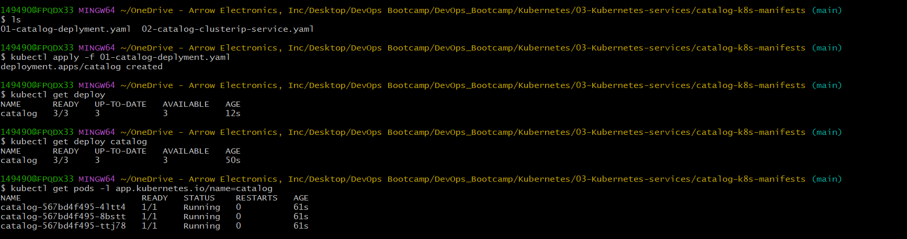
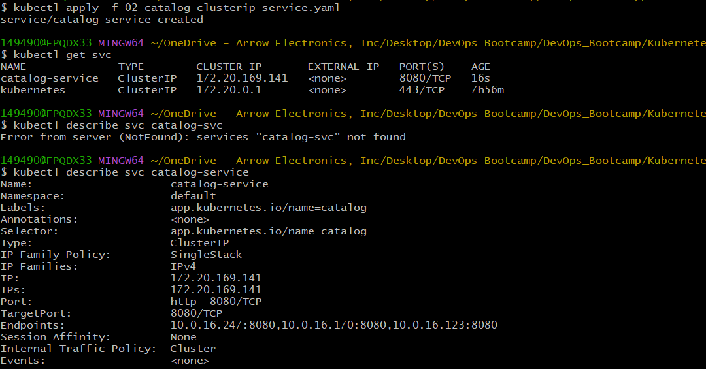
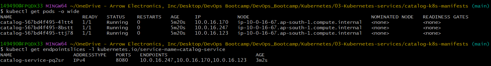
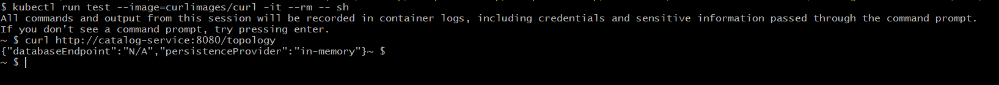
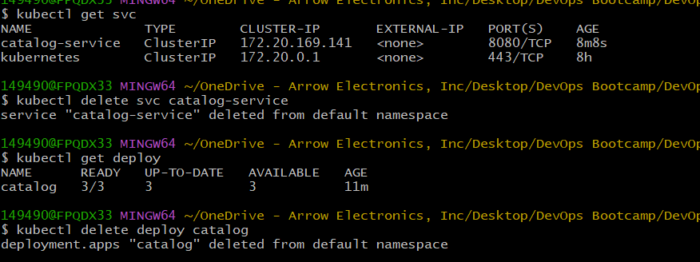

# Kubernetes Services - ClusterIP and Internal Service Discovery

## Introduction

This section explains how Kubernetes Services provide stable networking and service discovery for application Pods.

Pods in Kubernetes are ephemeral and their IP addresses can change whenever Pods restart or are recreated.

Kubernetes Services solve this problem by providing:
- Stable virtual IP addresses
- Internal DNS names
- Traffic distribution across Pods
- Dynamic service discovery

---
## Why Kubernetes Services Are Required

Pods are temporary resources and their IP addresses are not permanent.

Example problem:

```text
Pod-1 → 10.0.1.15
Pod crashes
New Pod → 10.0.1.28
```

Applications cannot reliably communicate using changing Pod IP addresses.

Kubernetes Services provide:
- Stable networking endpoints
- Load balancing across Pods
- Internal DNS resolution
- Loose coupling between applications

---
## Kubernetes Service Architecture

```text
Client
   ↓
Service (Stable IP/DNS)
   ↓
EndpointSlice
   ↓
Pods
```

The Service automatically routes traffic to healthy Pods matching the selector labels.

---
## Types of Kubernetes Services

| Service Type | Purpose |
|---|---|
| ClusterIP | Internal cluster communication |
| NodePort | Exposes application using Node IP and port |
| LoadBalancer | Creates cloud load balancer for external access |
| ExternalName | Maps service to external DNS name |

This demo focuses on the ClusterIP Service type.

---
## What is a ClusterIP Service?

ClusterIP is the default Kubernetes Service type.

It provides:
- Internal-only communication
- Stable virtual IP address
- Internal DNS resolution
- Load balancing across Pods

ClusterIP Services are accessible only from inside the Kubernetes cluster.

---
## Service Manifest Overview

The Service manifest defines how traffic should be routed to the Catalog application Pods.

The Service uses label selectors to dynamically discover matching Pods.
```
apiVersion: v1
kind: Service
metadata:
  name: catalog-service
  labels:
    app.kubernetes.io/name: catalog
spec:
  type: ClusterIP
  selector:
    app.kubernetes.io/name: catalog
  ports:
    - name: http
      port: 8080
      targetPort: 8080
      protocol: TCP
```

### API Version

```yaml
apiVersion: v1
```
Defines the Kubernetes core API version used for Services.

### Resource Type

```yaml
kind: Service
```
Specifies that this resource is a Kubernetes Service object.

### Metadata

```yaml
metadata:
  name: catalog-service
```
Defines the Service name used for:
- DNS resolution
- Internal communication
- Service discovery

### Service Type

```yaml
type: ClusterIP
```
Creates an internal-only Kubernetes Service accessible within the cluster network.

### Selector Labels

```yaml
selector:
  app.kubernetes.io/name: catalog
```
The selector allows the Service to automatically discover Pods with matching labels.
Any Pod containing this label becomes part of the Service endpoints.

### Service Ports

```yaml
ports:
  - port: 8080
    targetPort: 8080
```

| Field | Description |
|---|---|
| port | Service port exposed internally |
| targetPort | Container port receiving traffic |

Traffic flow:

```text
Service:8080 → Pod:8080
```

---
## Deploy the Service

Apply the Service manifest:

```bash
kubectl apply -f manifests/catalog-clusterip-service.yaml
```


---
## Verify Service Creation
Check the Service:
```bash
kubectl get svc
```
Describe the Service:
```bash
kubectl describe svc catalog-service
```
These commands help verify:
- ClusterIP address
- Service ports
- Endpoint mappings
- Label selectors


---

## ClusterIP Address
Kubernetes automatically assigns a virtual internal IP address to the Service.
Example:
```text
10.x.x.x
```
This IP remains stable even if backend Pods restart or change IP addresses.

## EndpointSlices and Pod Discovery

Kubernetes automatically creates EndpointSlice objects for Services.
EndpointSlices contain:
- Pod IP addresses
- Ports
- Endpoint information

View EndpointSlices:

```bash
kubectl get endpointslices \
-l kubernetes.io/service-name=catalog-service
```

Kubernetes continuously updates EndpointSlices whenever:
- Pods are added
- Pods are removed
- Pod IP addresses change

---
## How Services Discover Pods

The Service uses label selectors to dynamically identify matching Pods.

Example flow:
```text
Service Selector
        ↓
Find Matching Labels
        ↓
Create EndpointSlice
        ↓
Route Traffic to Pods
```
This mechanism enables automatic service discovery and load balancing.

## Verify Internal Service Connectivity

Launch a temporary test Pod:

```bash
kubectl run test \
--image=curlimages/curl \
-it --rm -- sh
```
Inside the Pod:

```bash
curl http://catalog-service:8080/topology
```

This verifies:
- Internal networking
- DNS resolution
- Service connectivity
- Pod-to-Pod communication
---

## Kubernetes Internal DNS Resolution

Kubernetes automatically creates DNS entries for Services.

Example DNS entry:
```text
catalog-service.default.svc.cluster.local
```
Applications inside the cluster can communicate using simple Service names instead of Pod IP addresses.

## Verify DNS Resolution

Launch a temporary DNS test Pod:

```bash
kubectl run dns-test \
--image=busybox:1.28 \
-it --rm
```
Inside the container:

```bash
nslookup catalog-service
```
![dns-resolution](screenshots/05-verify-dns.png]
This confirms that Kubernetes DNS is correctly resolving the Service name.

## Kubernetes Internal Traffic Flow
```text
Application Pod
       ↓
Cluster DNS
       ↓
Service IP
       ↓
EndpointSlice
       ↓
Backend Pods
```
Kubernetes handles traffic routing automatically using kube-proxy and cluster networking components.

---
## Cleanup

Delete the Service:
```bash
kubectl delete svc catalog-service
```
Delete the Deployment:
```bash
kubectl delete deployment catalog
```


---
## Author
Ramesh Mahipathi