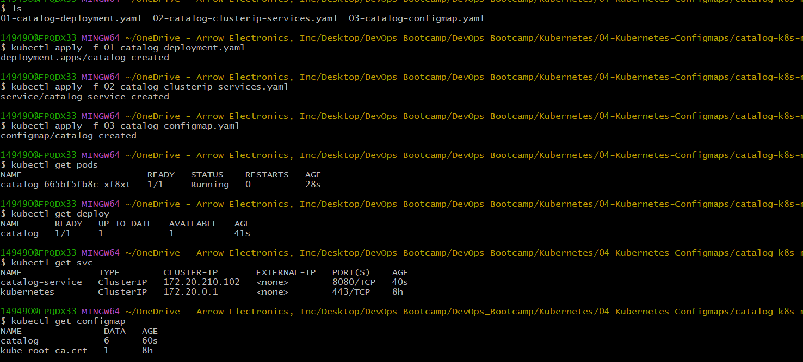
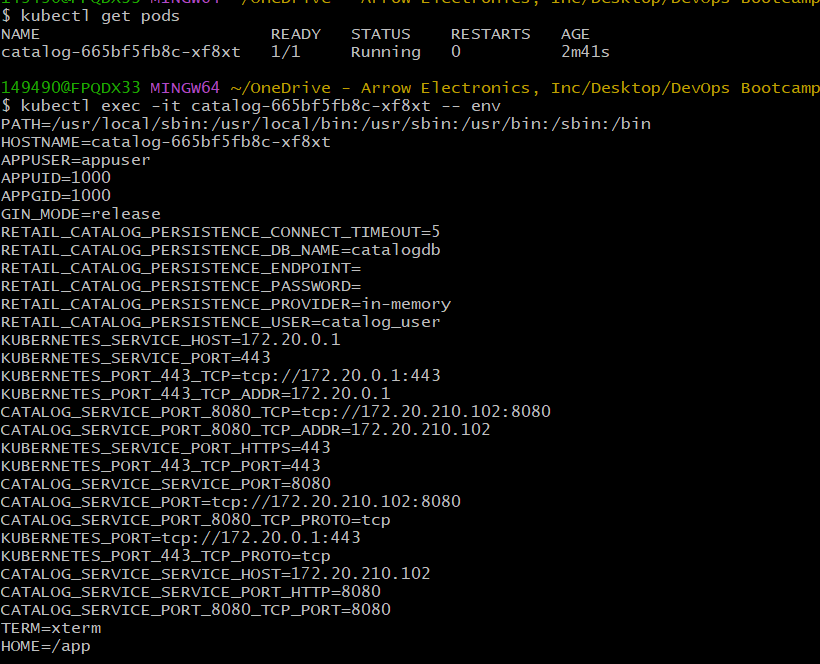
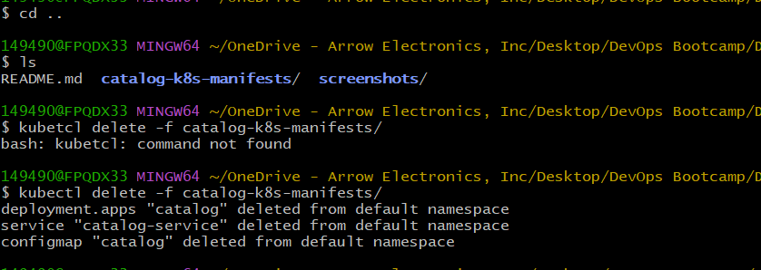

# Kubernetes ConfigMaps - Externalizing Application Configuration

## Introduction

This section explainss how Kubernetes ConfigMaps externalize application configuration from container images.

Instead of hardcoding configuration values inside application code or container images, Kubernetes ConfigMaps allow runtime configuration management using declarative manifests.

This approach improves:
- Portability
- Environment consistency
- Configuration management
- Deployment flexibility
- Infrastructure as Code practices

The Catalog microservice uses a ConfigMap to load runtime configuration values as environment variables.

---
## Why ConfigMaps Are Important

Applications often require runtime configuration such as:
- Database endpoints
- Feature flags
- Environment names
- Timeout values
- Logging configuration

Hardcoding these values inside application images creates several problems:
- Image rebuilds for every configuration change
- Environment-specific image duplication
- Poor configuration visibility
- Difficult operational management

ConfigMaps solve this by separating:
- application code
from
- runtime configuration

---
## Kubernetes Configuration Example

Different environments may require different configuration values:

| Environment | Database Endpoint |
|---|---|
| Development | dev-db.internal |
| QA | qa-db.internal |
| Production | prod-db.internal |

Using ConfigMaps allows the same container image to run across all environments while only changing configuration values.

---
## What is a ConfigMap?

A ConfigMap is a Kubernetes object used to store non-sensitive configuration data as key-value pairs.

ConfigMaps can provide configuration to containers through:
- Environment variables
- Mounted files
- Command arguments

ConfigMaps are commonly used for:
- Application settings
- Database endpoints
- Feature toggles
- Runtime parameters

---
## ConfigMap vs Secret

| Resource | Purpose |
|---|---|
| ConfigMap | Non-sensitive configuration |
| Secret | Sensitive data such as passwords, API keys, and tokens |

Sensitive information should never be stored in ConfigMaps.

---
## ConfigMap Manifest Overview

The ConfigMap stores runtime configuration values required by the Catalog microservice.

These values are later injected into the container as environment variables.

```yaml
apiVersion: v1
kind: ConfigMap
metadata:
  name: catalog
data:
  RETAIL_CATALOG_PERSISTENCE_PROVIDER: "in-memory"
  RETAIL_CATALOG_PERSISTENCE_ENDPOINT: ""
  RETAIL_CATALOG_PERSISTENCE_DB_NAME: "catalogdb"
  RETAIL_CATALOG_PERSISTENCE_USER: "catalog_user"
  RETAIL_CATALOG_PERSISTENCE_PASSWORD: ""
  RETAIL_CATALOG_PERSISTENCE_CONNECT_TIMEOUT: "5"
```

## Manifest Explanation
### API Version

```yaml
apiVersion: v1
```
Defines the Kubernetes core API version used for ConfigMaps.

### Resource Type
```yaml
kind: ConfigMap
```
Specifies that this resource is a Kubernetes ConfigMap object.

### Metadata
```yaml
metadata:
  name: catalog
```
Defines the ConfigMap name used by workloads referencing this configuration.

### Configuration Data
```yaml
data:
```
Stores configuration as key-value pairs.

Each entry becomes:
- an environment variable
OR
- a mounted file inside the container
depending on how the ConfigMap is consumed.

### Example Configuration Values

| Variable | Purpose |
|---|---|
| RETAIL_CATALOG_PERSISTENCE_PROVIDER | Defines persistence backend |
| RETAIL_CATALOG_PERSISTENCE_DB_NAME | Database name |
| RETAIL_CATALOG_PERSISTENCE_USER | Database username |
| RETAIL_CATALOG_PERSISTENCE_CONNECT_TIMEOUT | Connection timeout value |

## Injecting ConfigMap into the Deployment

The Deployment consumes the ConfigMap using:
```yaml
envFrom:
  - configMapRef:
      name: catalog
```
This instructs Kubernetes to load all ConfigMap key-value pairs as environment variables inside the container.

---
## How ConfigMap Injection Works

```text
ConfigMap
     ↓
Deployment
     ↓
Container Environment Variables
     ↓
Application Runtime
```

At container startup:
1. Kubernetes reads the ConfigMap
2. Environment variables are injected
3. Application consumes the runtime configuration

---
## Deploy the Resources

Apply all Kubernetes manifests:
```bash
kubectl apply -f manifests/
```


## Verify ConfigMap Creation

Check the ConfigMap:
```bash
kubectl get configmap
```

Describe the ConfigMap:

```bash
kubectl describe configmap catalog
```


This helps verify:
- Configuration values
- Metadata
- Resource creation

---
## Verify Environment Variable Injection

Connect inside the running container:

```bash
kubectl exec -it <pod-name> -- env
```
This command displays all environment variables loaded into the container runtime.


## Runtime Configuration Injection
Kubernetes automatically injected the ConfigMap values into the container environment during Pod startup.

The application can now consume configuration dynamically without modifying:
- application code
- container image

## Important ConfigMap Behavior
Environment variables loaded from ConfigMaps are injected only during container startup.

If the ConfigMap changes:
- existing Pods do not automatically reload environment variables
- Pods typically need to be restarted or redeployed

## Alternative ConfigMap Consumption Methods
ConfigMaps can also be mounted as files inside containers.

Common approaches:
- Environment variables
- Mounted configuration files
- Command-line arguments

---
## Cleanup
Delete all resources:
```bash
kubectl delete -f manifests/
```


---
## Key Learning Outcomes
This section covered the following Kubernetes concepts:

- ConfigMaps
- Externalized configuration
- Runtime environment variables
- Configuration as Code
- Deployment configuration injection
- Container runtime configuration
- Environment-specific application settings


---
## Author
Ramesh Mahipathi