# Kubernetes StatefulSets - MySQL Stateful Workload Management

## Introduction

This section we learn how Kubernetes StatefulSets manage stateful applications using stable Pod identities, predictable DNS names, and ordered deployment behavior.

Unlike stateless workloads, databases require:
- Stable network identities
- Persistent storage
- Predictable startup order
- Stable DNS resolution

The Catalog microservice is configured to use a MySQL database deployed through a Kubernetes StatefulSet.

## What is a Stateful Application?

A stateful application stores persistent data that must survive container or Pod restarts.

Examples:
- MySQL
- PostgreSQL
- MongoDB
- Kafka
- Elasticsearch

Stateful applications require:
- Stable identities
- Persistent storage
- Ordered startup/shutdown behavior
- Consistent network endpoints

## Stateless vs Stateful Workloads

| Feature | Stateless Application | Stateful Application |
|---|---|---|
| Stores Persistent Data | No | Yes |
| Pod Identity Important | No | Yes |
| Stable Hostname Required | No | Yes |
| Example | Nginx, APIs | MySQL, Kafka |
| Kubernetes Resource | Deployment | StatefulSet |

Deployments are ideal for stateless workloads, while StatefulSets are designed for applications requiring stable identity and persistence.

## Why Databases Should Not Use Deployments

Deployments create interchangeable Pods with:
- random Pod names
- changing identities
- unordered scaling behavior

Databases require:
- predictable identities
- stable DNS names
- ordered startup
- persistent storage

StatefulSets solve these problems by providing stable Pod identity management.

## What is a StatefulSet?

A StatefulSet is a Kubernetes workload controller designed for stateful applications.

StatefulSets provide:
- Stable Pod names
- Ordered Pod creation
- Ordered Pod deletion
- Persistent network identities
- Stable DNS records
- Persistent volume association

## Stable Pod Identity

Each Pod created by a StatefulSet receives a predictable hostname.

Example:

```text
catalog-mysql-0
catalog-mysql-1
catalog-mysql-2
```

Even if a Pod restarts:
- the Pod name remains the same
- the DNS identity remains the same

## Stable Pod Identity

Each Pod created by a StatefulSet receives a predictable hostname.

Example:

```text
catalog-mysql-0
catalog-mysql-1
catalog-mysql-2
```

Even if a Pod restarts:
- the Pod name remains the same
- the DNS identity remains the same

## What is a Headless Service?

A Headless Service is a Kubernetes Service configured with:

```yaml
clusterIP: None
```

Unlike normal Services:
- no virtual ClusterIP is assigned
- DNS resolves directly to Pod IP addresses

This enables direct Pod-to-Pod addressing for Stateful workloads.

## Why StatefulSets Use Headless Services

StatefulSets require stable DNS entries for individual Pods.

The Headless Service enables DNS records such as:

```text
catalog-mysql-0.catalog-mysql.default.svc.cluster.local
```

This allows:
- direct Pod addressing
- predictable database endpoints
- stable service discovery

## Update Application Configuration

The Catalog application ConfigMap is updated to point to the MySQL StatefulSet endpoint.

Example:

```yaml
RETAIL_CATALOG_PERSISTENCE_PROVIDER: "mysql"
RETAIL_CATALOG_PERSISTENCE_ENDPOINT: "catalog-mysql:3306"
```

The application now connects to MySQL instead of the in-memory database.

## StatefulSet Manifest Overview

The StatefulSet manifest defines:
- MySQL container configuration
- Stable Pod identities
- Storage configuration
- Database environment variables
- Networking configuration

```yaml
apiVersion: apps/v1
kind: StatefulSet
metadata:
  name: catalog-mysql
  labels:
    app.kubernetes.io/name: catalog
    app.kubernetes.io/instance: catalog
    app.kubernetes.io/component: mysql
    app.kubernetes.io/owner: retail-store-sample
spec:
  replicas: 1
  selector:
    matchLabels:
      app.kubernetes.io/name: catalog
      app.kubernetes.io/instance: catalog
      app.kubernetes.io/component: mysql
      app.kubernetes.io/owner: retail-store-sample
  template:
    metadata:
      labels:
        app.kubernetes.io/name: catalog
        app.kubernetes.io/instance: catalog
        app.kubernetes.io/component: mysql
        app.kubernetes.io/owner: retail-store-sample
    spec:
      containers:
        - name: mysql
          image: "public.ecr.aws/docker/library/mysql:8.0"
          imagePullPolicy: IfNotPresent
          env:
            - name: MYSQL_ROOT_PASSWORD
              value: my-secret-pw
            - name: MYSQL_DATABASE
              value: catalogdb
            - name: MYSQL_USER
              value: catalog_user
            - name: MYSQL_PASSWORD
              value: kalyandb101
          ports:
            - name: mysql
              containerPort: 3306
              protocol: TCP
          volumeMounts:
            - name: data
              mountPath: /var/lib/mysql
      volumes:
        - name: data
          emptyDir: {}
```

### API Version

```yaml
apiVersion: apps/v1
```
Defines the Kubernetes API group used for StatefulSets.

### Resource Type

```yaml
kind: StatefulSet
```
Specifies this resource as a Kubernetes StatefulSet object.

### Replicas

```yaml
replicas: 1
```
Defines the number of database Pods managed by the StatefulSet.

## Ordered Pod Creation

StatefulSets create Pods sequentially.

Example scaling behavior:

```text
catalog-mysql-0
      ↓
catalog-mysql-1
      ↓
catalog-mysql-2
```
The next Pod starts only after the previous Pod becomes healthy.

## Ordered Pod Deletion

StatefulSets terminate Pods in reverse order.

Example:

```text
catalog-mysql-2
      ↓
catalog-mysql-1
      ↓
catalog-mysql-0
```
This behavior protects application consistency during scale-down operations.

## MySQL Runtime Configuration

The MySQL container is configured using environment variables.

Example:

```yaml
MYSQL_DATABASE
MYSQL_USER
MYSQL_PASSWORD
```
These variables initialize the MySQL database during container startup.

## Important Security Consideration

Database credentials should never be hardcoded in production manifests.

For production environments:
- Kubernetes Secrets should be used
- Sensitive credentials should be encrypted and externally managed

## Storage Configuration

The StatefulSet currently uses:

```yaml
emptyDir: {}
```

This creates temporary ephemeral storage tied to the Pod lifecycle.

If the Pod is deleted:
- all database data is lost

## Why Persistent Storage Matters

Databases require durable storage.

In production environments:
- PersistentVolumes (PV)
- PersistentVolumeClaims (PVC)
- StorageClasses

are used to retain data across Pod restarts and rescheduling.

# Apply Resources
## Deploy the Stateful Workload

Apply all manifests:

```bash
kubectl apply -f manifests/
```
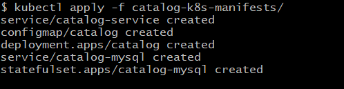

## Verify StatefulSet Resources
Check StatefulSets:
```bash
kubectl get statefulsets
```
Check Pods:
```bash
kubectl get pods -o wide
```
Check Services:
```bash
kubectl get svc
```
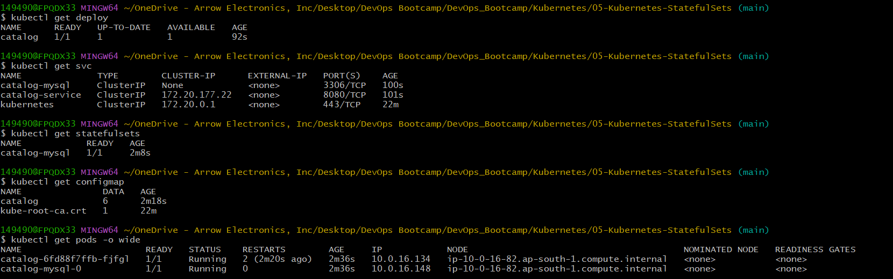
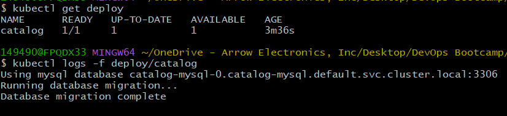

## Verify Stateful DNS Resolution
Launch a temporary DNS test Pod:
```bash
kubectl run dns-test \
--image=busybox:1.28 \
-it --rm
```

Inside the container:
```bash
nslookup catalog-mysql
nslookup catalog-mysql-0.catalog-mysql
```
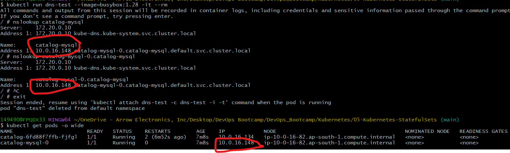

This verifies:
- Headless Service DNS
- Stateful Pod DNS resolution
- Direct Pod addressing

## StatefulSet DNS Resolution Flow

```text
Headless Service
        ↓
Cluster DNS
        ↓
Stable Stateful Pod DNS
        ↓
Pod IP Address
```

## Scale the StatefulSet
Scale up the StatefulSet:
```bash
kubectl scale statefulset catalog-mysql --replicas=3
```

Observe sequential Pod creation:
```text
catalog-mysql-0
catalog-mysql-1
catalog-mysql-2
```
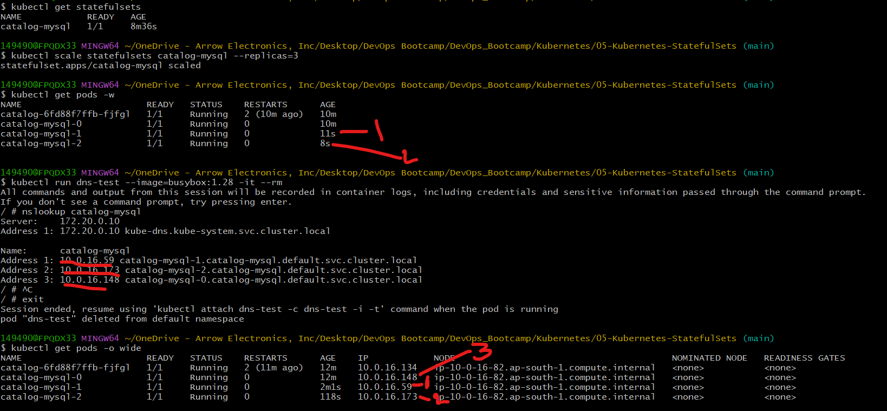

## Scale-down replicas
```bash
kubectl scale statefulset catalog-mysql --replicas=1
```
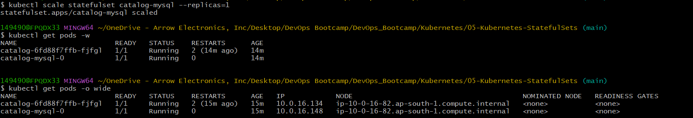

## Important Clarification - Scaling Does Not Create MySQL Replication

Scaling a StatefulSet does NOT automatically configure MySQL replication.

Each replica becomes an independent MySQL instance unless replication is manually configured.

Production-grade database replication requires:
- replication setup
- clustering logic
- operators
- Helm charts
- custom initialization scripts

## Stateful Pod Recreation

Delete a Pod:

```bash
kubectl delete pod catalog-mysql-0
```

Kubernetes recreates the Pod using:
- the same Pod name
- the same identity
- the same DNS name
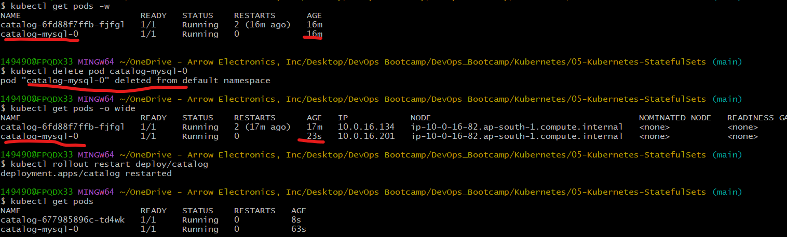

## Verify Database Tables

Inside MySQL:

```sql
SHOW DATABASES;
USE catalogdb;
SHOW TABLES;
```
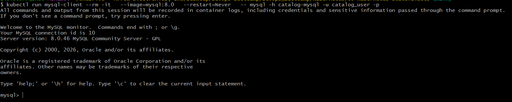
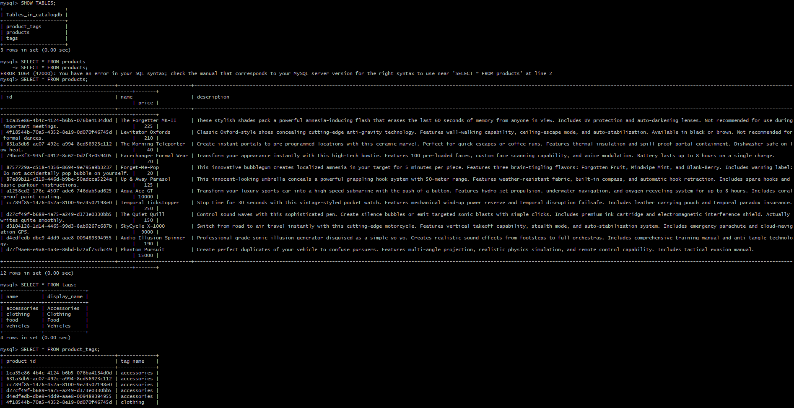

## Verify Application Connectivity
Forward traffic to the Catalog Service:

```bash
kubectl port-forward svc/catalog-service 7080:8080
```
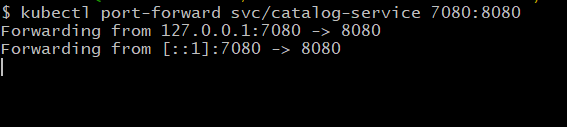

Verify topology endpoint:
```text
http://localhost:7080/topology
```
Expected result:

```json
{
  "databaseEndpoint": "catalog-mysql:3306",
  "persistenceProvider": "mysql"
}
```
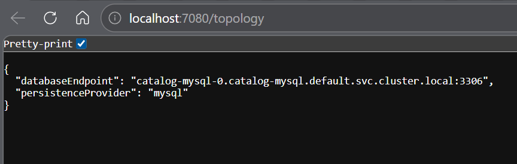

Verify health, size and tags
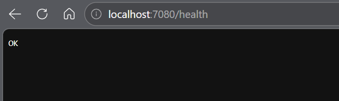
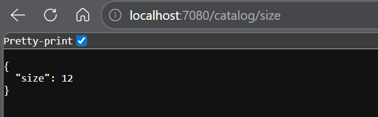
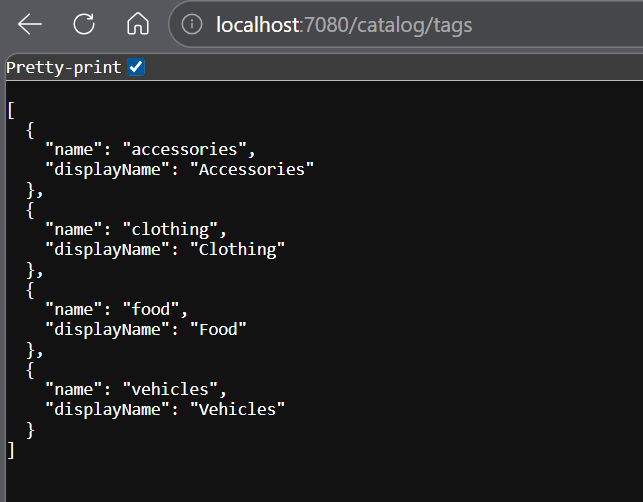

## Cleanup

Delete all resources:
```bash
kubectl delete -f manifests/
```
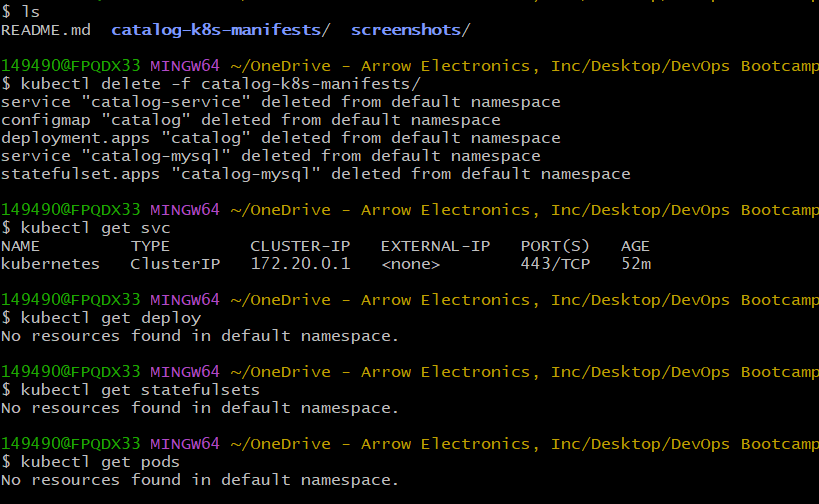

## Key Learning Outcomes

This section covered the following Kubernetes concepts:

- StatefulSets
- Stateful workload management
- Headless Services
- Stable Pod identities
- Ordered Pod scaling
- Stateful DNS resolution
- Ephemeral vs persistent storage
- Database connectivity inside Kubernetes
- Stateful application networking


---
## Author
Ramesh Mahipathi