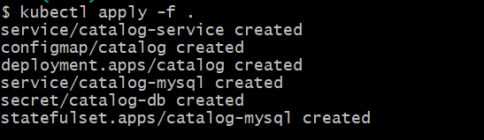
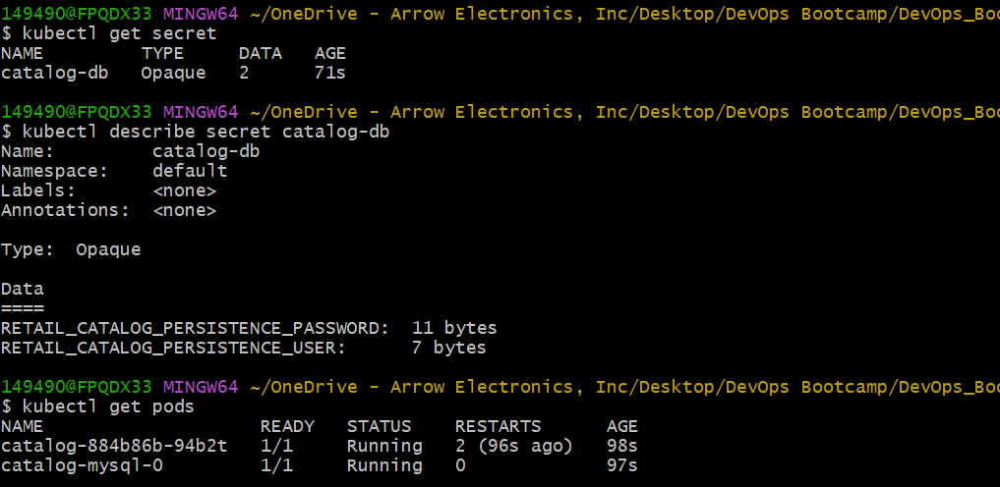
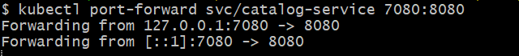
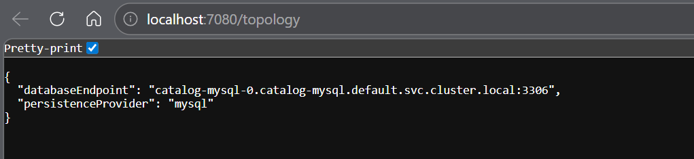
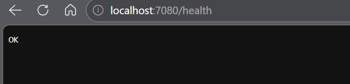

# Kubernetes Secrets - Secure MySQL Credential Management

## Introduction

This section explains how Kubernetes Secrets securely manage sensitive application data such as database usernames and passwords.

Previously, database credentials were stored inside ConfigMaps, which is not recommended for production workloads.

Kubernetes Secrets provide a better approach by:
- Separating sensitive data
- Reducing credential exposure
- Supporting secure runtime injection
- Improving workload security practices

The Catalog microservice and MySQL StatefulSet are updated to consume credentials from Kubernetes Secrets.

## Why Kubernetes Secrets Are Important

Applications often require sensitive information such as:
- Database usernames
- Passwords
- API keys
- Tokens
- Certificates

Storing these values directly inside:
- application code
- container images
- ConfigMaps
- Git repositories

creates serious security risks.

Kubernetes Secrets provide a mechanism to store and inject sensitive data into workloads securely.

## ConfigMap vs Secret

| Resource | Purpose |
|---|---|
| ConfigMap | Non-sensitive configuration |
| Secret | Sensitive credentials and confidential data |

Examples:

### ConfigMap
- Database endpoint
- Feature flags
- Timeout values

### Secret
- Database passwords
- API tokens
- TLS certificates

## Important Security Clarification

Kubernetes Secrets are Base64-encoded by default.

Base64 encoding is NOT encryption.

Without additional protection:
- Secrets can still be decoded
- Anyone with sufficient cluster access can retrieve them

Production environments should additionally use:
- etcd encryption
- RBAC restrictions
- external secret management systems

## What is Base64 Encoding?

Kubernetes stores Secret values in Base64-encoded format.

Example:

```text
catalog_user
↓
Y2F0YWxvZ191c2Vy
```

Base64 encoding helps safely transport binary and text data in YAML manifests.

## Secret Injection Flow

```text
Kubernetes Secret
        ↓
Deployment / StatefulSet
        ↓
Container Environment Variables
        ↓
Application Runtime
```

## Secret Manifest Overview

The Secret manifest stores MySQL database credentials required by:
- MySQL StatefulSet
- Catalog application Deployment

```yaml
apiVersion: v1
kind: Secret
metadata:
  name: catalog-db
data:
  RETAIL_CATALOG_PERSISTENCE_USER: "Y2F0YWxvZ191c2Vy"
  RETAIL_CATALOG_PERSISTENCE_PASSWORD: "a2FseWFuZGIxMDE="
```

### API Version

```yaml
apiVersion: v1
```
Defines the Kubernetes core API version used for Secrets.

### Resource Type

```yaml
kind: Secret
```

Specifies that this resource is a Kubernetes Secret object.

### Metadata

```yaml
metadata:
  name: catalog-db
```

Defines the Secret name referenced by workloads consuming the credentials.

### Secret Data

```yaml
data:
```

Stores sensitive values as Base64-encoded key-value pairs.

Example:

```yaml
RETAIL_CATALOG_PERSISTENCE_USER
RETAIL_CATALOG_PERSISTENCE_PASSWORD
```

## Decode Secret Values

Example command:

```bash
echo "Y2F0YWxvZ191c2Vy" | base64 --decode
```

Output:

```text
catalog_user
```

## Removing Credentials from ConfigMap

Database usernames and passwords were removed from the ConfigMap because ConfigMaps are intended only for non-sensitive configuration data.

This separation improves:
- security
- operational clarity
- configuration management

## Injecting Secrets into the StatefulSet

The MySQL StatefulSet consumes credentials using:

```yaml
valueFrom:
  secretKeyRef:
```

This allows Kubernetes to inject Secret values directly into container environment variables during Pod startup.

## How secretKeyRef Works

```yaml
secretKeyRef:
  name: catalog-db
  key: RETAIL_CATALOG_PERSISTENCE_USER
```

Kubernetes:
1. Reads the Secret object
2. Retrieves the specified key
3. Injects the decoded value into the container environment

## Injecting Secrets into the Application Deployment

The Catalog Deployment consumes both:
- ConfigMap values
- Secret values

using:

```yaml
envFrom:
```

This merges configuration and credentials into the container runtime environment.

## How envFrom Works

```yaml
envFrom:
```

This allows Kubernetes to import:
- all ConfigMap variables
- all Secret variables

as container environment variables automatically.

## Deploy the Resources

Apply all manifests:

```bash
kubectl apply -f manifests/
```


## Verify Secret Creation

Check Secrets:
```bash
kubectl get secrets
```

Describe Secret metadata:
```bash
kubectl describe secret catalog-db
```

View Secret YAML:
```bash
kubectl get secret catalog-db -o yaml
```


## Secret Visibility Behavior
When viewing Secrets using:
```bash
kubectl get secret -o yaml
```
the values remain Base64 encoded instead of plain text.

This helps reduce accidental credential exposure.

## Verify Application Connectivity

Expose the Catalog Service locally:

```bash
kubectl port-forward svc/catalog-service 7080:8080
```


Verify application endpoints:
```text
http://localhost:7080/topology
http://localhost:7080/health
```



Successful responses confirm:
- Secret injection worked correctly
- Database authentication succeeded
- Application connectivity is healthy

## Runtime Secret Injection Flow

```text
Kubernetes Secret
        ↓
Deployment / StatefulSet
        ↓
Environment Variables
        ↓
Application Container
        ↓
MySQL Authentication
```

## Production Best Practices

For production environments:

- Avoid storing Secrets in Git repositories
- Enable etcd encryption
- Restrict Secret access using RBAC
- Rotate credentials regularly
- Use external secret managers when possible

Common external secret solutions:
- AWS Secrets Manager
- HashiCorp Vault
- External Secrets Operator

## Cleanup

Delete all resources:

```bash
kubectl delete -f manifests/
```

## Key Learning Outcomes

This section covered the following Kubernetes security concepts:

- Kubernetes Secrets
- Secure credential management
- Base64 encoding
- Secret injection using secretKeyRef
- Runtime environment variable injection
- ConfigMap vs Secret separation
- StatefulSet credential management
- Application authentication flow

---
## Author
Ramesh Mahipathi