# Amazon EKS Pod Identity Agent - Secure AWS Access for Kubernetes Pods

## Introduction

Applications running inside Kubernetes often need access to AWS services such as:
- Amazon S3
- DynamoDB
- SQS
- Secrets Manager
- CloudWatch

Traditionally, applications used:
- hardcoded AWS credentials
- IAM user access keys
- credentials stored in Secrets

which creates major security risks.

Amazon EKS Pod Identity provides a secure mechanism for Kubernetes Pods to temporarily assume IAM roles without storing AWS credentials inside containers.

This section demonstrates:
- EKS Pod Identity Agent architecture
- IAM role association
- Pod-to-IAM authentication flow
- secure AWS SDK authentication
- temporary credential retrieval

## Why EKS Pod Identity Matters

Without Pod Identity:

```text
Application Pod
      ↓
Static AWS Access Keys
      ↓
Security Risk
```

Problems:
- credential leakage
- secret rotation complexity
- long-lived credentials
- accidental Git exposure
- operational overhead

With EKS Pod Identity:

```text
Pod
  ↓
Service Account
  ↓
IAM Role
  ↓
Temporary Credentials
  ↓
AWS Service Access
```

Benefits:
- no static AWS credentials
- temporary IAM credentials
- least privilege access
- centralized IAM management
- native AWS SDK integration


## What is Amazon EKS Pod Identity?
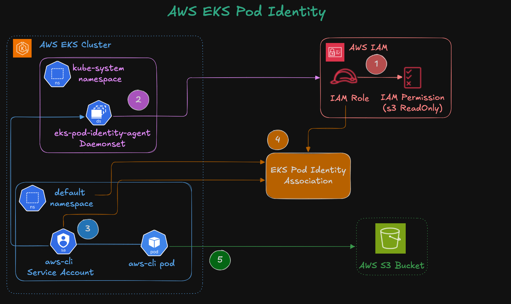

Amazon EKS Pod Identity is an AWS-managed feature that allows Kubernetes Pods to securely assume IAM roles using Kubernetes Service Accounts.

It eliminates the need for:
- IAM user credentials
- credential Secrets
- IRSA annotations
- manual token management

AWS automatically injects temporary credentials into Pods at runtime.


## EKS Pod Identity vs IRSA

| Feature | IRSA | EKS Pod Identity |
|---|---|---|
| OIDC Provider Required | Yes | No |
| IAM Role Annotation | Required | Not Required |
| AWS Managed | Partial | Fully Managed |
| Simpler Setup | Moderate | Easier |
| Credential Injection | Web Identity | Pod Identity Agent |

EKS Pod Identity is the newer AWS-recommended approach for EKS workload authentication.

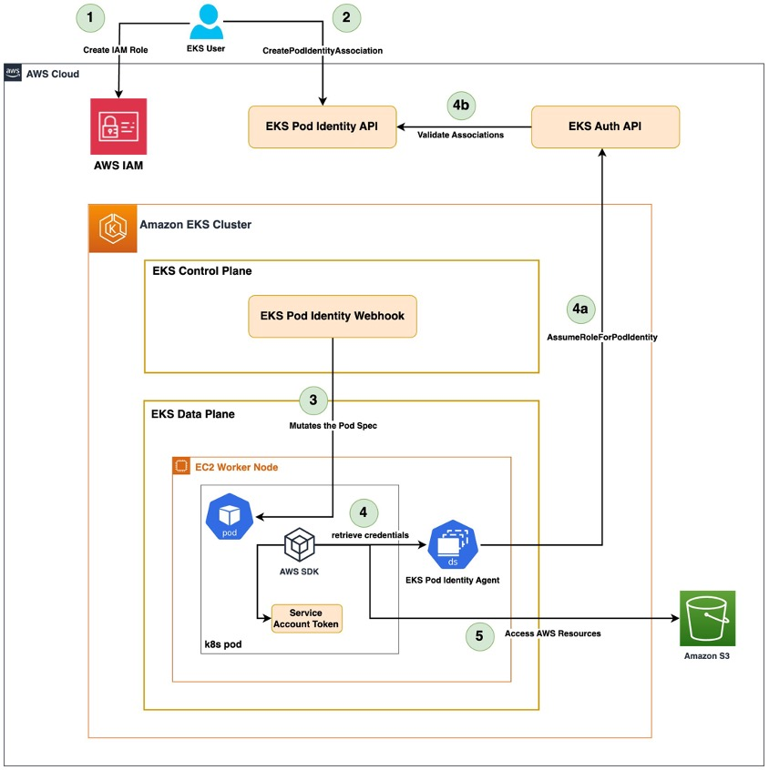

## High-Level Authentication Flow

The authentication process works as follows:

1. Kubernetes Pod starts
2. Pod uses a Kubernetes Service Account
3. Pod Identity Agent runs on worker nodes
4. EKS validates Pod Identity association
5. Temporary IAM credentials are generated
6. AWS SDK inside the Pod accesses AWS services securely


## Runtime Credential Flow

```text
Kubernetes Pod
        ↓
Kubernetes Service Account
        ↓
EKS Pod Identity Association
        ↓
IAM Role
        ↓
Temporary AWS Credentials
        ↓
AWS SDK / AWS CLI
        ↓
Amazon S3 Access
```

## How the EKS Pod Identity Agent Works

The EKS Pod Identity Agent runs as a DaemonSet inside the cluster.

It is responsible for:
- receiving Pod credential requests
- validating Service Account associations
- communicating with AWS authentication services
- delivering temporary credentials to Pods

The agent runs on every worker node.

## Why the Pod Identity Agent Uses a DaemonSet

A DaemonSet ensures one Pod runs on every Kubernetes worker node.

This is required because:
- every node may run application Pods
- credential requests must be handled locally
- all workloads need access to the agent

This is a common Kubernetes pattern for:
- monitoring agents
- logging agents
- networking components
- security agents

## What We Will Implement

This demo performs the following:

1. Install EKS Pod Identity Agent
2. Create a Kubernetes Service Account
3. Deploy an AWS CLI Pod
4. Verify AWS access initially fails
5. Create an IAM Role
6. Associate Service Account with IAM Role
7. Restart the Pod
8. Verify AWS access succeeds

## Install EKS Pod Identity Agent

The EKS Pod Identity Agent is installed as an EKS add-on.

The add-on deploys:
- DaemonSet
- supporting Pods
- authentication components

Verify installation:

```bash
kubectl get daemonset -n kube-system
kubectl get pods -n kube-system
```
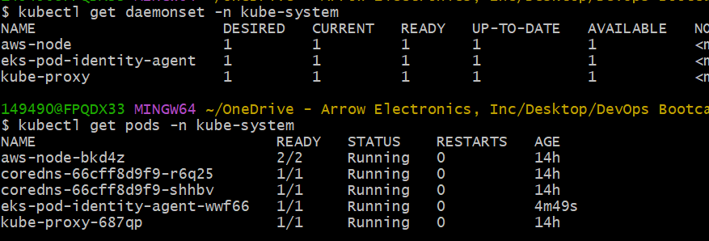

## What Happens After Installation?

Once installed:
- the Pod Identity Agent runs on every worker node
- EKS enables Pod Identity associations
- Pods can request temporary AWS credentials dynamically

## Create Kubernetes Service Account

A Kubernetes Service Account provides an identity for Pods inside the cluster.

In this demo:
- the Pod uses `aws-cli-sa`
- this Service Account is later mapped to an IAM Role

## Why Service Accounts Matter

Kubernetes Service Accounts are used to:
- identify Pods
- authenticate Pods
- authorize workloads
- integrate with cloud IAM systems

In EKS Pod Identity:
- Service Accounts become the bridge between Kubernetes and AWS IAM.

## Deploy AWS CLI Pod

The AWS CLI Pod is used to test AWS API access from inside Kubernetes.

The Pod uses:
- the Kubernetes Service Account
- AWS CLI image
- long-running sleep command for testing

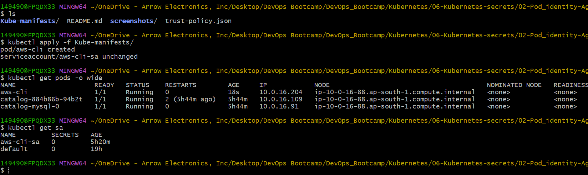

## Why AWS Access Fails Initially
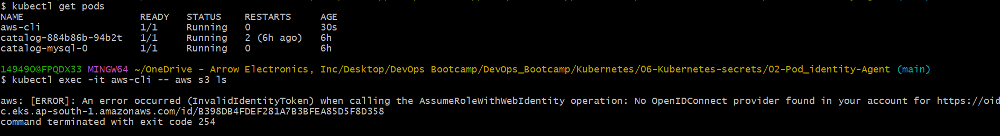

Initially, the Pod has:
- no IAM role association
- no AWS permissions

When running:
```bash
aws s3 ls
```

the request fails because:
- the Pod identity is not mapped to any AWS IAM role
- AWS denies the request

## Important Observation

The error references the EC2 node IAM role.

This proves:
- the Pod itself has no direct IAM permissions
- requests fall back to node-level permissions
- Pod Identity association is not yet configured

## Create IAM Role for Pod Identity

An IAM role is created with:
- trust relationship for Pod Identity
- S3 read-only permissions

The trust policy allows:
- `pods.eks.amazonaws.com`
- to assume the IAM role dynamically

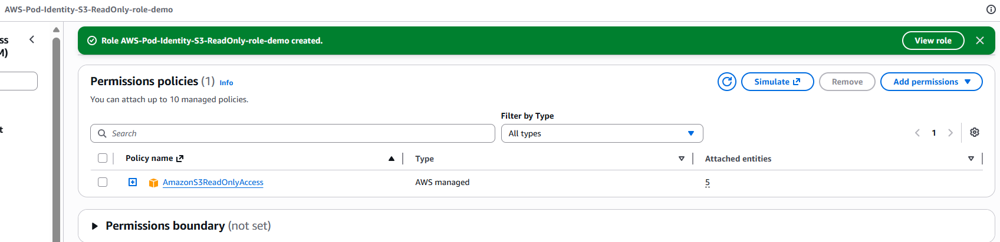

## Understanding the Trust Policy

The trust relationship defines:
- who can assume the IAM role

In this case:

```json
"Service": "pods.eks.amazonaws.com"
```

allows the EKS Pod Identity system to generate temporary credentials for associated Pods.

## Create Pod Identity Association
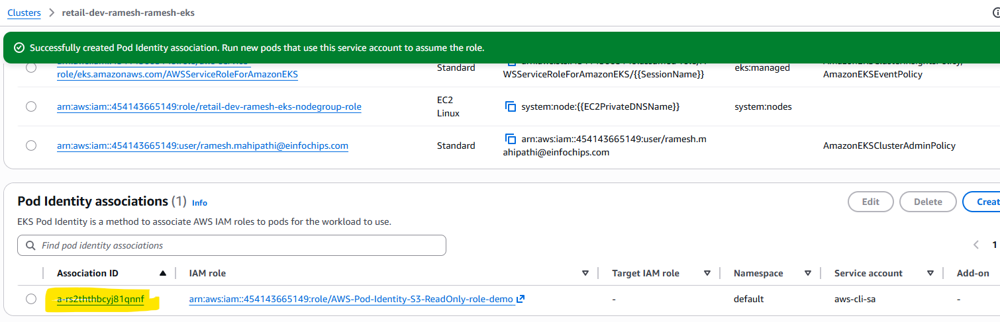

The Pod Identity Association connects:

```text
Kubernetes Service Account
            ↓
IAM Role
```

Association parameters:
- EKS Cluster
- Namespace
- Service Account
- IAM Role

## Why the Pod Must Be Restarted
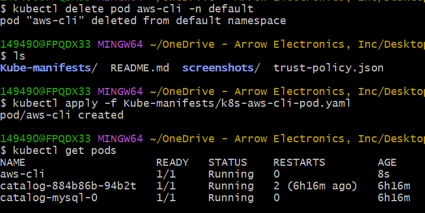

Existing Pods do not automatically receive updated identity associations.

Restarting the Pod ensures:
- new environment variables are injected
- fresh temporary credentials are generated
- the Pod receives the IAM role mapping

## Verify AWS Access

After restarting the Pod:
```bash
aws s3 ls
```
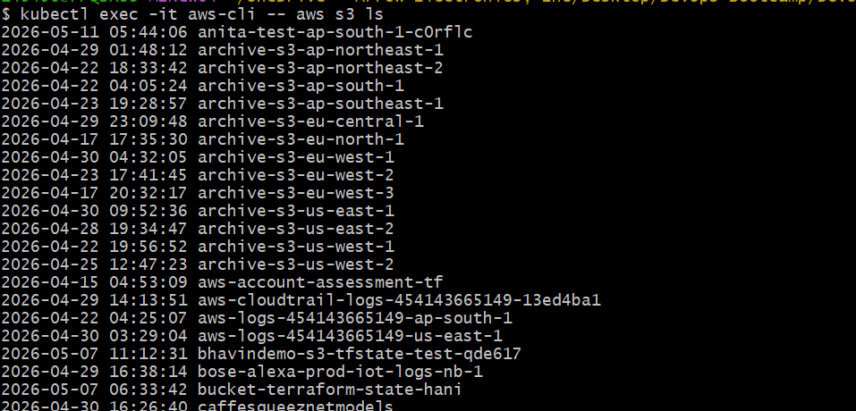

now succeeds because:
- the Pod successfully assumes the IAM role
- temporary credentials are available
- AWS authorization succeeds

## Internal Credential Retrieval Flow

```text
AWS CLI inside Pod
        ↓
AWS SDK Credential Chain
        ↓
EKS Pod Identity Agent
        ↓
EKS Authentication Service
        ↓
IAM Role Assumption
        ↓
Temporary Credentials
        ↓
S3 Access Granted
```

## Security Benefits

EKS Pod Identity improves security by:

- eliminating static AWS credentials
- reducing credential leakage risk
- using temporary credentials
- supporting least privilege access
- centralizing IAM management

## Production Best Practices

For production workloads:

- create separate IAM roles per application
- follow least privilege access
- avoid wildcard IAM permissions
- use dedicated Service Accounts
- rotate permissions regularly
- monitor CloudTrail activity

## Common Real-World Use Cases

EKS Pod Identity is commonly used for:

- S3 access
- DynamoDB access
- SQS messaging
- Secrets Manager retrieval
- CloudWatch logging
- ECR authentication
- AWS SDK integrations

## Cleanup

Delete Kubernetes resources:

```bash
kubectl delete -f kube-manifests/
```
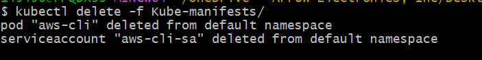
Remove:
- Pod Identity Association
- IAM Role
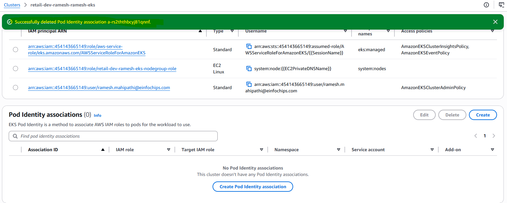


## Key Learning Outcomes

This section covered:

- Kubernetes Service Accounts
- Amazon EKS Pod Identity
- IAM Role association
- temporary AWS credentials
- secure Pod authentication
- DaemonSet architecture
- AWS SDK credential flow
- secure AWS access from Kubernetes Pods

---
## Author
Ramesh Mahipathi