# Install AWS Secrets and Configuration Provider (ASCP) for Amazon EKS

## Introduction

Applications running inside Kubernetes often require sensitive information such as:

- database passwords
- API keys
- access tokens
- encryption secrets

Traditionally, these values were stored using:
- Kubernetes Secrets
- ConfigMaps
- environment variables

However, in production environments, organizations usually store secrets in centralized secret management systems such as:

- AWS Secrets Manager
- AWS Systems Manager Parameter Store
- HashiCorp Vault

In this section, we configure Amazon EKS to securely retrieve secrets directly from AWS Secrets Manager using:

- Secrets Store CSI Driver
- AWS Secrets and Configuration Provider (ASCP)
- Amazon EKS Pod Identity

This eliminates the need to store sensitive credentials directly inside Kubernetes manifests.

## Why External Secret Management Matters

Storing secrets directly inside Kubernetes has several challenges:

- secrets are Base64 encoded, not encrypted by default
- secret rotation becomes difficult
- secrets may accidentally leak into Git repositories
- multiple applications may duplicate credentials
- centralized auditing becomes difficult

Using AWS Secrets Manager solves these problems by providing:

- centralized secret management
- IAM-based access control
- automatic rotation support
- auditing via CloudTrail
- secure runtime retrieval

## What We Will Build

In this demo, we will configure our EKS cluster so Pods can securely retrieve secrets from AWS Secrets Manager at runtime.

Architecture components:

- Secrets Store CSI Driver
- AWS Secrets and Configuration Provider (ASCP)
- EKS Pod Identity Agent
- IAM Role for Pod authentication
- AWS Secrets Manager
- Kubernetes ServiceAccount

The secret will be mounted inside the Pod filesystem dynamically.

## High-Level Architecture Flow

The overall authentication and secret retrieval flow works as follows:

1. Pod starts inside EKS
2. Pod uses Kubernetes ServiceAccount
3. EKS Pod Identity maps ServiceAccount → IAM Role
4. CSI Driver requests secrets from AWS Secrets Manager
5. ASCP authenticates using Pod Identity
6. Secret values are mounted into the Pod filesystem

## Core Components Explained

### Secrets Store CSI Driver

The CSI Driver allows Kubernetes Pods to mount secrets from external providers as volumes.

It acts as the bridge between:
- Kubernetes
- external secret systems

---

### AWS Secrets and Configuration Provider (ASCP)

ASCP is the AWS-specific provider for the CSI Driver.

It enables:
- AWS Secrets Manager integration
- Parameter Store integration

---

### EKS Pod Identity

Pod Identity provides temporary IAM credentials to Kubernetes Pods securely without static AWS keys.

---

### AWS Secrets Manager

AWS-managed service used for:
- secret storage
- secret rotation
- encryption
- auditing

## What is a CSI Driver?

CSI stands for:

```text
Container Storage Interface
```

CSI Drivers allow Kubernetes to integrate external storage systems dynamically.

Common CSI use cases:
- EBS volumes
- EFS volumes
- Azure disks
- Secret mounting

In this setup:
- secrets are mounted similarly to storage volumes
- Pods access secrets as files

## Why Secrets Are Mounted as Files Instead of Environment Variables

The Secrets Store CSI Driver mounts secrets as files because:

- files support automatic rotation
- large secrets are easier to manage
- avoids Pod restarts for some updates
- reduces environment variable exposure

Mounted secrets usually appear under paths like:

```text
/mnt/secrets-store/
```

## Learning Objectives

By completing this section, we will:

- install Helm repositories
- install the Secrets Store CSI Driver
- install the AWS Secrets Provider (ASCP)
- verify DaemonSets and Pods
- create IAM policies and roles
- configure EKS Pod Identity
- prepare EKS for runtime secret mounting

## Why We Use Helm

Helm is the package manager for Kubernetes.

Without Helm:
- multiple YAML manifests must be managed manually
- upgrades become difficult
- deployments are repetitive

With Helm:
- deployments become reusable
- configuration becomes template-driven
- upgrades and rollbacks are simplified

## Helm Benefits

Helm provides:

- reusable templates
- centralized configuration
- release management
- versioning
- rollback support
- simplified upgrades
- environment-specific values

## Verify Prerequisites

Before installing ASCP, ensure:

- EKS cluster is running
- kubectl is configured
- Helm is installed
- EKS Pod Identity Agent is installed
- worker nodes are healthy
- cluster version supports Pod Identity

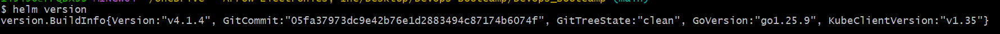
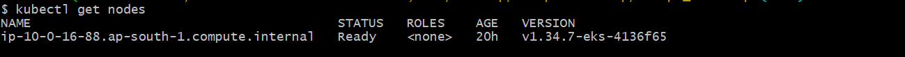

## Install Helm Repositories
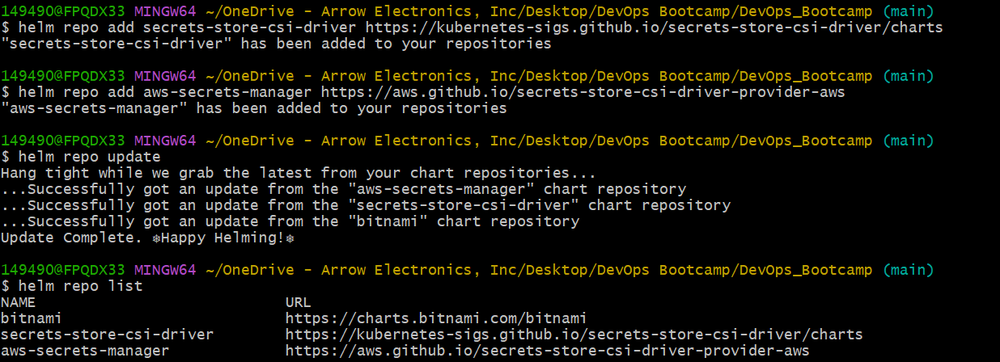

We add Helm repositories for:

- Secrets Store CSI Driver
- AWS Secrets Provider

This allows Helm to download Kubernetes packages directly from official repositories.

## Why Two Components Are Required

Two separate components are required:

| Component | Responsibility |
|---|---|
| CSI Driver | Mount framework |
| ASCP | AWS integration provider |

The CSI Driver alone cannot communicate with AWS Secrets Manager.

The AWS provider (ASCP) adds AWS-specific integration capabilities.

## Install Secrets Store CSI Driver
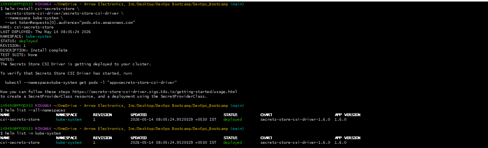

The CSI Driver is installed into the `kube-system` namespace.

This driver runs as a DaemonSet on worker nodes and handles:
- secret mounting
- volume integration
- communication with providers

Verify the installation
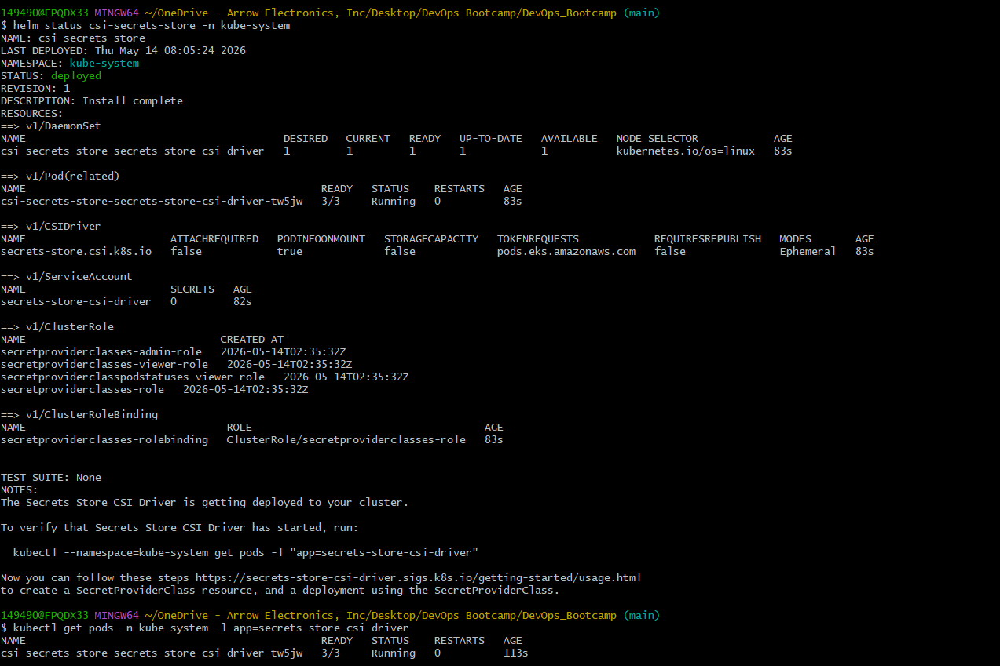

## Why the CSI Driver Uses a DaemonSet

The CSI Driver must run on every worker node because:
- Pods can run on any node
- secret mounting happens locally on nodes
- all nodes need access to the driver

This follows the same Kubernetes pattern used by:
- logging agents
- monitoring agents
- networking plugins

## Understanding the `pods.eks.amazonaws.com` Audience

The CSI Driver installation includes:

```bash
--set tokenRequests[0].audience="pods.eks.amazonaws.com"
```

This configures service account tokens specifically for EKS Pod Identity authentication.

Without this:
- Pods cannot authenticate properly
- secret retrieval fails
- Pod Identity integration breaks

## Install AWS Secrets and Configuration Provider (ASCP)
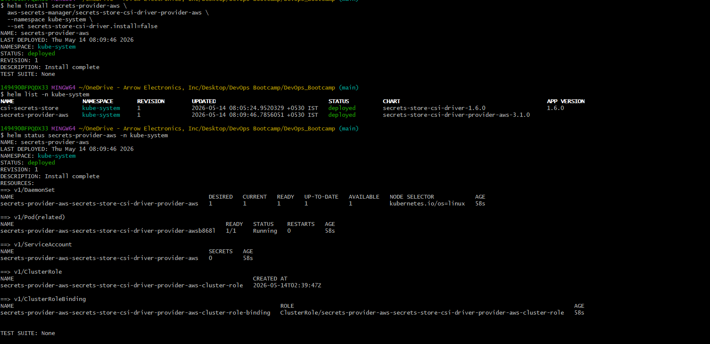

The AWS Provider connects the CSI Driver to:
- AWS Secrets Manager
- AWS Systems Manager Parameter Store

It handles:
- authentication
- AWS API calls
- secret retrieval

Verify Installation
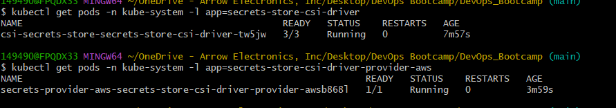

## Why `--set secrets-store-csi-driver.install=false` Is Required

The AWS provider Helm chart includes the CSI Driver as a dependency.

Since the CSI Driver was already installed separately, we disable duplicate installation to avoid:
- Helm ownership conflicts
- duplicate resources
- installation failures

## Verify Installation

After installation, verify:

- Pods are running
- DaemonSets are healthy
- Helm releases are installed
- no CrashLoopBackOff errors exist

## Troubleshooting

If Pods are not running correctly:

Check Pod status:

```bash
kubectl get pods -n kube-system
```

Check DaemonSets:

```bash
kubectl get daemonsets -n kube-system
```
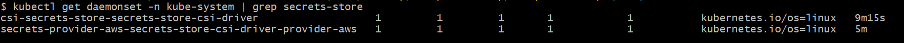

Check logs:

```bash
kubectl logs -n kube-system -l app=secrets-store-csi-driver-provider-aws
```
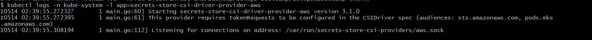

Describe resources:

```bash
kubectl describe daemonset -n kube-system
```
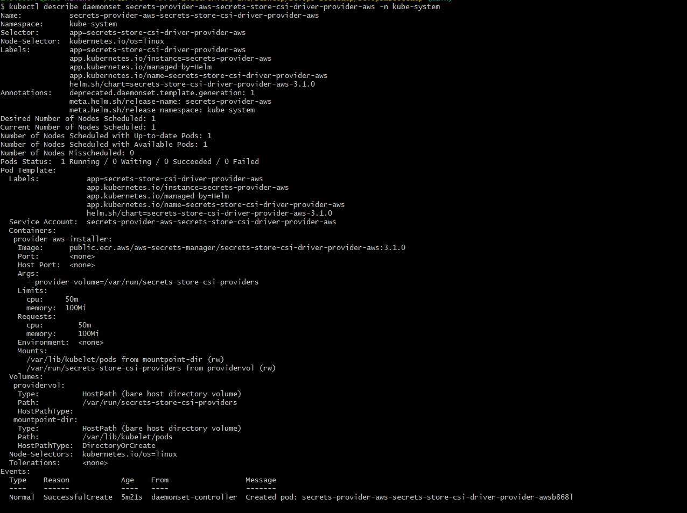

## IAM Integration for Secret Access

To allow Pods to access AWS Secrets Manager securely:

1. Create IAM Policy
2. Create IAM Role
3. Attach Policy to Role
4. Configure Pod Identity Association
5. Map Kubernetes ServiceAccount to IAM Role

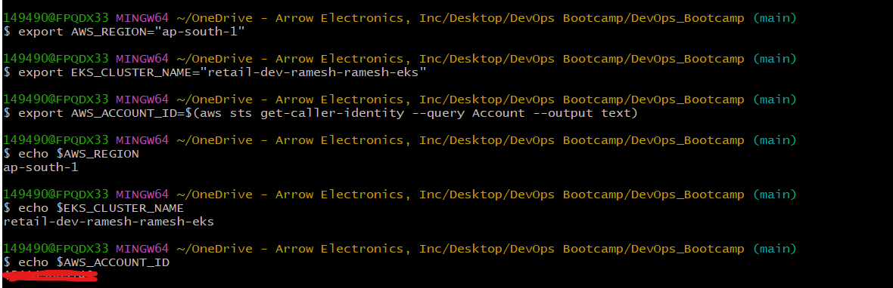
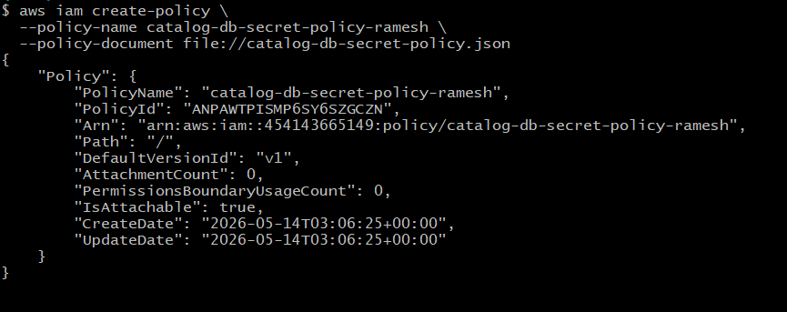
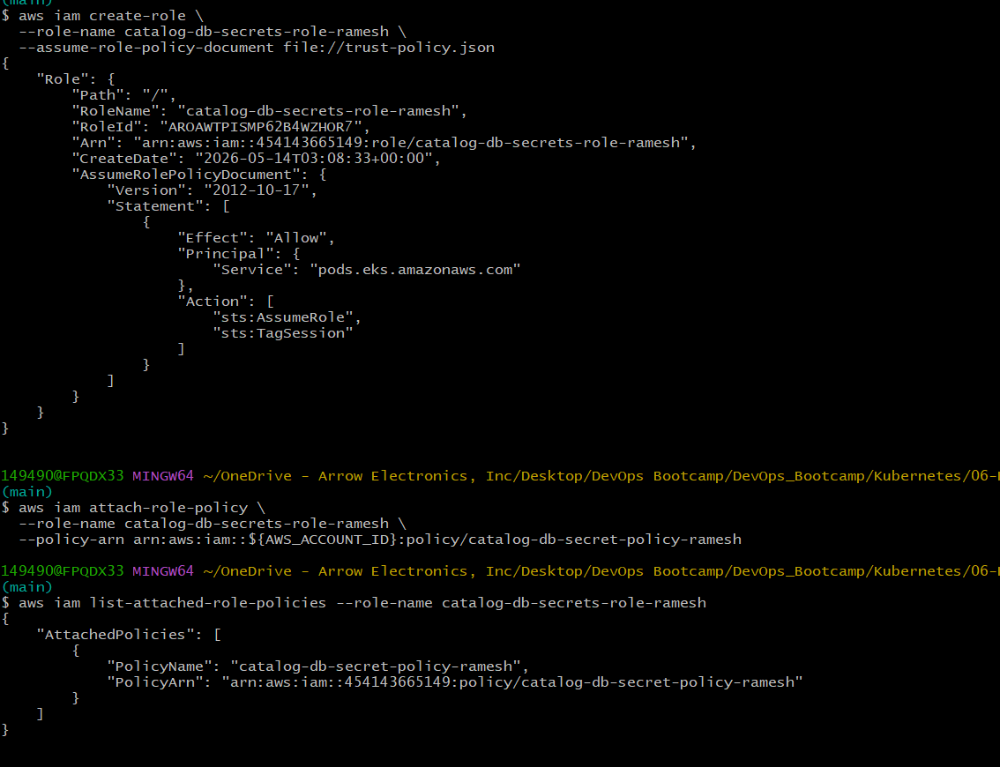
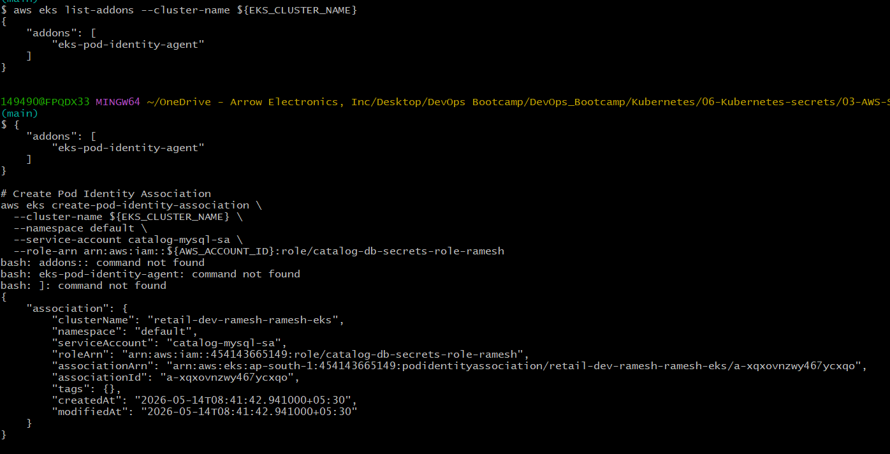
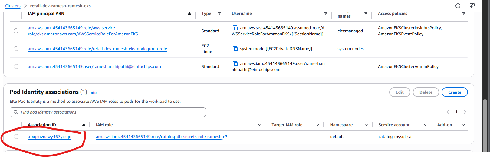
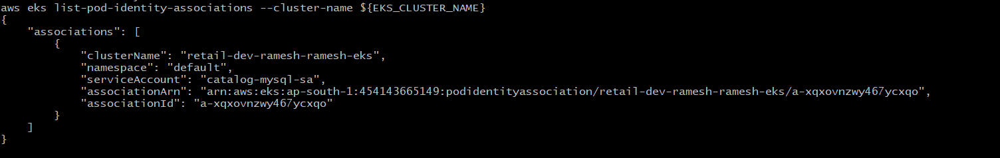

## Why We Scope Access to a Single Secret

The IAM policy grants access only to:

```text
catalog-db-secret
```

instead of all secrets.

This follows the security principle of:

```text
Least Privilege Access
```

Applications should receive only the permissions they absolutely require.

## Understanding the Trust Policy

The IAM trust policy allows:

```json
"Service": "pods.eks.amazonaws.com"
```

This enables:
- EKS Pod Identity
- to assume the IAM role
- on behalf of Kubernetes Pods

## Pod Identity Association

The Pod Identity Association connects:

```text
Kubernetes ServiceAccount
            ↓
IAM Role
```

This mapping allows Pods using the ServiceAccount to receive temporary AWS credentials automatically.

## Why Kubernetes ServiceAccounts Are Important

ServiceAccounts provide Pod identities inside Kubernetes.

In EKS Pod Identity:
- the ServiceAccount becomes the identity bridge
- AWS IAM permissions are attached indirectly
- Pods inherit permissions through the ServiceAccount

## Runtime Authentication Flow

```text
Pod
 ↓
ServiceAccount
 ↓
EKS Pod Identity
 ↓
IAM Role
 ↓
Temporary AWS Credentials
 ↓
ASCP
 ↓
AWS Secrets Manager
 ↓
Secret Mounted into Pod
```

## Security Benefits

This architecture improves security by:

- eliminating static AWS credentials
- avoiding hardcoded passwords
- using temporary IAM credentials
- centralizing secret management
- supporting audit logging
- enabling secret rotation

## Real-World Production Use Cases

This architecture is commonly used for:

- database passwords
- API tokens
- TLS certificates
- third-party credentials
- encryption keys
- SaaS integrations

## Key Learning Outcomes

This section covered:

- Secrets Store CSI Driver
- AWS Secrets Provider (ASCP)
- Helm-based deployments
- DaemonSets
- IAM Roles
- EKS Pod Identity
- ServiceAccount mappings
- runtime secret retrieval
- secure Kubernetes secret management

---
## Author
Ramesh Mahipathi