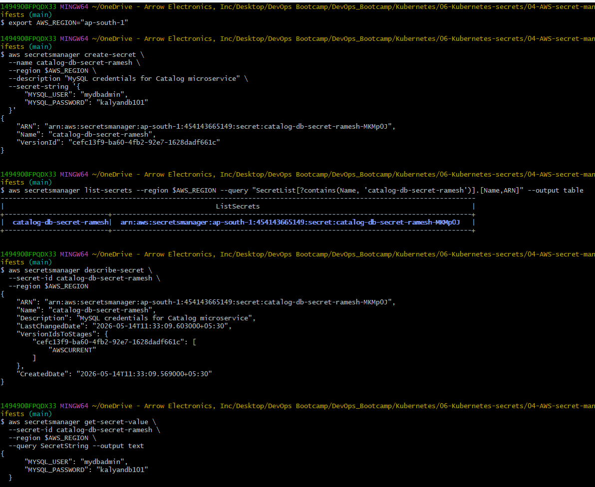
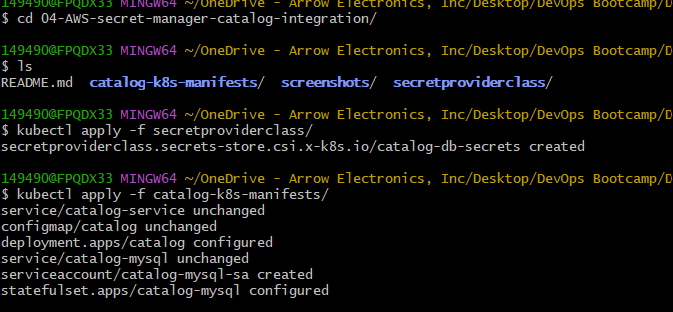
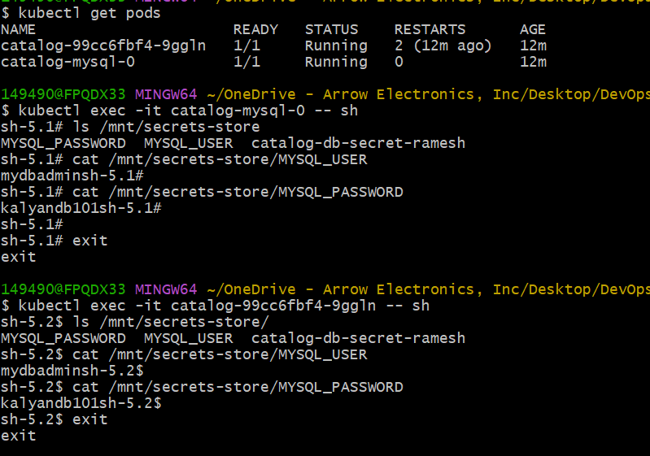

# Integrate AWS Secrets Manager with Catalog Microservice using EKS Pod Identity

## Introduction

In the previous section, we installed:

- Secrets Store CSI Driver
- AWS Secrets and Configuration Provider (ASCP)
- Amazon EKS Pod Identity

Now we will integrate those components with our Catalog microservice.

Instead of storing MySQL credentials inside:
- Kubernetes Secrets
- ConfigMaps
- environment variables

the application will securely retrieve secrets directly from AWS Secrets Manager at runtime.

This approach is commonly used in production environments because:
- credentials remain centralized in AWS
- no plaintext credentials exist inside Kubernetes
- Pods use temporary IAM credentials
- secret rotation becomes easier

## What We Will Build

In this section we will:

1. Create a secret in AWS Secrets Manager
2. Create a SecretProviderClass
3. Configure Pod Identity authentication
4. Mount secrets inside Pods using CSI volumes
5. Update MySQL StatefulSet to read secrets dynamically
6. Update Catalog Deployment to consume mounted secrets
7. Verify secret retrieval inside running containers

## Why This Architecture Matters

Traditional Kubernetes secret handling has limitations:

- secrets are stored inside etcd
- secrets may accidentally leak into Git repositories
- rotating secrets requires extra operational effort
- hardcoded credentials increase security risks

With AWS Secrets Manager integration:

- secrets stay outside Kubernetes
- Pods retrieve secrets only when needed
- IAM controls access centrally
- secret rotation becomes easier
- applications avoid static credentials

## High-Level Architecture Flow

The complete authentication and secret retrieval flow works like this:

```text
AWS Secrets Manager
        ↓
ASCP Provider
        ↓
Secrets Store CSI Driver
        ↓
Mounted Secret Files
        ↓
Kubernetes Pod
        ↓
Application Reads Secret Files
```

Authentication flow:

```text
Pod
 ↓
ServiceAccount
 ↓
EKS Pod Identity
 ↓
IAM Role
 ↓
Temporary AWS Credentials
 ↓
AWS Secrets Manager Access
```

## What is SecretProviderClass?

`SecretProviderClass` is a Kubernetes custom resource definition (CRD).

It tells the CSI Driver:

- which external secret provider to use
- which secrets to retrieve
- how secrets should be exposed inside the Pod

In this demo:
- provider = AWS
- source = AWS Secrets Manager
- authentication = EKS Pod Identity

## Why SecretProviderClass Is Required

The CSI Driver itself does not know:

- which secret to fetch
- where the secret exists
- how to authenticate

The SecretProviderClass acts like a configuration blueprint for secret retrieval.

## AWS Secrets Manager Secret Structure

Our AWS secret stores MySQL credentials in JSON format:

```json
{
  "MYSQL_USER": "mydbadmin",
  "MYSQL_PASSWORD": "kalyandb101"
}
```

This allows:
- structured secret storage
- easy parsing
- multiple secret fields inside a single secret object

## Why `jmesPath` Is Used

The AWS secret contains multiple JSON fields.

`jmesPath` extracts individual fields from the JSON secret.

Example:

```yaml
jmesPath:
  - path: "MYSQL_USER"
    objectAlias: "MYSQL_USER"
```

This creates mounted files like:

```text
/mnt/secrets-store/MYSQL_USER
/mnt/secrets-store/MYSQL_PASSWORD
```

## Why Secrets Are Mounted as Files

The Secrets Store CSI Driver mounts secrets as files instead of environment variables.

Benefits:
- supports runtime secret rotation
- reduces environment variable exposure
- avoids storing secrets in Pod specs
- easier integration with applications

## Understanding `usePodIdentity: "true"`

This setting tells ASCP to authenticate using:

```text
Amazon EKS Pod Identity
```

instead of:
- static AWS credentials
- node IAM roles
- IRSA

This provides:
- temporary credentials
- fine-grained IAM access
- improved security

## Why ServiceAccount Is Important

The Kubernetes ServiceAccount acts as the Pod identity inside the cluster.

The flow works like this:

```text
ServiceAccount
        ↓
Pod Identity Association
        ↓
IAM Role
        ↓
AWS Permissions
```

Pods using this ServiceAccount automatically inherit AWS permissions securely.

## Updating the MySQL StatefulSet

The MySQL StatefulSet was updated to:

- mount secrets from AWS Secrets Manager
- read credentials dynamically from mounted files
- avoid hardcoded database passwords

## Understanding the CSI Volume Mount

The StatefulSet now includes a CSI volume:

```yaml
csi:
  driver: secrets-store.csi.k8s.io
```

This volume allows:
- external secret mounting
- runtime secret retrieval
- communication with ASCP

## Why Mounted Secret Volumes Are Read-Only

The mounted secret volume uses:

```yaml
readOnly: true
```

This prevents:
- accidental modifications
- malicious secret tampering
- container-side secret corruption

## Runtime Secret Loading

Inside the container, the startup script reads secrets dynamically:

```bash
cat /mnt/secrets-store/MYSQL_USER
cat /mnt/secrets-store/MYSQL_PASSWORD
```

This means:
- credentials are retrieved only at runtime
- no credentials are baked into container images
- no Kubernetes Secret objects are required

## Updating the Catalog Deployment

The Catalog application Deployment was also updated to:

- mount secrets from AWS Secrets Manager
- read credentials dynamically
- authenticate securely to MySQL

## Why This Is More Secure Than Kubernetes Secrets

With Kubernetes Secrets:
- secrets are stored in etcd
- Base64 encoding is not encryption
- secrets exist inside the cluster

With AWS Secrets Manager integration:
- secrets remain stored only in AWS
- Pods retrieve them temporarily
- IAM controls access
- no secret duplication exists

## Zero-Trust Secret Architecture

This setup follows a zero-trust model:

- applications receive secrets only at runtime
- no long-term credentials exist
- access is IAM-controlled
- Pods receive least-privilege permissions

## Verifying Mounted Secrets

We verified the mounted files inside running Pods:

```bash
kubectl exec -it <pod-name> -- ls /mnt/secrets-store
```

Then verified actual secret contents:

```bash
kubectl exec -it <pod-name> -- cat /mnt/secrets-store/MYSQL_USER
```




This confirms:
- CSI Driver is working
- ASCP is retrieving secrets
- Pod Identity authentication succeeded

## Verifying the Catalog Application

After deployment:

- Catalog application successfully connected to MySQL
- MySQL credentials were retrieved dynamically
- application endpoints became accessible

## Why No Native Kubernetes Secret Was Created

This setup intentionally avoids creating native Kubernetes Secret objects.

Benefits:
- reduces secret duplication
- minimizes attack surface
- keeps secrets centralized in AWS
- improves compliance posture

## Verifying Database Connectivity

We connected to MySQL using a temporary MySQL client Pod and confirmed:

- database access works
- credentials are valid
- applications authenticate successfully
- runtime secret mounting works correctly

## Security Advantages of This Architecture

This implementation provides:

- centralized secret management
- IAM-based authorization
- temporary credentials
- reduced credential exposure
- improved auditability
- support for secret rotation
- zero hardcoded secrets

## Real-World Production Benefits

This architecture is widely used in enterprise Kubernetes platforms because it enables:

- secure workload identity
- centralized credential governance
- separation of duties
- compliance-friendly secret handling
- secure multi-environment deployments

## Important Operational Notes

### Secret Rotation

If secrets rotate in AWS Secrets Manager:
- mounted secret files can refresh automatically
- applications may require reload logic

---

### Pod Restart Behavior

Some applications read secrets only during startup.

In such cases:
- Pods may require restart after secret rotation

---

### IAM Least Privilege

Always scope IAM policies to:
- specific secrets
- specific applications
- minimal required permissions

## Troubleshooting

### Check SecretProviderClass

```bash
kubectl get secretproviderclass
```

---

### Check Mounted Volumes

```bash
kubectl describe pod <pod-name>
```

---

### Check CSI Driver Logs

```bash
kubectl logs -n kube-system -l app=secrets-store-csi-driver
```

---

### Check ASCP Provider Logs

```bash
kubectl logs -n kube-system -l app=secrets-store-csi-driver-provider-aws
```

---

### Verify Pod Identity Association

```bash
aws eks list-pod-identity-associations --cluster-name <cluster-name>
```

## Common Interview Questions

### Why use AWS Secrets Manager instead of Kubernetes Secrets?

AWS Secrets Manager provides:
- centralized secret storage
- IAM-based access control
- audit logging
- secret rotation support

---

### Why do we need SecretProviderClass?

It defines:
- which secrets to retrieve
- which provider to use
- how secrets are exposed inside Pods

---

### Why are secrets mounted as files?

Because:
- files support rotation better
- avoids exposing secrets in environment variables
- reduces accidental leaks

---

### What role does ASCP play?

ASCP acts as the AWS integration layer between:
- Kubernetes CSI Driver
- AWS Secrets Manager

---

### How does Pod Identity improve security?

Pod Identity:
- removes static AWS credentials
- uses temporary IAM credentials
- provides fine-grained permissions

---

### Why is readOnly=true important?

It prevents:
- secret modification
- accidental corruption
- malicious writes

## Final Summary

In this section we implemented a production-grade secret management architecture for Amazon EKS.

We successfully integrated:

- AWS Secrets Manager
- Secrets Store CSI Driver
- AWS Secrets and Configuration Provider (ASCP)
- Amazon EKS Pod Identity
- Kubernetes ServiceAccounts
- StatefulSets and Deployments

The Catalog application now retrieves MySQL credentials securely at runtime without storing plaintext secrets inside Kubernetes.

---
## Author
Ramesh Mahipathi