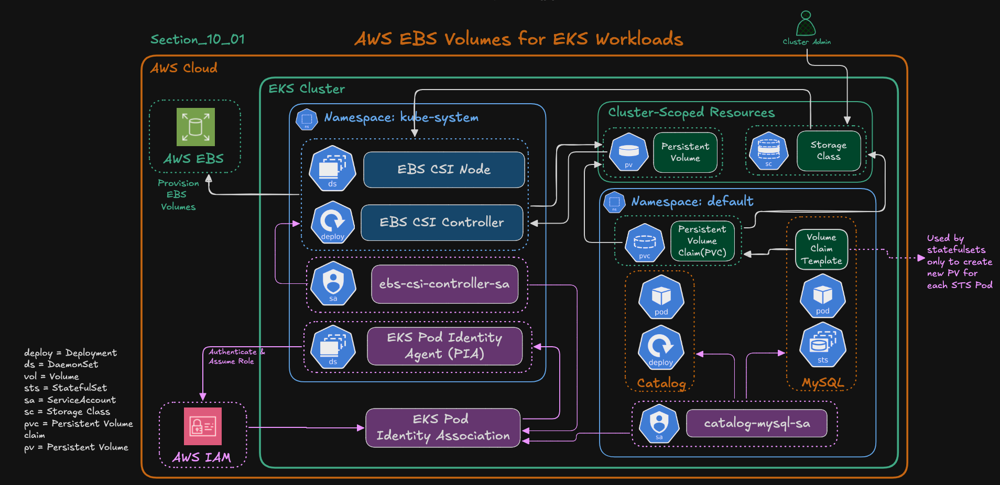
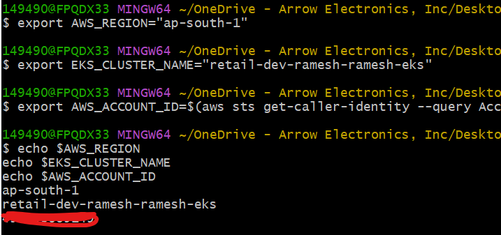
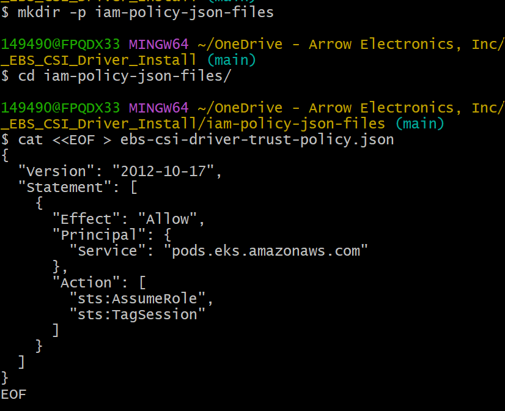
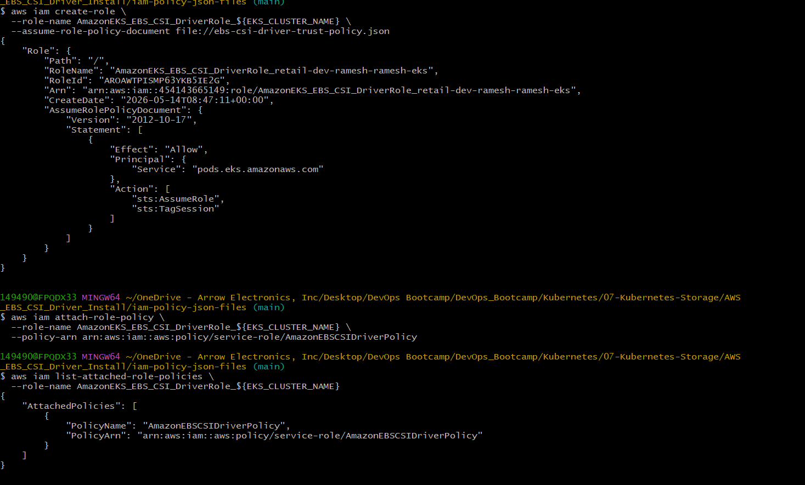
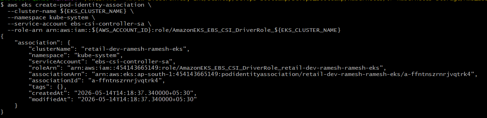
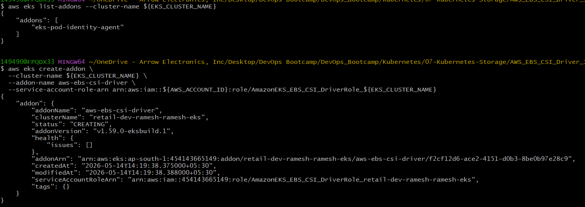
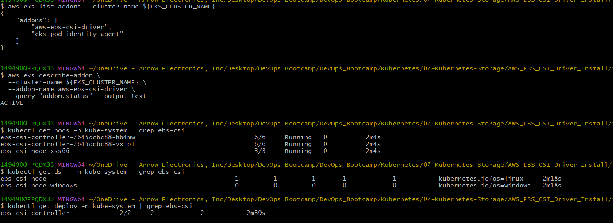

# Amazon EBS CSI Driver Install on EKS (with Pod Identity)

## Learning Objectives
In this section, we are going to understand how Kubernetes workloads running inside Amazon EKS can dynamically create and use Amazon EBS volumes using the Amazon EBS CSI Driver.

By the end of this section, we will:
1. Create a trust policy for the EBS CSI Driver IAM role.
2. Create an IAM Role and attach the required AWS-managed policy.
3. Configure EKS Pod Identity Association.
4. Install the Amazon EBS CSI Driver add-on.
5. Verify the installation using Kubernetes commands.

## What is Amazon EBS CSI Driver?
The Amazon EBS CSI Driver allows Kubernetes Pods running in EKS to use Amazon Elastic Block Store (EBS) volumes as persistent storage.

Without this driver:
- Kubernetes cannot directly communicate with AWS EBS.
- Pods cannot dynamically create or attach EBS volumes.

With the CSI Driver:
- Kubernetes can automatically provision EBS volumes.
- Volumes can persist even if Pods restart.
- Stateful applications like MySQL, PostgreSQL, MongoDB, etc., can safely store data.

## What is CSI?
CSI stands for:
- Container Storage Interface

It is a standard interface used by Kubernetes to communicate with storage providers.

Examples:
- AWS EBS CSI Driver
- AWS EFS CSI Driver
- Azure Disk CSI Driver
- Google Persistent Disk CSI Driver
CSI makes Kubernetes storage platform-independent.

## Why Do We Need Persistent Storage?
By default, containers are ephemeral.

That means:
- If Pod restarts → data is lost.
- If Pod gets deleted → data disappears.

Example:
If MySQL stores database files inside the container filesystem:
- Pod crash = database loss.

To solve this:
- We use Persistent Volumes backed by AWS EBS.

## AWS EBS CSI Driver Architecture


## Main Components
The EBS CSI setup contains multiple Kubernetes and AWS components working together.

### 1. EBS CSI Controller
Runs as a Deployment inside:
```bash
kube-system
```
Responsibilities:
- Creates EBS volumes
- Deletes EBS volumes
- Attaches volumes
- Detaches volumes
This component talks directly to AWS APIs.

### 2. EBS CSI Node
Runs as a DaemonSet.

Meaning:
- One Pod runs on every worker node.

Responsibilities:
- Mount EBS volumes onto worker nodes
- Make storage available to Pods

### 3. IAM Role
The CSI Driver needs AWS permissions like:
- ec2:CreateVolume
- ec2:AttachVolume
- ec2:DeleteVolume

So we create an IAM Role and attach:
```bash
AmazonEBSCSIDriverPolicy
```

### 4. Pod Identity Association

This securely connects:
```text
Kubernetes ServiceAccount
        ↓
IAM Role
```
So Pods can securely obtain temporary AWS credentials.

### 5. StorageClass
Defines:
- Storage type
- Provisioner
- Volume behavior

Example:
```yaml
provisioner: ebs.csi.aws.com
```

### 6. PersistentVolumeClaim (PVC)
Application requests storage using PVC.

Example:
```yaml
storage: 10Gi
```
Kubernetes dynamically creates an EBS volume.

---
## Flow of Storage Provisioning
### High-Level Workflow
```text
Application Pod
      ↓
PersistentVolumeClaim (PVC)
      ↓
StorageClass
      ↓
EBS CSI Controller
      ↓
AWS EBS Volume Created
      ↓
EBS CSI Node mounts volume
      ↓
Pod uses persistent storage
```

---
## Install Amazon EBS CSI Driver (AWS CLI Method)

### Step-01: Export Environment Variables
```bash
# Replace the placeholders below with your actual values
export AWS_REGION="us-east-1"
export EKS_CLUSTER_NAME="retail-dev-eksdemo1"
export AWS_ACCOUNT_ID=$(aws sts get-caller-identity --query Account --output text)

# Confirm values
echo $AWS_REGION
echo $EKS_CLUSTER_NAME
echo $AWS_ACCOUNT_ID
```


- We are creating reusable shell variables.
- This avoids typing long values repeatedly.

### Step-02: Create Trust Policy File
```bash
mkdir -p iam-policy-json-files
cd iam-policy-json-files
```
trust-policy.json
```bash
cat <<EOF > ebs-csi-driver-trust-policy.json
{
  "Version": "2012-10-17",
  "Statement": [
    {
      "Effect": "Allow",
      "Principal": {
        "Service": "pods.eks.amazonaws.com"
      },
      "Action": [
        "sts:AssumeRole",
        "sts:TagSession"
      ]
    }
  ]
}
EOF
```


Why Pod Identity?
Traditionally EKS used:
- IRSA (IAM Roles for Service Accounts)

Now AWS recommends:
- EKS Pod Identity

Benefits:
- Simpler
- Better management
- Easier scaling
- Centralized authentication

### Step-03: Create IAM Role and Attach Policy
```bash
# Create IAM Role
aws iam create-role \
  --role-name AmazonEKS_EBS_CSI_DriverRole_${EKS_CLUSTER_NAME} \
  --assume-role-policy-document file://ebs-csi-driver-trust-policy.json

# Attach IAM Policy to IAM Role
aws iam attach-role-policy \
  --role-name AmazonEKS_EBS_CSI_DriverRole_${EKS_CLUSTER_NAME} \
  --policy-arn arn:aws:iam::aws:policy/service-role/AmazonEBSCSIDriverPolicy

# Verify:
aws iam list-attached-role-policies \
  --role-name AmazonEKS_EBS_CSI_DriverRole_${EKS_CLUSTER_NAME}
```


### Step-04: Create Pod Identity Association
```bash
# Create EKS Pod Identity Association
aws eks create-pod-identity-association \
  --cluster-name ${EKS_CLUSTER_NAME} \
  --namespace kube-system \
  --service-account ebs-csi-controller-sa \
  --role-arn arn:aws:iam::${AWS_ACCOUNT_ID}:role/AmazonEKS_EBS_CSI_DriverRole_${EKS_CLUSTER_NAME}
```


#### Explanation:
This is one of the most important steps.

we are binding
```text
IAM Role
      ↕
Kubernetes ServiceAccount
```

#### What Happens Here?

The ServiceAccount:
```text
The ServiceAccount:
```

inside:
```text
kube-system
```
gets permission to use the IAM Role.

#### Why Is This Needed?
The EBS CSI Controller Pod must call AWS APIs.

Examples:
- Create EBS volumes
- Attach volumes
- Delete volumes

Without IAM permissions:
- Storage provisioning fails.

## Authentication Flow
```text
EBS CSI Controller Pod
        ↓
ServiceAccount
        ↓
Pod Identity Association
        ↓
IAM Role
        ↓
Temporary AWS Credentials
        ↓
AWS EBS APIs
```

---
### Step-05: Install the EBS CSI Driver Add-on
```bash
Step-02-05: Install the EBS CSI Driver Add-on
```
This installs the AWS-managed EBS CSI Driver add-on into the cluster.

### What Gets Created Automatically?
AWS deploys:
| Component          | Type       |
| ------------------ | ---------- |
| ebs-csi-controller | Deployment |
| ebs-csi-node       | DaemonSet  |

### Why Use AWS Managed Add-on?
Advantages:
- Easier upgrades
- AWS-managed lifecycle
- Better compatibility
- Reduced manual work

### Difference Between Deployment and DaemonSet
| Deployment                   | DaemonSet                    |
| ---------------------------- | ---------------------------- |
| Runs selected number of Pods | Runs one Pod per node        |
| Used for controllers         | Used for node-level services |

### EBS CSI Controller
Usually only a few replicas needed.

### EBS CSI Node
Must run on every worker node because mounting happens locally on nodes.



---
### Step-06: Verify Installation
```bash
# List EKS add-ons (after install)
aws eks list-addons --cluster-name ${EKS_CLUSTER_NAME}

# Describe Addon - Verify Status
aws eks describe-addon \
  --cluster-name ${EKS_CLUSTER_NAME} \
  --addon-name aws-ebs-csi-driver \
  --query "addon.status" --output text
```


---
## Summary
| Component                | Purpose                             |
| ------------------------ | ----------------------------------- |
| IAM Role                 | Grants AWS permissions              |
| AmazonEBSCSIDriverPolicy | Allows EBS operations               |
| Pod Identity Association | Connects ServiceAccount to IAM Role |
| EKS Add-on               | Deploys EBS CSI components          |
| Controller               | Manages EBS lifecycle               |
| Node Plugin              | Mounts volumes on worker nodes      |
| StorageClass             | Defines storage provisioning        |
| PVC                      | Requests persistent storage         |

---
## Key Takeaways
1. Kubernetes itself cannot create AWS EBS volumes directly.
2. CSI Driver acts as the bridge between Kubernetes and AWS storage.
3. EBS CSI Controller communicates with AWS APIs.
4. EBS CSI Node mounts storage onto worker nodes.
5. Pod Identity securely provides AWS credentials to Pods.
6. Persistent storage is critical for stateful applications.

---
## Author
Ramesh Mahipathi