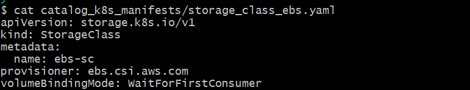
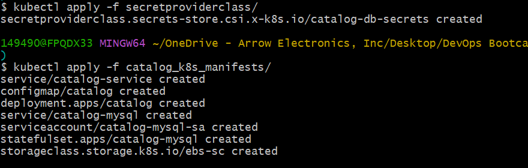
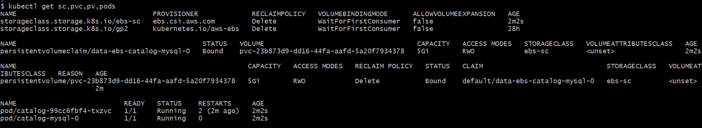
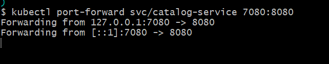
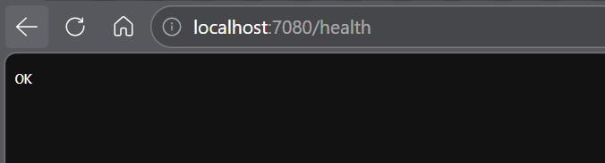
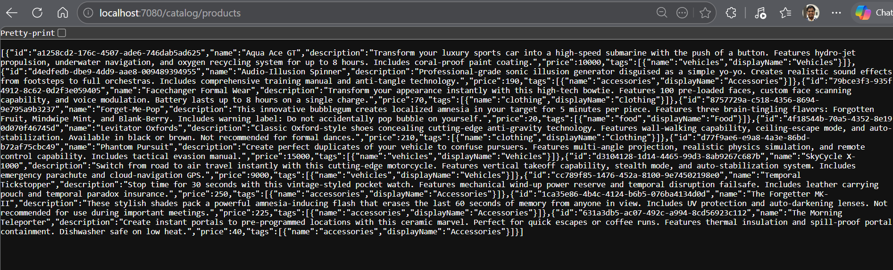
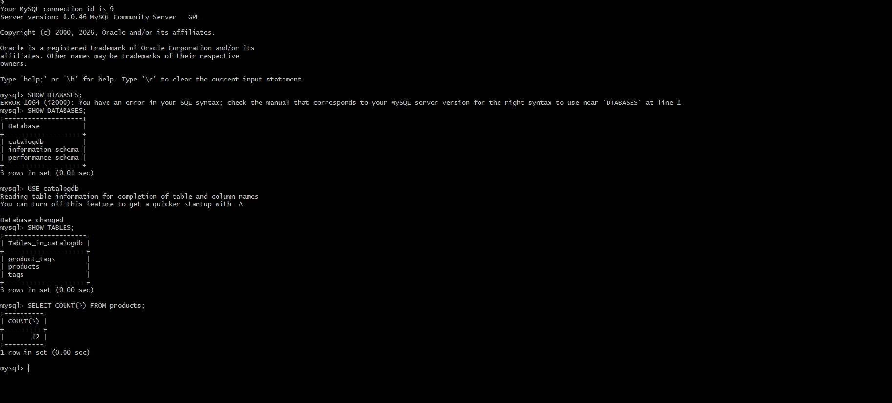
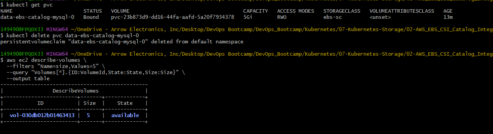
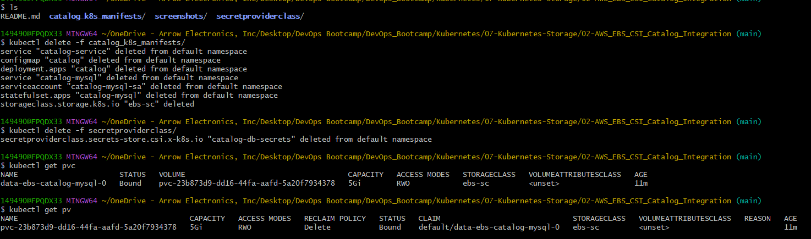

# AWS EBS CSI Integration for Catalog Microservice

## Learning Objectives
By the end of this section, we will:
- Integrate Amazon EBS CSI Driver with the Catalog MySQL StatefulSet
- Create a StorageClass backed by Amazon EBS volumes
- Replace emptyDir storage with real persistent storage
- Verify database persistence across Pod restarts
- Understand the EBS volume lifecycle
- Understand how Pod Identity and AWS Secrets Manager work together with persistent storage

## Big Picture Understanding
In the previous section:
- We installed the Amazon EBS CSI Driver.
- We configured IAM Role and Pod Identity.
- We enabled EKS to dynamically create EBS volumes.

In this section:
- We will actually use the CSI Driver in a real application.

## Current Problem
Previously MySQL was likely using:
```bash
emptyDir:
```

Problem with emptyDir:
| Event          | Result    |
| -------------- | --------- |
| Pod Restart    | Data Lost |
| Node Failure   | Data Lost |
| Pod Reschedule | Data Lost |
This is NOT suitable for databases.

## Solution
We will now use:
```text
PersistentVolumeClaim (PVC)
        ↓
StorageClass
        ↓
Amazon EBS Volume
```

This provides:
- Persistent storage
- Automatic EBS provisioning
- Data survival after Pod restart
- Production-grade database storage

## Architecture Flow
```text
MySQL StatefulSet
       ↓
volumeClaimTemplate
       ↓
PersistentVolumeClaim (PVC)
       ↓
StorageClass (ebs-sc)
       ↓
EBS CSI Driver
       ↓
AWS EBS Volume Created
       ↓
Mounted into Pod at /var/lib/mysql
```

---
## Step 1 – Create StorageClass for Amazon EBS
```yaml
apiVersion: storage.k8s.io/v1
kind: StorageClass
metadata:
  name: ebs-sc
provisioner: ebs.csi.aws.com
volumeBindingMode: WaitForFirstConsumer
```


### A StorageClass defines:
“How Kubernetes should provision storage.”

1. apiVersion
```yaml
storage.k8s.io/v1
```
This is the Kubernetes Storage API group.

2. kind
```yaml
StorageClass
```
Creates a StorageClass resource.

3. metadata.name
```yaml
ebs-sc
```
This becomes the StorageClass name.

PVCs will later reference this.

4. provisioner
```yaml
ebs.csi.aws.com
```
Very important field.

This tells Kubernetes:
- “Use AWS EBS CSI Driver for storage provisioning.”

Without this:
- Kubernetes does not know which storage backend to use.

5. volumeBindingMode
```yaml
WaitForFirstConsumer
```
This is extremely important in cloud environments.

### What Does WaitForFirstConsumer Mean?
Kubernetes waits until:
- A Pod is scheduled onto a node
BEFORE creating the EBS volume.

### Why Is This Important?
Amazon EBS volumes are:
- Availability Zone specific.

Example:
```text
Worker Node → us-east-1a
```
The EBS volume must also be created in:
```text
us-east-1a
```
If Kubernetes creates volume too early:
- Wrong AZ may be selected
- Pod scheduling can fail

### Benefits
| Benefit             | Explanation                  |
| ------------------- | ---------------------------- |
| Better scheduling   | Volume created in correct AZ |
| Prevents failures   | Avoids zone mismatch         |
| Recommended for EKS | AWS best practice            |

### Default Reclaim Policy
If not specified:
```text
Delete
```
Meaning:
- When PVC is deleted
- EBS volume is automatically deleted

---
## Step 2 – Update MySQL StatefulSet to Use EBS Storage
```yaml
apiVersion: apps/v1
kind: StatefulSet
metadata:
  name: catalog-mysql
  labels:
    app.kubernetes.io/name: catalog
    app.kubernetes.io/instance: catalog
    app.kubernetes.io/component: mysql
    app.kubernetes.io/owner: retail-store-sample
spec:
  replicas: 1
  serviceName: catalog-mysql
  selector:
    matchLabels:
      app.kubernetes.io/name: catalog
      app.kubernetes.io/instance: catalog
      app.kubernetes.io/component: mysql
      app.kubernetes.io/owner: retail-store-sample
  template:
    metadata:
      labels:
        app.kubernetes.io/name: catalog
        app.kubernetes.io/instance: catalog
        app.kubernetes.io/component: mysql
        app.kubernetes.io/owner: retail-store-sample
    spec:
      serviceAccount: catalog-mysql-sa # Service Account    
      containers:
        - name: mysql
          image: "public.ecr.aws/docker/library/mysql:8.0"
          imagePullPolicy: IfNotPresent
          ports:
            - name: mysql
              containerPort: 3306
              protocol: TCP          
          env:
            - name: MYSQL_ROOT_PASSWORD
              value: my-secret-pw
            - name: MYSQL_DATABASE
              value: catalogdb
          command: ["/bin/bash", "-c"]
          args:
            - |
              export MYSQL_USER=$(cat /mnt/secrets-store/MYSQL_USER);
              export MYSQL_PASSWORD=$(cat /mnt/secrets-store/MYSQL_PASSWORD);
              echo "Loaded secrets from AWS Secrets Manager. Starting MySQL with user=$MYSQL_USER";
              exec docker-entrypoint.sh mysqld          
          volumeMounts:
            - name: data
              mountPath: /var/lib/mysql
            - name: aws-secrets
              mountPath: /mnt/secrets-store
              readOnly: true              
      volumes:
        #- name: data
        #  emptyDir: {}
        - name: aws-secrets
          csi:
            driver: secrets-store.csi.k8s.io
            readOnly: true
            volumeAttributes:
              secretProviderClass: "catalog-db-secrets"          
# Added for provisioning EBS Volumes              
  volumeClaimTemplates:
    - metadata:
        name: data-ebs
      spec:
        accessModes: ["ReadWriteOnce"]
        resources:
          requests:
            storage: 10Gi
        storageClassName: ebs-sc   
```

### Why StatefulSet?
StatefulSets are designed for:
- Databases
- Stateful applications
- Stable network identity
- Persistent storage

### What is volumeClaimTemplates?
This is one of the most important StatefulSet features.
For every Pod created:
Kubernetes automatically creates:
```text
PVC → PV → EBS Volume
```

### Example
If StatefulSet replicas = 3

Kubernetes creates:
| Pod     | PVC          |
| ------- | ------------ |
| mysql-0 | data-mysql-0 |
| mysql-1 | data-mysql-1 |
| mysql-2 | data-mysql-2 |
Each Pod gets its own dedicated EBS volume.

### What happen internally
When the statefulset is created:
```text
StatefulSet
      ↓
PVC Created
      ↓
StorageClass Used
      ↓
EBS CSI Driver Called
      ↓
AWS EBS Volume Created
      ↓
PV Automatically Bound
      ↓
Volume Mounted into Pod
```

---
## Step 3 – Deploy and Verify Resources
```bash
kubectl apply -f 01_secretproviderclass/
kubectl apply -f 02_catalog_k8s_manifests/
```


Verify resources created:
```bash
kubectl get sc,pvc,pv,pods
```


## Step 4 – Test Application Connectivity
```bash
kubectl port-forward svc/catalog-service 7080:8080
```


health and products check
```text
http://localhost:7080/health
http://localhost:7080/catalog/products
```



## Step 5 – Verify Database Persistence
```bash
kubectl run mysql-client --rm -it \
  --image=mysql:8.0 \
  --restart=Never \
  -- mysql -h catalog-mysql -u mydbadmin -p
```



### What Are We Verifying?
We are verifying:
- Database exists
- Tables exist
- Product data exists
- Data is successfully stored

Data is now stored on:
- Amazon EBS Volume

NOT inside container filesystem.
---
## Step 6 – Delete Pod and Verify Data Persistence
```bash
kubectl delete pod catalog-mysql-0
kubectl get pods -w
```


This simulates:
- Pod crash
- Node failure
- Container restart

### What Happens?
Kubernetes automatically recreates the Pod.

Because this is a StatefulSet:
- Same Pod identity reused
- Same PVC reused
- Same EBS volume reattached

### important statefulset behavior
```text
catalog-mysql-0
       ↓
PVC remains
       ↓
EBS Volume remains
       ↓
New Pod mounts same volume
       ↓
Data preserved
```

## Step 7 – Validate EBS Volume Lifecycle

Delete Kubernetes resources
```bash
kubectl delete -f 02_catalog_k8s_manifests/
kubectl delete -f 01_secretproviderclass/
```

Verify PVC and PV
```bash
kubectl get pvc
kubectl get pv
```


Deletes:
- Deployments
- StatefulSets
- Services
- Pods

BUT:
- PVC may still remain.

### EBS volume remains until PVC is deleted.

Why?
PVC is the ownership reference.

As long as PVC exists:
- Kubernetes preserves storage.

## Delete PVC
```bash
kubectl delete pvc data-catalog-mysql-0
```


### What happens internally
```text
PVC Deleted
      ↓
PV Released
      ↓
StorageClass Reclaim Policy = Delete
      ↓
EBS CSI Driver calls AWS
      ↓
EBS Volume Deleted
```

---
## Summary: EBS CSI Persistenct Storage
| Component            | Purpose                               |
| -------------------- | ------------------------------------- |
| EBS CSI Driver       | Integrates Kubernetes with AWS EBS    |
| StorageClass         | Defines dynamic provisioning behavior |
| StatefulSet          | Provides stable persistent Pods       |
| volumeClaimTemplates | Automatically creates PVCs            |
| PVC                  | Requests storage                      |
| PV                   | Actual storage resource               |
| EBS Volume           | Physical AWS storage                  |
| Pod Identity         | Secure AWS authentication             |
| Secrets Store CSI    | Mounts AWS Secrets Manager secrets    |

---
## Complete Storage Lifecycle
```text
StatefulSet
      ↓
volumeClaimTemplate
      ↓
PVC Created
      ↓
StorageClass Used
      ↓
EBS Volume Provisioned
      ↓
Mounted to Pod
      ↓
Data Stored Persistently
      ↓
Pod Restart
      ↓
Same Volume Reattached
      ↓
Data Survives
```

---
## Key Takeaways
1. emptyDir is temporary storage.
2. EBS provides persistent storage.
3. StorageClass enables dynamic provisioning.
4. StatefulSets are ideal for databases.
5. volumeClaimTemplates automatically create per-Pod storage.
6. PVC deletion controls EBS cleanup.
7. EBS volumes survive Pod restarts.
8. CSI Drivers extend Kubernetes storage capabilities.
9. Pod Identity securely provides AWS access to Pods.

---
## Author
Ramesh Mahipathi