# Amazon RDS MySQL Database Integration with Catalog Microservice
## Introduction
In this section, we will integrate our Catalog microservice with an:
```text
Amazon RDS MySQL Database
```
instead of using the in-cluster MySQL StatefulSet used in previous sections.

## Learning Objectives
By the end of this section, we will be able to:

1. Connect a Kubernetes application to an Amazon RDS MySQL database.
2. Replace in-cluster MySQL StatefulSet with a private RDS endpoint.
3. Use AWS Secrets Manager with Secrets Store CSI Driver securely.
4. Configure Kubernetes ExternalName Service for DNS-based access.
5. Verify connectivity between Catalog microservice and Amazon RDS.

## Why Move from StatefulSet MySQL to Amazon RDS?
In previous sections:
```text
Kubernetes StatefulSet + MySQL
```
worked well for learning Kubernetes storage concepts.

But in real production environments, managing databases inside Kubernetes introduces operational complexity.

## Challenges of Running Databases Inside Kubernetes
| Challenge         | Explanation                                  |
| ----------------- | -------------------------------------------- |
| Backups           | Need manual backup strategies                |
| Patching          | DB engine updates become your responsibility |
| Replication       | Manual HA/replica setup                      |
| High Availability | Complex failover management                  |
| Recovery          | Disaster recovery becomes difficult          |
| Scaling           | Harder operational scaling                   |
| Monitoring        | Requires additional tooling                  |


## Why Amazon RDS?
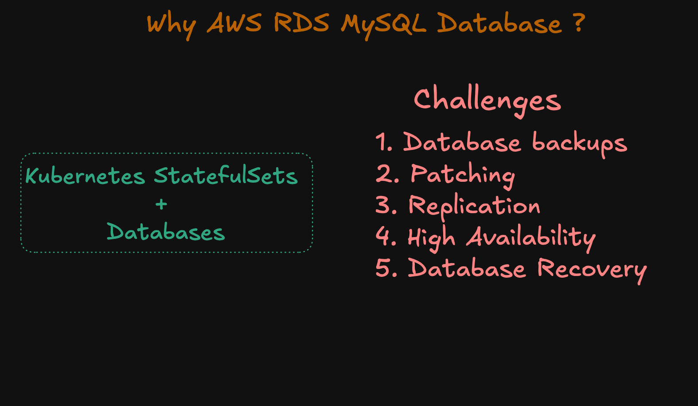

Amazon RDS provides:
| Feature           | Benefit                    |
| ----------------- | -------------------------- |
| Automated Backups | Point-in-time recovery     |
| Managed Patching  | AWS handles updates        |
| Multi-AZ Support  | High availability          |
| Read Replicas     | Scaling reads              |
| Monitoring        | CloudWatch integration     |
| Security          | IAM + SG + encryption      |
| Reliability       | AWS-managed infrastructure |


## Production Architecture

Instead of:
```text
Catalog Pod
      ↓
In-cluster MySQL Pod
```

We now use:
```text
Catalog Pod
      ↓
ExternalName Service
      ↓
Amazon RDS Endpoint
      ↓
RDS MySQL Database
```

## Architecture
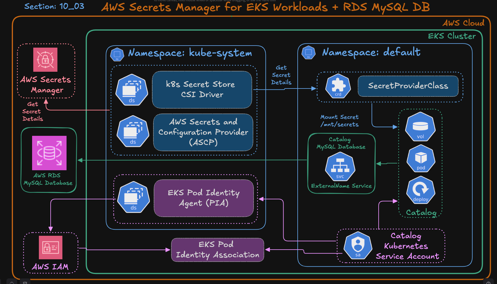
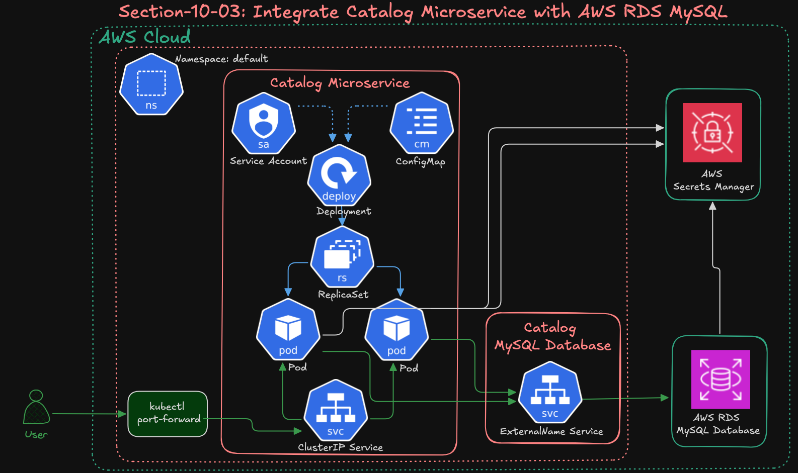

### 1. Catalog Microservice
Runs inside EKS cluster.

Responsibilities:
- Serves API requests
- Reads/Writes product data
- Connects to RDS database

### 2. Amazon RDS MySQL
Managed database service hosted by AWS.

Benefits:
- Fully managed
- Durable storage
- Automated maintenance

### 3. AWS Secrets Manager
Stores database credentials securely.

Instead of hardcoding:
```yaml
MYSQL_PASSWORD: mypassword
```
Secrets are retrieved dynamically at runtime.

### 4. Secrets Store CSI Driver
Mounts secrets securely into Pods.

### 5. EKS Pod Identity
Allows Pods to securely access AWS services without static AWS keys.

### 6. ExternalName Service
Provides Kubernetes-native DNS name for external RDS endpoint.

---
## High-Level Traffic flow
```text
User
   ↓
Catalog Service
   ↓
Catalog Pod
   ↓
ExternalName Service
   ↓
Amazon RDS Endpoint
   ↓
RDS MySQL Database
```

## Secret Retieval flow
```text
Catalog Pod
      ↓
ServiceAccount
      ↓
Pod Identity Association
      ↓
IAM Role
      ↓
AWS Secrets Manager
      ↓
Secrets Store CSI Driver
      ↓
Secrets mounted into Pod
```

---
## Create Amazon RDS Database

### Step-01: Create Security Group for RDS
Objective: Allow traffic from EKS cluster to RDS MySQL instance securely.

#### Get EKS Cluster Security Group
```bash
aws eks describe-cluster \
  --name retail-dev-eksdemo1 \
  --query "cluster.resourcesVpcConfig.clusterSecurityGroupId" \
  --output text
```

#### Why Do We Need This?
We will use this Security Group as the inbound source for RDS.

Meaning:
- Only EKS workloads can access RDS

This is much safer than opening database access publicly.

#### Create RDS Security Group
```text
EC2 → Security Groups → Create security group
```

#### Recommended Settings
| Setting      | Value                      |
| ------------ | -------------------------- |
| Name         | rds-mysql-sg               |
| VPC          | Same VPC as EKS            |
| Inbound Type | MySQL/Aurora (3306)        |
| Source       | EKS Cluster Security Group |
| Outbound     | Allow All                  |


Use:
```text
EKS Security Group
```
as inbound source

MySQL default port:
```text
3306
```

### Step-02: Create DB Subnet Group

#### Why DB Subnet Group?
RDS requires subnet selection for deployment.

A DB Subnet Group defines:
- Which subnets RDS can use
- Multi-AZ placement
- Private networking

From AWS Console:
```text
RDS → Subnet groups → Create DB subnet group
```
#### Configuration
| Setting | Value                           |
| ------- | ------------------------------- |
| Name    | rds-private-subnets             |
| VPC     | Same EKS VPC                    |
| Subnets | Private subnets in multiple AZs |

#### Why Private Subnets?
Best pracice:
```text
Databases should not be publicly accessible
```

#### Multi-AZ Importance
Using at least 2 AZs improves:
- Availability
- Failover capability
- Reliability


### Step-03: Create RDS MySQL Instance

#### From AWS Console:
```text
RDS → Databases → Create database
```

#### Configuration:
| Setting         | Value                |
| --------------- | -------------------- |
| Engine          | MySQL 8.0            |
| Template        | Free tier / Dev-Test |
| DB Identifier   | mydb3                |
| Master Username | mydbadmin            |
| Password        | kalyandb101          |
| Instance Class  | db.t3.micro          |
| Public Access   | No                   |
| Security Group  | rds-mysql-sg         |

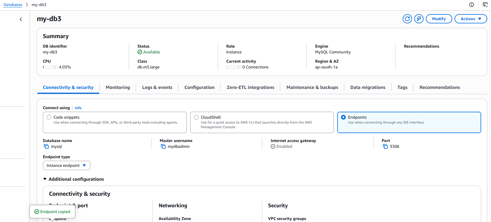

---
### Step-04: Connect to RDS and Create Database Schema

Objective: Initialize the database.

```bash
kubectl run mysql-client --rm -it \
  --image=mysql:8.0 \
  --restart=Never \
  -- mysql -h mydb3.cxojydmxwly6.us-east-1.rds.amazonaws.com -u mydbadmin -p
```

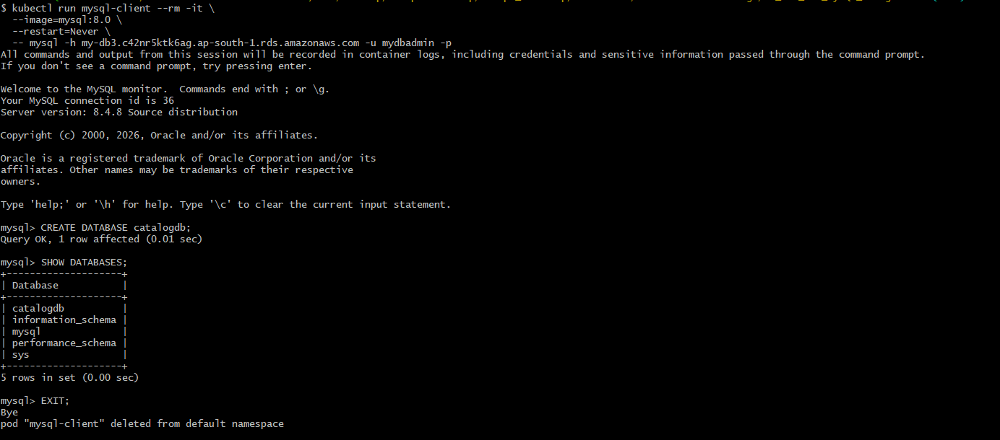

This launches a temporary Pod inside the cluster.

Benefits:
- Tests cluster-to-RDS connectivity
- Verifies Security Groups
- Verifies DNS resolution

### Step-05: Update Kubernetes Manifests

Previously:
```text
MySQL StatefulSet existed inside Kubernetes
```
Now:
```text
MySQL exists externally in Amazon RDS
```

We replace:
```text
Cluster-internal MySQL Service
```
with:
```text
ExternalName Service
```

#### What is ExternalName Service?
A Kubernetes Service type that maps DNS internally.

Instead of routing traffic directly:
- It returns a DNS CNAME record.

## Step-06: Deploy Resources
```bash
# Deploy Secret Provider Class
kubectl apply -f 01_secretproviderclass/

# Deploy Catalog Application
kubectl apply -f 02_catalog_k8s_manifests
```
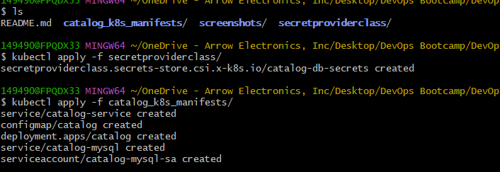

## Step-07: Verify Setup
```bash
kubectl logs -f deploy/catalog
```
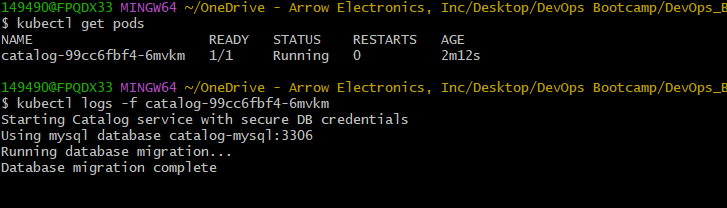

## Step-08: Verify Application Endpoints
### Port Forward
```bash
kubectl port-forward svc/catalog-service 7080:8080
```
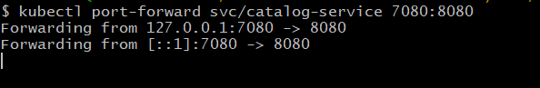

### Test URLs
```bash
http://localhost:7080/health
http://localhost:7080/catalog/topology
http://localhost:7080/catalog/products
http://localhost:7080/catalog/tags
http://localhost:7080/catalog/size
```

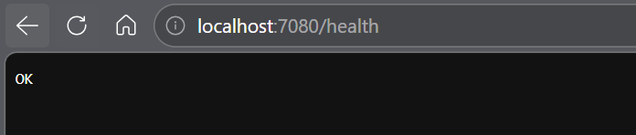
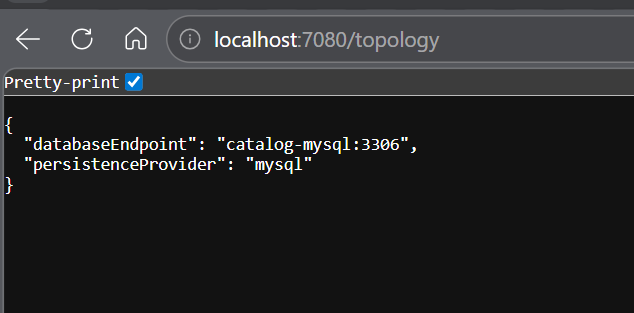
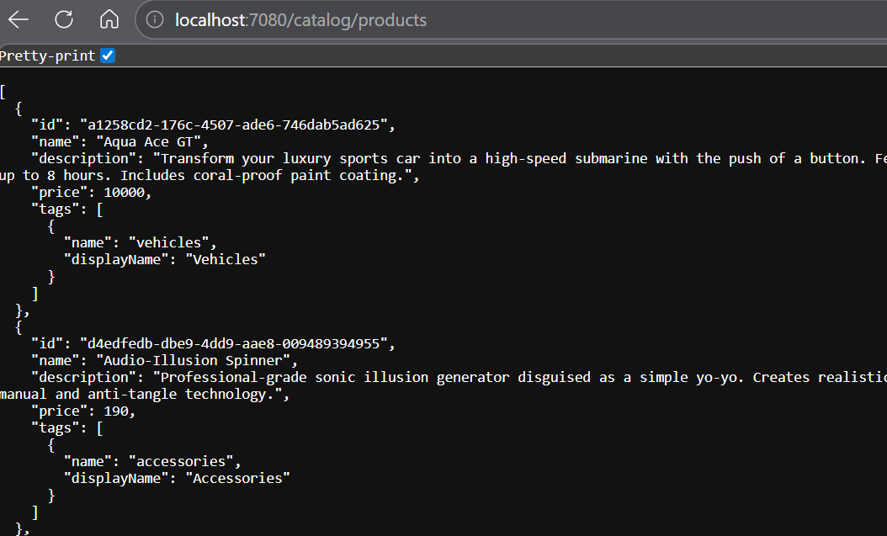
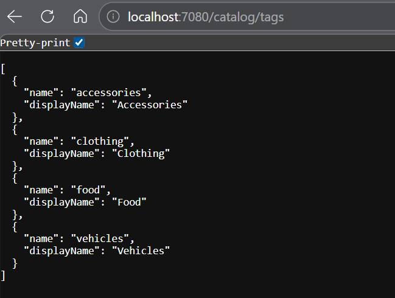
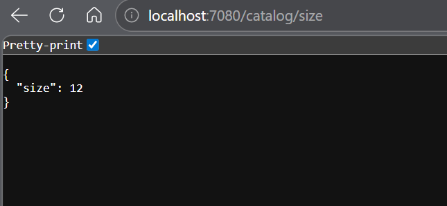

## Step-09: Verify Database Entries in RDS
```bash
kubectl run mysql-client --rm -it \
  --image=mysql:8.0 \
  --restart=Never \
  -- mysql -h mydb3.cxojydmxwly6.us-east-1.rds.amazonaws.com -u mydbadmin -p
```
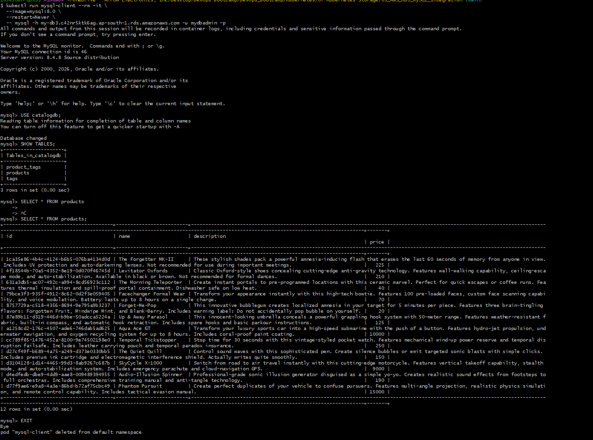

## Clean-up
### Remove Kubernetes Resources
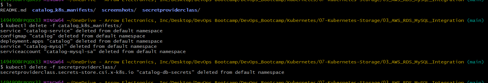
### Delete RDS
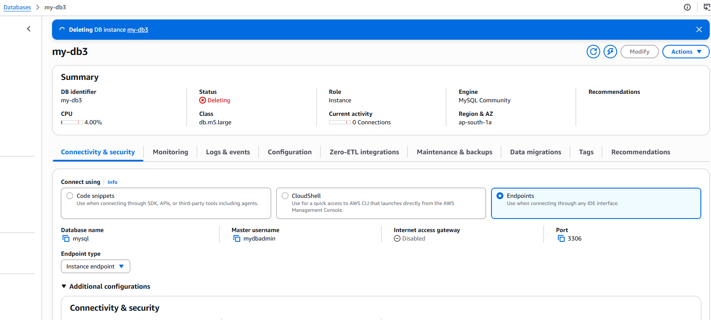
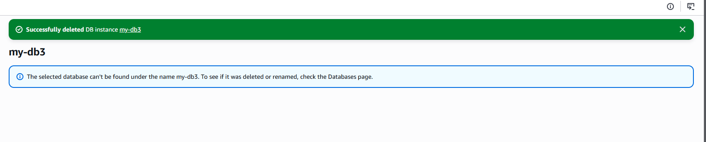
### Delete Subnet Group
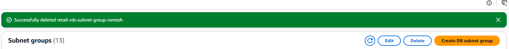
### Delete Security Group
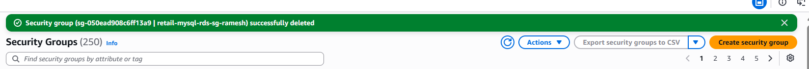

---
## What we Achieved
We successfully:
- Integrated EKS application with Amazon RDS MySQL
- Replaced StatefulSet database with managed RDS
- Used ExternalName Service for seamless DNS integration
- Retrieved credentials securely using Secrets Manager
- Used Pod Identity for secure AWS authentication
- Verified full end-to-end connectivity

## Final Architecture
```text
Catalog Pod
      ↓
ServiceAccount
      ↓
Pod Identity
      ↓
AWS Secrets Manager
      ↓
DB Credentials

Catalog Pod
      ↓
ExternalName Service
      ↓
Amazon RDS Endpoint
      ↓
RDS MySQL Database
```

## Key Takeaways
- Running databases inside Kubernetes is possible but operationally complex.
- Amazon RDS simplifies production database management.
- ExternalName Service enables transparent external DB integration.
- Secrets Manager removes need for hardcoded secrets.
- Pod Identity securely provides AWS permissions to Pods.
- Applications can migrate from in-cluster DB to RDS with minimal changes.

## Kubernetes concepts covered
| Concept               | Usage                              |
| --------------------- | ---------------------------------- |
| ExternalName Service  | DNS-based external service mapping |
| ServiceAccount        | Pod identity                       |
| Secrets Store CSI     | Secure secrets mounting            |
| Pod Identity          | AWS authentication                 |
| RDS Security Groups   | Network access control             |
| Temporary Client Pods | Connectivity testing               |


## Author
Ramesh Mahipathi