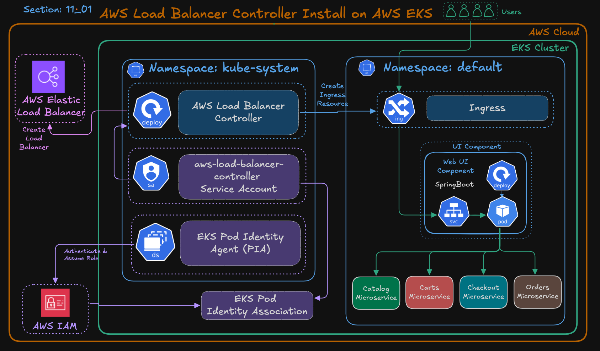

# AWS Load Balancer Controller on EKS

## Purpose
Install AWS Load Balancer Controller on EKS to automatically provision and manage AWS ALB/NLB resources using Kubernetes Ingress resources.

## Components
- AWS Load Balancer Controller
- IAM Policy
- IAM Role
- Trust Policy
- EKS Pod Identity
- Helm

## Flow
Ingress → AWS Load Balancer Controller → AWS ALB → Kubernetes Services → Pods

## Key Concepts
- Ingress only defines routing rules
- Controller creates actual AWS Load Balancer
- Pod Identity securely provides IAM access to controller pods
- Helm simplifies controller installation

---
## AWS Load Balancer Controller (LBC)

This controller:
- Watches Kubernetes Ingress resources

Automatically creates:
- ALB (Application Load Balancer)
- NLB (Network Load Balancer)

Configures:
- Target Groups
- Security Groups
- Listener Rules
- Health Checks

without us manually creating them in AWS Console.

---
## What Problem Are We Solving?

Normally:
- Pods are internal
- Services are internal

Users on internet cannot directly access them

So we need:
- A public entry point
- Routing mechanism
- AWS Load Balancer

This is where:
- Ingress
- AWS Load Balancer Controller
- ALB
all work together.

---
## HIGH LEVEL FLOW

User Request Flow:
```text
User
   ↓
AWS ALB
   ↓
Ingress Resource
   ↓
Kubernetes Service
   ↓
Pods
```
But Kubernetes itself cannot create AWS ALB.

So we install:
```text
AWS Load Balancer Controller
```

This controller talks to:
- Kubernetes API
- AWS APIs
and automatically creates AWS Load Balancers.

---
## IMPORTANT UNDERSTANDING
### Ingress Resource ≠ Load Balancer
Ingress is only:
```text
Routing Rules
```
Example:
```text
/app → App1
/api → App2
```
But somebody must:
- read these rules
- create ALB
- configure listeners

That component is:
## AWS Load Balancer Controller


### 1. kube-system Namespace
Contains infrastructure components.

### Components
#### A. AWS Load Balancer Controller
This is the brain.

Responsibilities:
- Watches ingress resources
- Creates ALB/NLB
- Creates Target Groups
- Updates listeners
- Registers pod IPs

#### Service Account
```text
aws-load-balancer-controller
```
Pods use ServiceAccounts for identity inside Kubernetes.

But this controller must access AWS services.

Example:
- Create ALB
- Modify Security Groups
- Create listeners
So it needs AWS permissions.

#### C. EKS Pod Identity Agent (PIA)
This is NEW AWS recommended approach.

Earlier:
- IRSA was used
Now:
- Pod Identity is preferred

Purpose:
- Securely provide IAM permissions to Pods

#### D. Pod Identity Association
This links:
```text
Kubernetes ServiceAccount ↔ AWS IAM Role
```

That means:
```text
Controller Pod
→ assumes IAM Role
→ gets AWS permissions
```

### 2. Default Namespace
This contains actual applications.

Example:
- UI App
- Catalog Service
- Cart Service
- Orders Service
Ingress exists here.

---
## How Controller Works
Controller continuously watches:
```text
Ingress Resources
```
When it sees new ingress:
```text
kind: Ingress
```

it automatically:
- Creates ALB
- Creates listeners
- Creates target groups
- Registers pod IPs
- Configures routing rules
This is why controller installation is mandatory.

---
## Step-01 — IAM Role and Policy Setup
Kubernetes Pods cannot access AWS automatically

AWS needs:
- Authentication
- Authorization

So we create:
- IAM Policy
- IAM Role
- Trust Policy
- Pod Identity Association

### Export Environment Variables
```bash
export AWS_REGION="us-east-1"
export EKS_CLUSTER_NAME="retail-dev-eksdemo1"
export AWS_ACCOUNT_ID=$(aws sts get-caller-identity --query Account --output text)
```
Purpose:
- Avoid hardcoding values repeatedly

### Create IAM Policy
This Policy defines:
- What actions are allowed?

Example:
- Create ALB
- Delete Target Groups
- Modify Security Groups

Without policy:
- Controller cannot create AWS resources

```bash
mkdir -p iam-policy-json-files
cd iam-policy-json-files

curl -o aws-load-balancer-controller-policy.json \
https://raw.githubusercontent.com/kubernetes-sigs/aws-load-balancer-controller/main/docs/install/iam_policy.json

aws iam create-policy \
  --policy-name AWSLoadBalancerControllerIAMPolicy_${EKS_CLUSTER_NAME} \
  --policy-document file://aws-load-balancer-controller-policy.json
```


### Create Trust Policy File
```yaml
cat <<EOF > aws-load-balancer-controller-trust-policy.json
{
  "Version": "2012-10-17",
  "Statement": [
    {
      "Effect": "Allow",
      "Principal": {
        "Service": "pods.eks.amazonaws.com"
      },
      "Action": [
        "sts:AssumeRole",
        "sts:TagSession"
      ]
    }
  ]
}
EOF
```

### Create IAM Role and Attach Policy
```bash
# Create the IAM Role
aws iam create-role \
  --role-name AmazonEKS_LBC_Role_${EKS_CLUSTER_NAME} \
  --assume-role-policy-document file://aws-load-balancer-controller-trust-policy.json

# Attach the LBC IAM Policy
aws iam attach-role-policy \
  --role-name AmazonEKS_LBC_Role_${EKS_CLUSTER_NAME} \
  --policy-arn arn:aws:iam::${AWS_ACCOUNT_ID}:policy/AWSLoadBalancerControllerIAMPolicy_${EKS_CLUSTER_NAME}

# Verify attachment
aws iam list-attached-role-policies \
  --role-name AmazonEKS_LBC_Role_${EKS_CLUSTER_NAME}
```

### Create EKS Pod Identity Association
```bash
aws eks create-pod-identity-association \
  --cluster-name ${EKS_CLUSTER_NAME} \
  --namespace kube-system \
  --service-account aws-load-balancer-controller \
  --role-arn arn:aws:iam::${AWS_ACCOUNT_ID}:role/AmazonEKS_LBC_Role_${EKS_CLUSTER_NAME}
```

---
## Step-02 – Install AWS Load Balancer Controller (Helm)
### Add Helm Repo and Update
```bash
helm repo add eks https://aws.github.io/eks-charts
helm repo update
```

### Install Load Balancer Controller
```bash
# Get VPC ID
VPC_ID=$(aws eks describe-cluster \
  --name ${EKS_CLUSTER_NAME} \
  --query "cluster.resourcesVpcConfig.vpcId" \
  --output text)

# Verify VPC ID
echo $VPC_ID

# Install AWS Load Balancer Controller using HELM
helm install aws-load-balancer-controller eks/aws-load-balancer-controller \
  -n kube-system \
  --set clusterName=${EKS_CLUSTER_NAME} \
  --set region=${AWS_REGION} \
  --set vpcId=${VPC_ID} \
  --set serviceAccount.create=true \
  --set serviceAccount.name=aws-load-balancer-controller  
```

Explanation:
- serviceAccount.create=true → Creates the ServiceAccount automatically during Helm installation.
- serviceAccount.name → Uses the same ServiceAccount name linked to your Pod Identity association.
- clusterName → Specifies the name of your EKS cluster.
- vpcId → Supplies the EKS cluster’s VPC ID manually (required when IMDS auto-detection is restricted).
- region → Explicitly sets the AWS Region to help the controller locate cluster and network resources when IMDS access is limited.

### Verify Helm Release
List Helm releases:
```bash
helm list -n kube-system
```

Check Helm status:
```bash
helm status aws-load-balancer-controller -n kube-system
```

---
## Step-03: Verify Controller Deployment
```bash
# List Pods
kubectl get pods -n kube-system -l app.kubernetes.io/name=aws-load-balancer-controller
```

Check deployment and logs:
```bash
kubectl get deployment -n kube-system aws-load-balancer-controller
kubectl logs -n kube-system -l app.kubernetes.io/name=aws-load-balancer-controller
```


---
## Author
Ramesh Mahipathi