# Helm Basics
## Helm Introduction

### Why Helm?
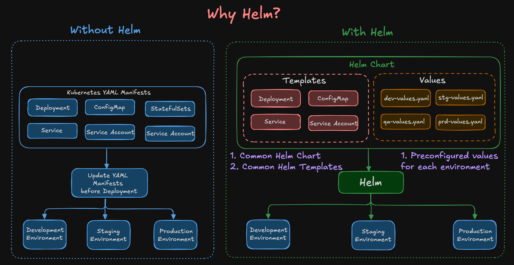

Helm is the package manager for Kubernetes.

Just like:
- apt for Ubuntu
- yum for RHEL
- npm for Node.js

Helm helps us package, deploy, manage, upgrade, and rollback Kubernetes applications easily.

In Kubernetes, applications usually contain multiple YAML manifests such as:
- Deployment
- Service
- ConfigMap
- StatefulSet
- ServiceAccount
- Ingress

Managing all these YAML files manually across multiple environments becomes difficult over time.

### Without Helm

Without Helm:
- We manually maintain multiple Kubernetes YAML files
- Separate YAML files are usually required for:
    - Development
    - Staging
    - Production
- Any configuration change must be updated manually
- Maintaining consistency across environments becomes difficult
- Upgrades and rollbacks are harder to manage

This increases:
- Human errors
- YAML duplication
- Operational complexity
- Deployment inconsistency

### With Helm

With Helm:
- We create reusable Helm charts
- Common Kubernetes templates are maintained in one place
- Environment-specific configurations are stored in separate values files

Example:
```text
dev-values.yaml
stg-values.yaml
qa-values.yaml
prd-values.yaml
```

Helm dynamically combines:
- Templates
- Values
and generates Kubernetes manifests automatically during deployment.

This allows the same Helm chart to deploy applications into:
- Development
- Staging
- Production
with different configurations.

---
## Helm Benefits
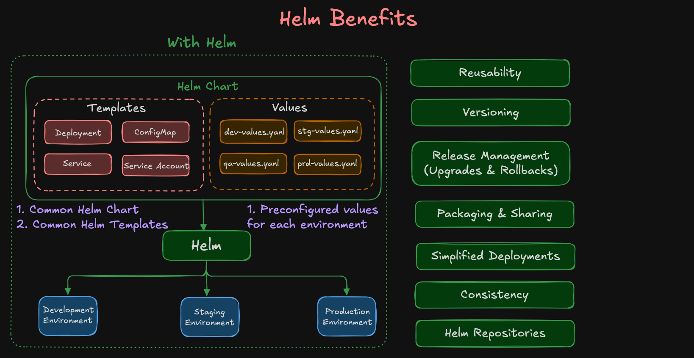

1. Reusability: One Helm chart can be reused across multiple environments.

2. Versioning: Helm supports chart versioning and release history tracking.

3. Release Management: Helm makes upgrades and rollbacks easier.

Example:
```bash
helm history ui
helm rollback ui 1
```

4. Packaging and Sharing: Helm charts can be packaged and stored in repositories.

Teams can easily share and reuse charts.

5. Simplified Deployments: Instead of applying multiple YAML files:
```bash
kubectl apply -f deployment.yaml
kubectl apply -f service.yaml
kubectl apply -f configmap.yaml
```
Helm allows deploying everything using a single command:
```bash
helm install ui <chart>
```

6. Consistency: Helm helps maintain standardized and predictable deployments across environments.

7. Helm Repositories: Helm charts can be stored in repositories such as:
- ArtifactHub
- Bitnami
- AWS ECR
- Azure ACR
- GCP Artifact Registry

---
## Helm Workflow
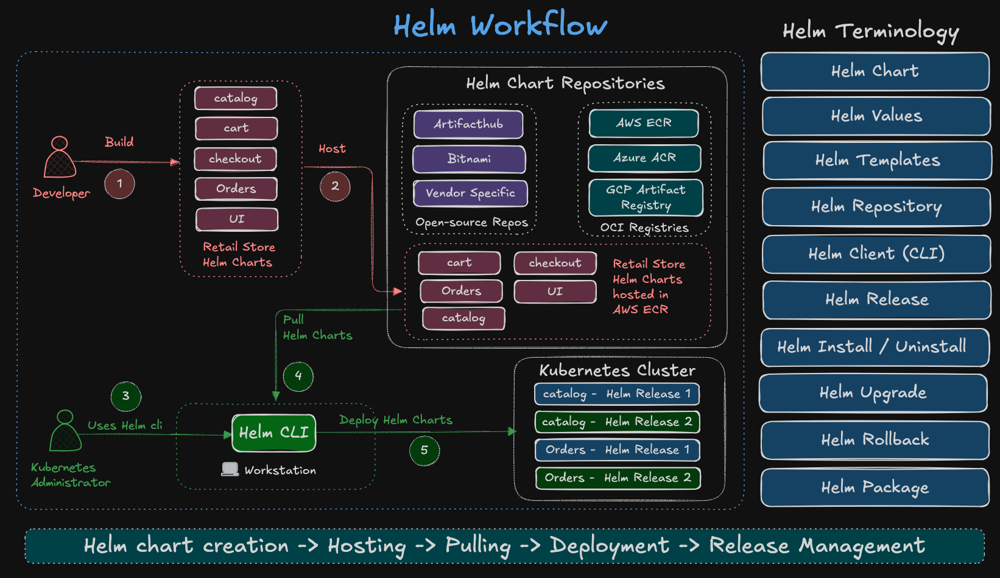

The Helm workflow generally follows these stages:
1. Developers create Helm charts for applications
2. Charts are hosted in Helm repositories
3. Kubernetes administrators use Helm CLI
4. Helm pulls charts from repositories
5. Helm deploys resources into Kubernetes clusters
6. Helm manages releases, upgrades, and rollbacks

---
## Helm Terminology
| Term            | Description                                |
| --------------- | ------------------------------------------ |
| Helm Chart      | Kubernetes application package             |
| Helm Values     | Configurable values used during deployment |
| Helm Templates  | Reusable Kubernetes YAML templates         |
| Helm Repository | Storage location for Helm charts           |
| Helm CLI        | Command-line tool used to manage Helm      |
| Helm Release    | Running instance of a Helm chart           |
| Helm Install    | Deploy a Helm chart                        |
| Helm Upgrade    | Upgrade an existing release                |
| Helm Rollback   | Revert to a previous release               |
| Helm Package    | Pack a chart into distributable format     |

---
## Install Retail UI Helm Chart
Before installing the Helm chart, authenticate to AWS Public ECR.
### Authenticate to Public ECR
```bash
aws ecr-public get-login-password --region us-east-1 | helm registry login -u AWS --password-stdin public.ecr.aws
```
#### What this command does:
Generates temporary authentication token
Logs Helm into AWS Public ECR
Allows Helm to pull OCI charts

### Install Retail UI Helm Chart
```bash
helm install ui oci://public.ecr.aws/aws-containers/retail-store-sample-ui-chart \
  --version 1.0.0
```

#### Command Breakdown
| Component                    | Description            |
| ---------------------------- | ---------------------- |
| helm install                 | Installs a Helm chart  |
| ui                           | Helm release name      |
| oci://                       | OCI registry protocol  |
| retail-store-sample-ui-chart | Helm chart name        |
| --version                    | Specific chart version |
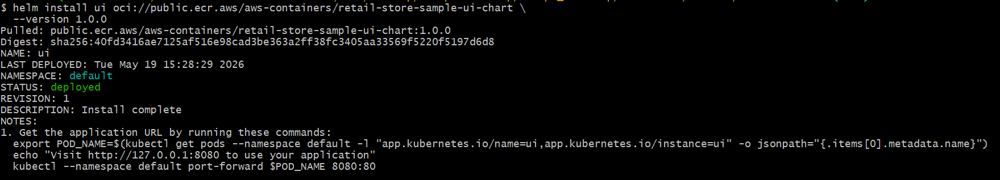
---

## List Helm Releases
```bash
# List Helm releases (default table output)
helm list
helm ls

# List Helm releases in YAML or JSON
helm list --output=yaml
helm list --output=json

# List Helm releases for a specific namespace (if not using default)
helm list -n default
```
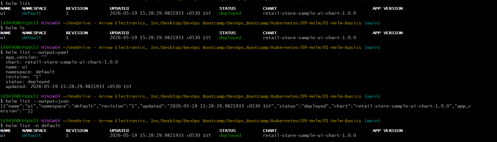
---

## Verify Kubernetes Resources
```bash
# List Pods created by the 'ui' release
kubectl get pods

# List Services created by the 'ui' release
kubectl get svc
```
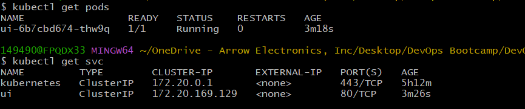

By default, the Retail UI chart exposes a ClusterIP service. To access it from your local machine, use port-forward:
```bash
# Port-forward to access the application locally (adjust service name if different)
kubectl port-forward svc/ui 30080:80

# Access the Retail UI application
http://localhost:30080
```
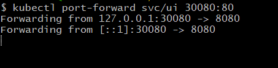


---
## Upgrade Retail UI Release
```bash
# Upgrade to a new chart version (1.2.4) and change app theme (example)
helm upgrade ui oci://public.ecr.aws/aws-containers/retail-store-sample-ui-chart \
  --version 1.2.4 \
  --set app.theme=orange

# Check release history
helm history ui

# Watch Pods during rollout
kubectl get pods -w

# (If service is ClusterIP) Port-forward again to access the app
kubectl port-forward svc/ui 30080:80
# Then browse:
# http://localhost:30080
```
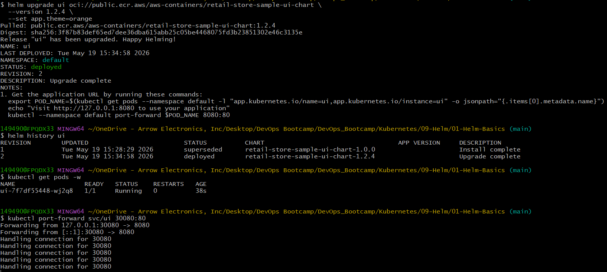
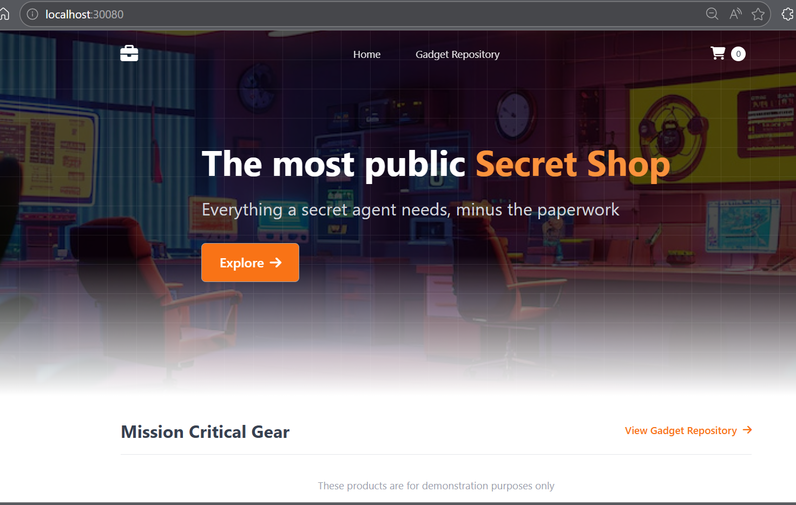

---
## Print Helm Values & Manifests
```bash
# Print only overridden values
helm get values ui

# Print all values (defaults + overrides)
helm get values ui --all

# Print rendered Kubernetes manifests (Deployment, Service, etc.)
helm get manifest ui
```

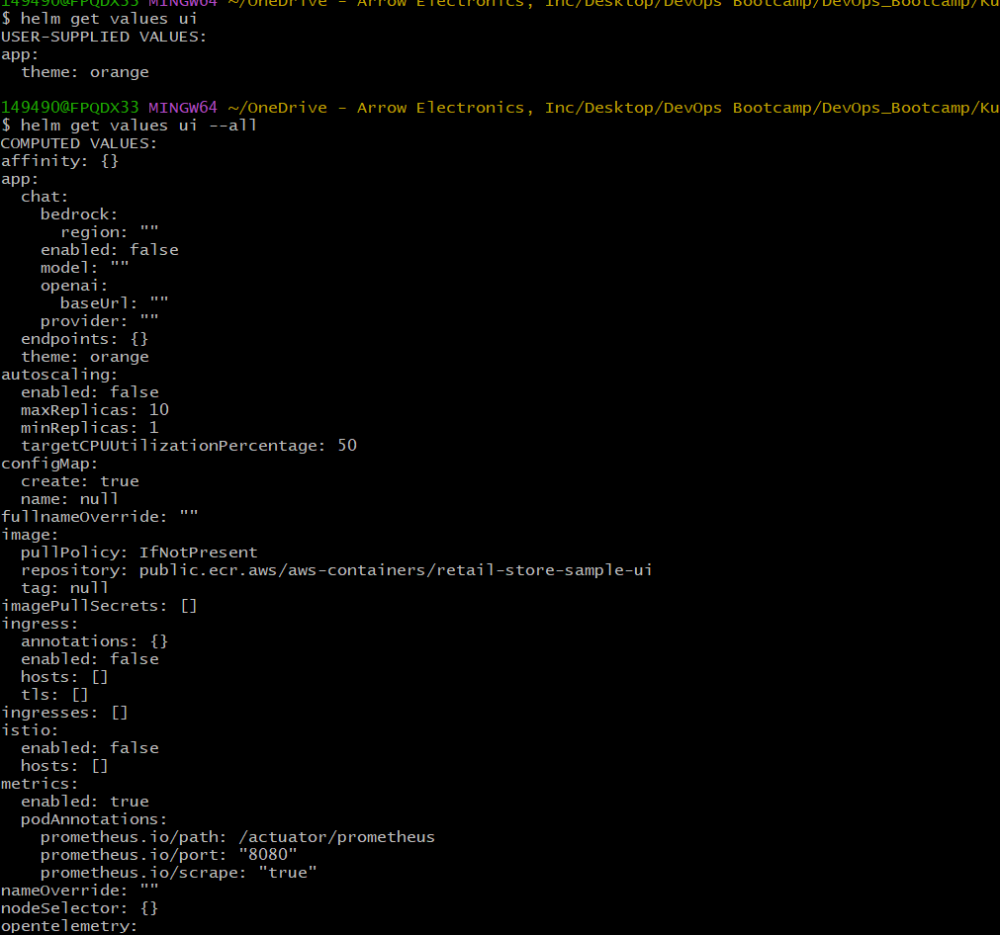
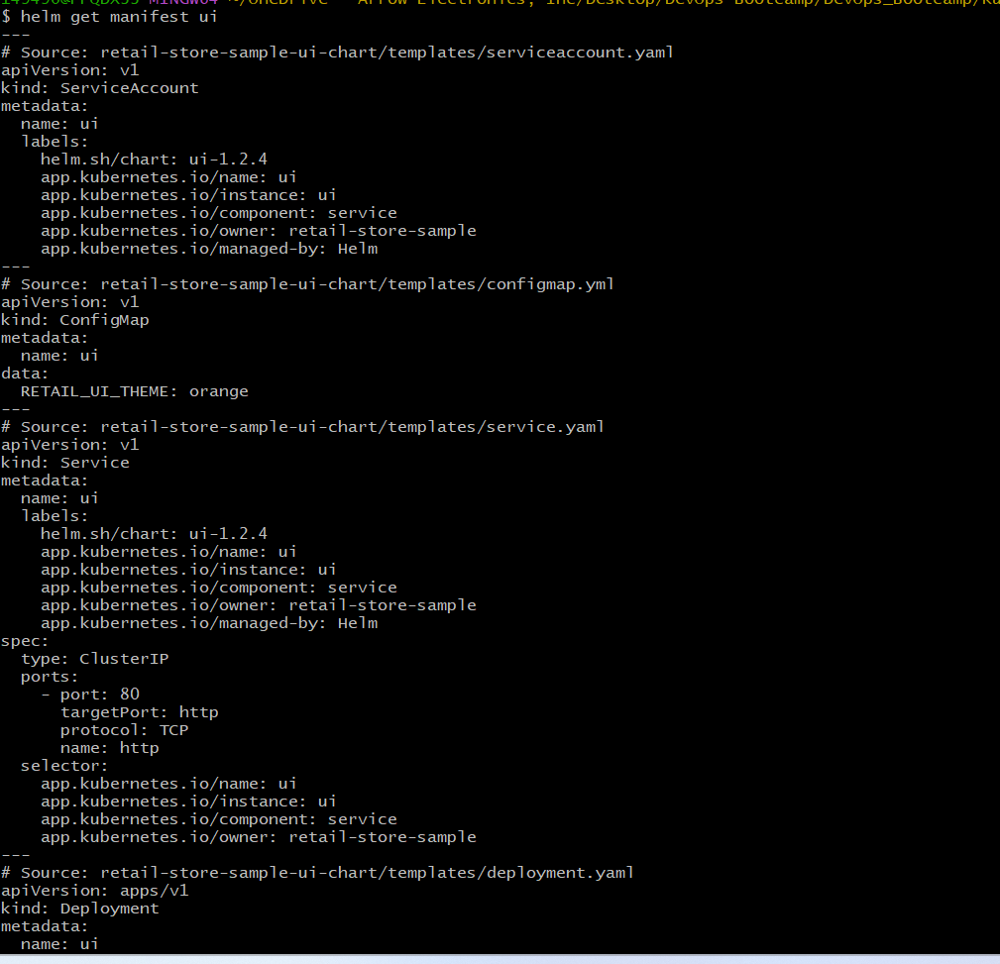

---
## Rollback to Previous Release
```bash
# Show release history
helm history ui

# Roll back to revision 1
helm rollback ui 1

# Verify rollback
helm list
helm history ui
kubectl get pods -w

# (If service is ClusterIP) Port-forward to access the application
kubectl port-forward svc/ui 30080:80
# http://localhost:30080
```
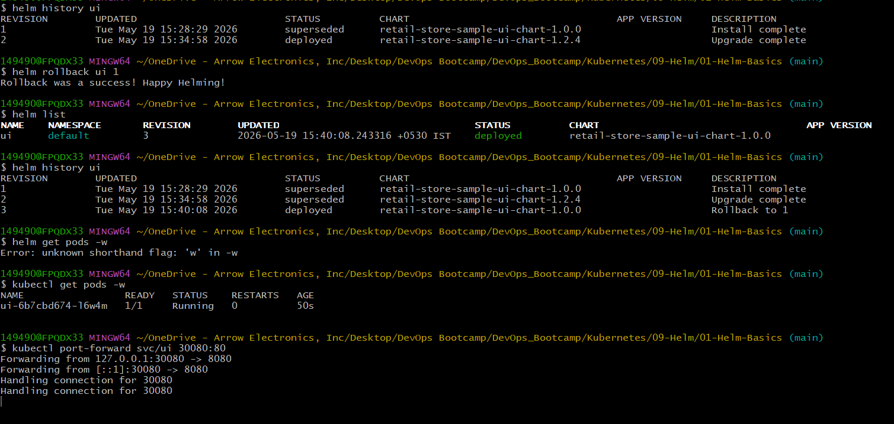
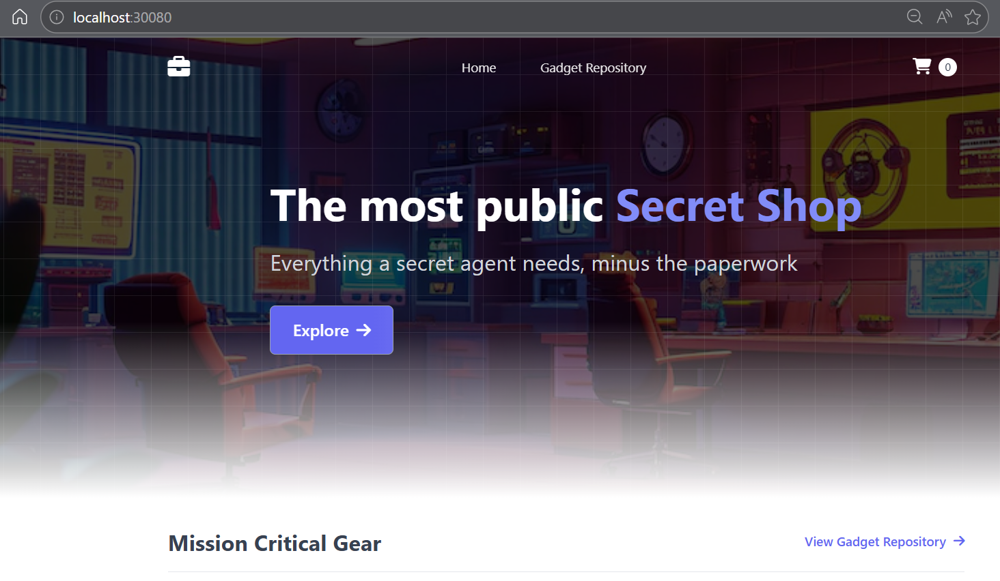

---
## Update Application Theme
```bash
# First Upgrade to latest version
helm upgrade ui oci://public.ecr.aws/aws-containers/retail-store-sample-ui-chart \
  --version 1.3.0
  
# Change theme to green (stays on chart version 1.3.0)
helm upgrade ui oci://public.ecr.aws/aws-containers/retail-store-sample-ui-chart \
  --version 1.3.0 \
  --set app.theme=green

# If pods don't restart automatically, trigger a rollout:
kubectl rollout restart deployment/ui

# Verify pods
kubectl get pods

# (If service is ClusterIP) Port-forward to access the app
kubectl port-forward svc/ui 30080:80
# http://localhost:30080
```
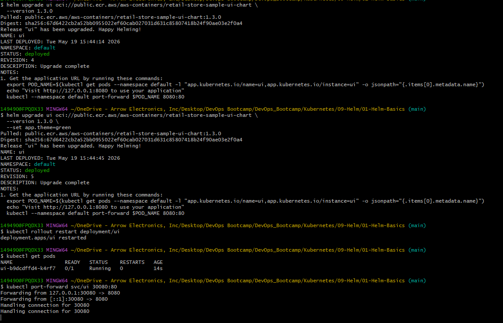
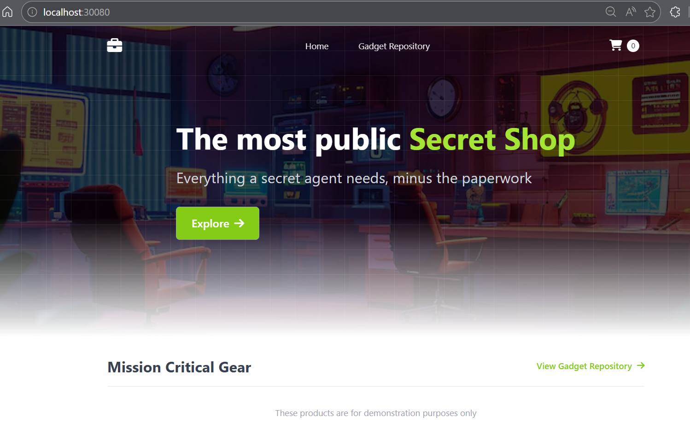

---
## Uninstall Retail UI Release
```bash
# List Helm releases
helm ls

# Uninstall the 'ui' release
helm uninstall ui
```
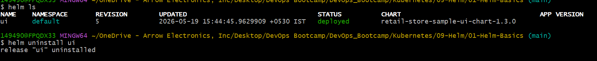

---
## Author
Ramesh Mahipathi