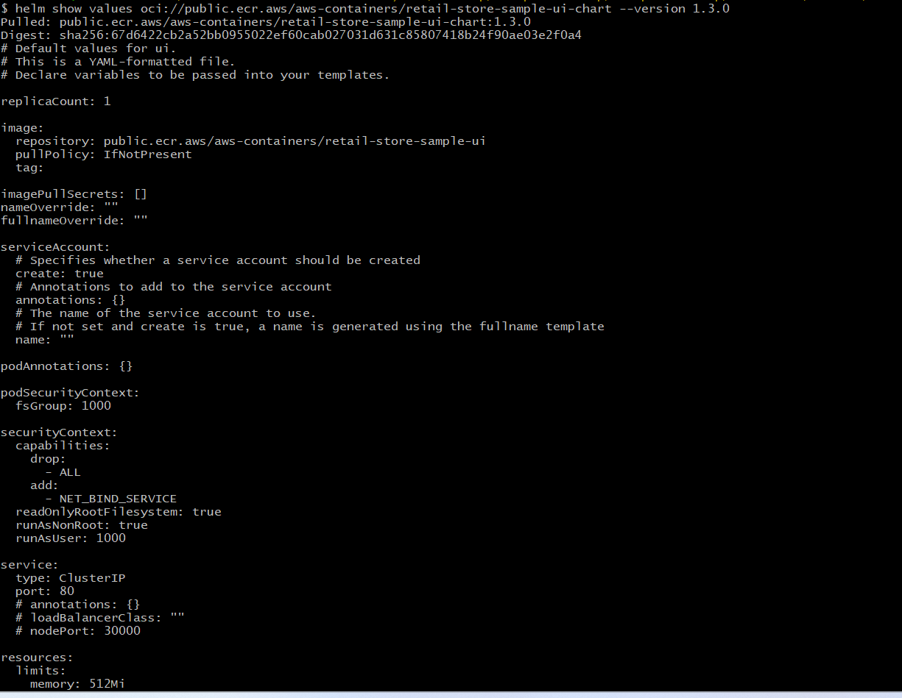
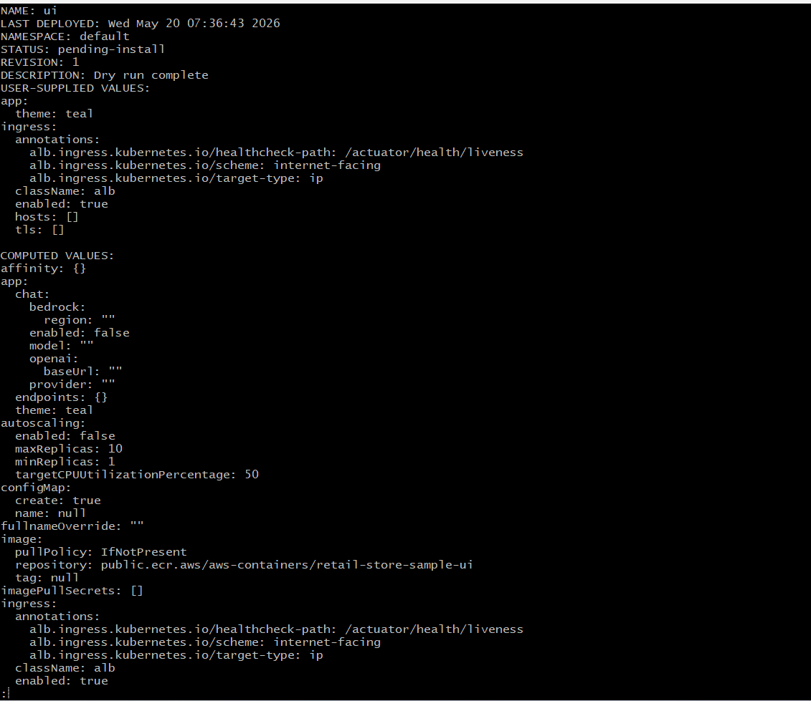
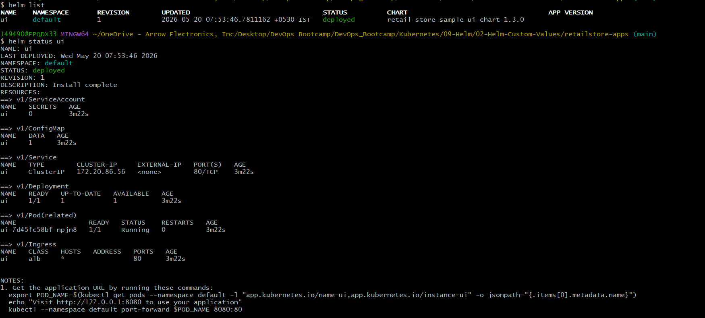
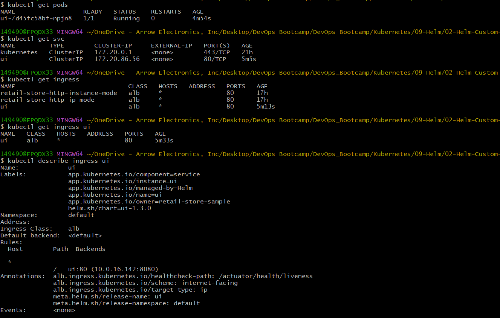
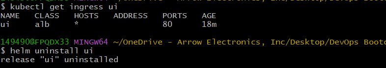

# Helm Custom Values - Retail Store UI with Ingress (HTTP)
## Introduction
In this section, we will learn:
- How to override default Helm values
- How to use custom values files
- How to enable Ingress using AWS Load Balancer Controller (ALB)
- How to customize application settings such as theme
- How Helm renders Kubernetes manifests using custom values

---
## Helm Values — What, Why, and How?
### What are Helm Values?
Helm values are configuration parameters used to customize Helm chart deployments.

These values are usually stored inside:
- values.yaml

A chart author defines default values inside the chart, and users can override them during installation or upgrades.

### Where do values come from?
Helm values generally come from:

1. Chart Default Values
These are shipped with the chart itself.

Example: 
```bash
values.yaml
```
These defaults are automatically used if no overrides are provided.

2. Custom Override Files
Users can override defaults using:
```bash
-f <file-name.yaml>
```
Example:
```bash
-f values-ui.yaml
```
This is the recommended approach for environment-specific configurations.

3. Inline Overrides
Quick value changes can also be done using:
```bash
--set key=value
```
Example:
```
--set app.theme=green
```

---
## Helm Value Precedence
Helm applies values using the following priority order (highest → lowest):
1. --set and --set-string
2. Multiple -f files (last file wins)
3. Chart default values.yaml

This means custom overrides always take precedence over chart defaults.

---
## Best Practices for Helm Values
### 1. Use Separate Values Files per Environment
Example:
- values-dev.yaml
- values-stg.yaml
- values-prod.yaml

This helps:
- Maintain consistency
- Reduce accidental configuration drift
- Separate environment-specific settings cleanly

### 2. Prefer -f Files for Large Configurations
Use:
1. -f values.yaml for most configurations
2. --set only for quick temporary overrides

### 3. Avoid Storing Secrets in Values Files
Do not store:
- Passwords
- Tokens
- AWS credentials
- Sensitive secrets

Instead use:
- Kubernetes Secrets
- External Secrets
- IRSA
- Secret Managers

---
## Inspect and Preview Helm Values
### View Default Chart Values
This command shows all configurable options available in the chart.
```bash
helm show values oci://public.ecr.aws/aws-containers/retail-store-sample-ui-chart --version 1.3.0
```
This is useful for:
- Understanding chart configuration
- Discovering supported values
- Learning configurable settings


### Dry Run Before Deployment
Before deploying, Helm allows previewing rendered manifests without creating resources.
```bash
cd retailstore-apps

helm install ui oci://public.ecr.aws/aws-containers/retail-store-sample-ui-chart \
  --version 1.3.0 \
  -f values-ui.yaml \
  --dry-run
```

Why Use Dry Run?
Dry-run helps:
- Validate YAML rendering
- Detect template issues
- Preview Kubernetes manifests
- Avoid failed deployments
This is a very common production practice before applying Helm releases.



---
## Helm Upgrade and Reuse
### Upgrade using Custom Values
```bash
helm upgrade ui ... -f values-ui.yaml
```
This applies changes from the custom values file.

### Install Helm Release with Custom Values
```bash
# Verify if AWS Load Balancer Controller installed
kubectl get deploy  -n kube-system aws-load-balancer-controller
kubectl get pods -n kube-system

# Verify Default Ingressclass configured
kubectl get ingressclass
Observation: "alb" should be default ingressclass

# Change Directory (adjust to your repo layout)
cd 12-02-Helm-Custom-Values/retailstore-apps

# Helm Install
cd retailstore-apps
helm install ui oci://public.ecr.aws/aws-containers/retail-store-sample-ui-chart \
  --version 1.3.0 \
  -f values-ui.yaml
```


---
## Verify Ingress and ALB
```bash
# List Helm Release
helm list

# This gives a nice summary of resources created by the release.
helm status ui --show-resources

# After install/upgrade, see effective values
helm get values ui --all

# Shows all Kubernetes manifests (raw YAML) rendered and applied by Helm:
helm get manifest ui

# Pods created by the release
kubectl get pods

# Services (expect ClusterIP for internal communication)
kubectl get svc

# Ingress (ALB will be created by the controller)
kubectl get ingress

# Describe the Ingress to view ALB details and events
kubectl describe ingress ui
```
![verify-helm-status](screenshots/04-verify-helm-status-ui.png


---
## Uninstall Helm Release
```bash
# Uninstall Helm Release
helm uninstall ui
```


---
## Author
Ramesh Mahipathi