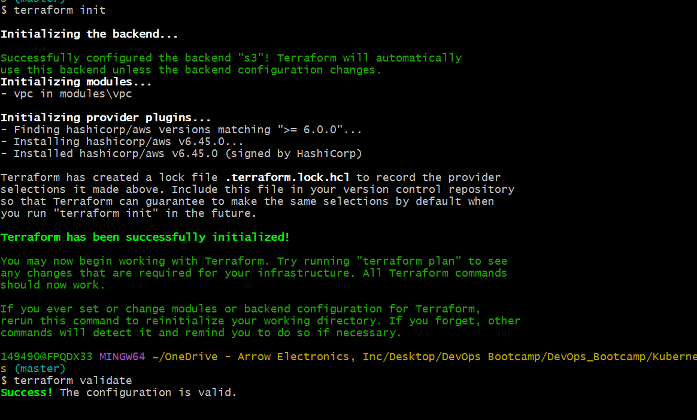
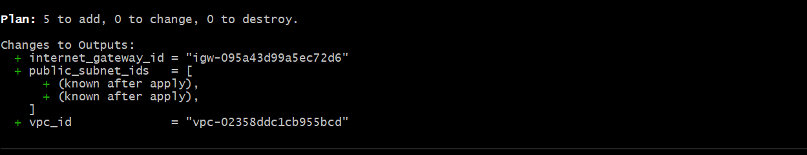
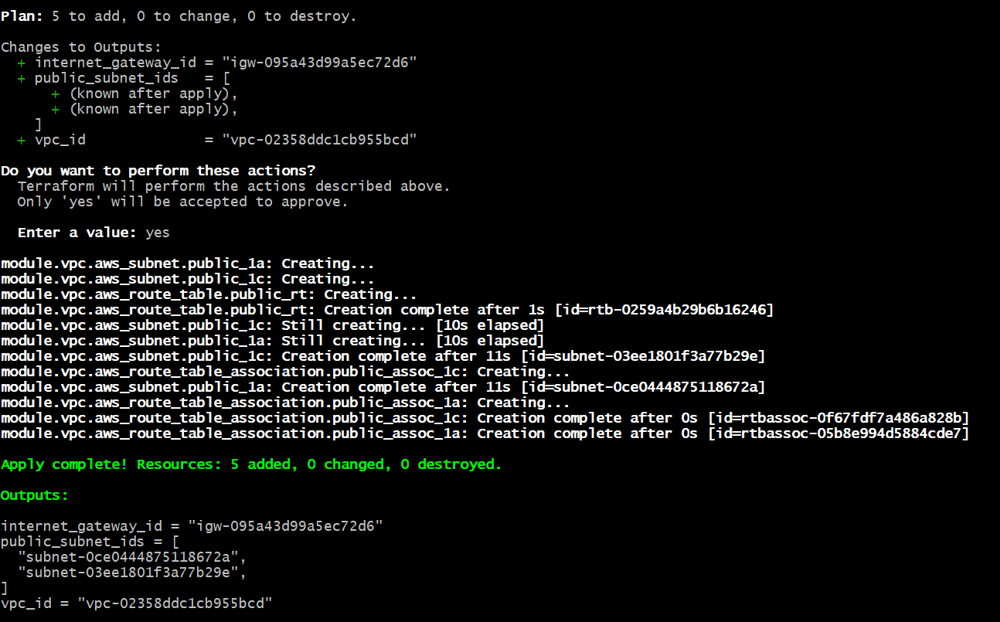
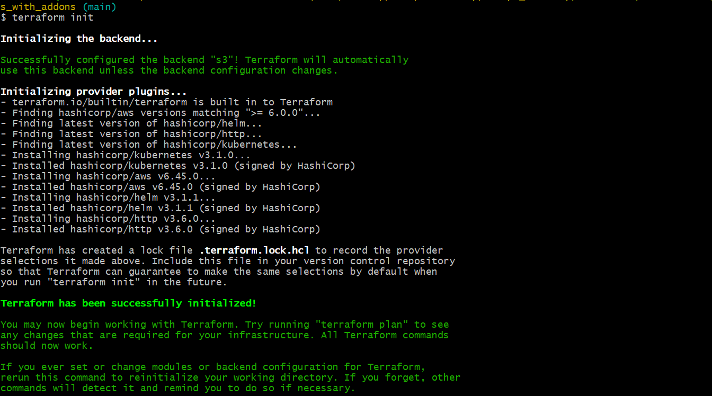
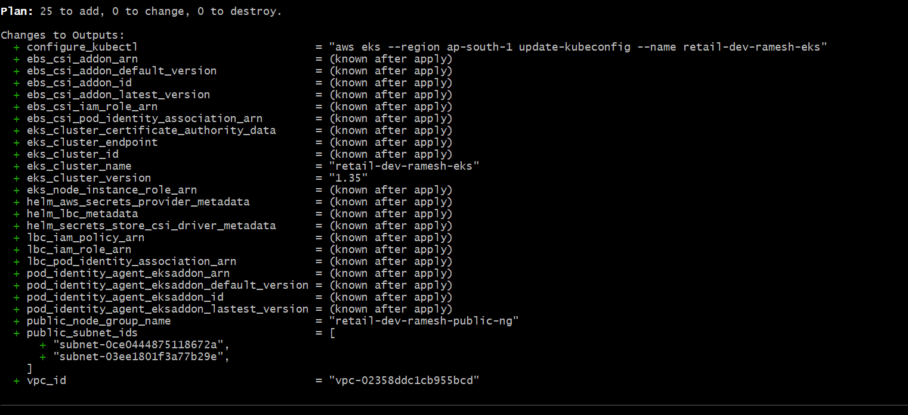
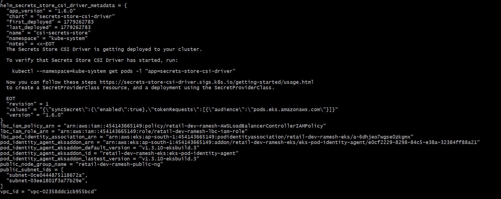
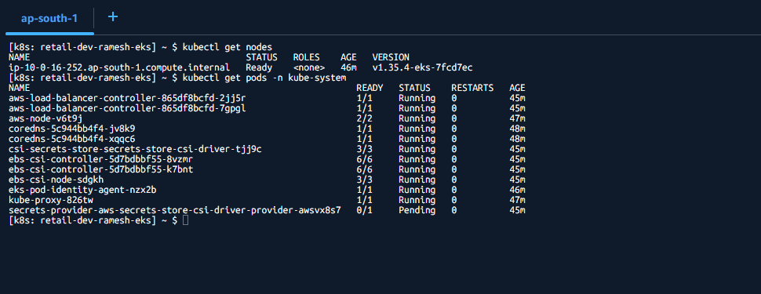
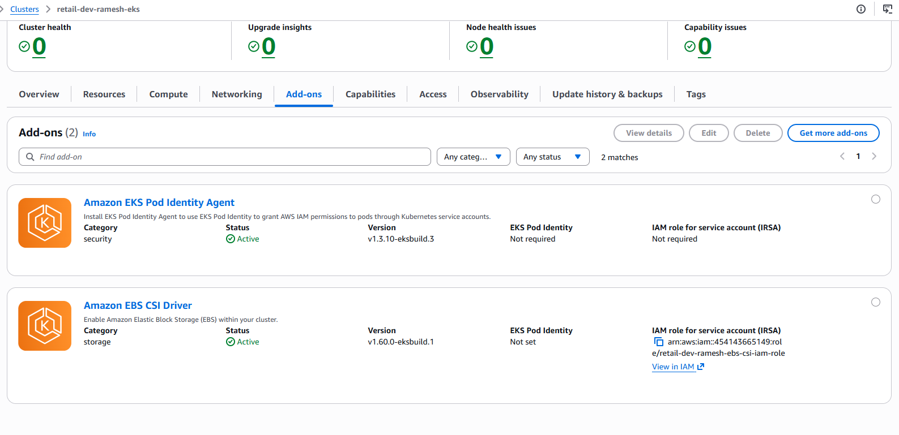

# Terraform on AWS EKS Cluster with AddOns
## AWS Load Balancer Controller + EBS CSI + Secrets Store CSI + Pod Identity Agent

---

# 📌 Project Overview

This project provisions a complete AWS EKS Cluster using Terraform and integrates important AWS/Kubernetes AddOns required for production-ready workloads.

The following AddOns are implemented:

- AWS Load Balancer Controller (LBC)
- Amazon EBS CSI Driver
- Secrets Store CSI Driver
- AWS Secrets & Configuration Provider (ASCP)
- EKS Pod Identity Agent

---

# 🏗️ Architecture Overview

## Components

| AddOn | Purpose |
|---|---|
| Pod Identity Agent | Allows Pods to securely assume IAM Roles |
| AWS Load Balancer Controller | Creates and manages ALB/NLB resources |
| EBS CSI Driver | Dynamically provisions EBS Volumes |
| Secrets Store CSI Driver + ASCP | Mounts AWS Secrets Manager secrets into Pods |

---

# 📂 Project Structure

```bash
13_Terraform_EKS_Cluster_with_Addons/
│
├── 01_VPC_terraform-manifests/
│   ├── c1-versions.tf
│   ├── c2-variables.tf
│   ├── c3-vpc.tf
│   ├── c4-outputs.tf
│   └── terraform.tfvars
│
├── modules/
│   └── vpc/
│       ├── datasource-and-locals.tf
│       ├── main.tf
│       ├── outputs.tf
│       ├── variables.tf
│       └── README.md
│
├── 02_EKS_terraform-manifests_with_addons/
│   ├── c1-versions.tf
│   ├── c2-variables.tf
│   ├── c3-remote-state.tf
│   ├── c4-datasources-and-locals.tf
│   ├── c5-tags.tf
│   ├── c6-cluster-iam-role.tf
│   ├── c7-eks-cluster.tf
│   ├── c8-managed-nodegroup.tf
│   ├── c9-eks-addon.tf
│   ├── c10-outputs.tf
│
│   ├── c11-podidentityagent-addon.tf
│   ├── c12-helm-and-kubernetes.tf
│   ├── c13-podidentity-assume-role.tf
│
│   ├── c14-01-lbc-iam-policy-datasources.tf
│   ├── c14-02-lbc-iam-policy-and-role.tf
│   ├── c14-03-lbc-eks-pod-identity-association.tf
│   ├── c14-04-lbc-helm-install.tf
│
│   ├── c15-01-ebscsi-iam-policy-and-role.tf
│   ├── c15-02-ebscsi-eks-pod-identity-association.tf
│   ├── c15-03-ebscsi-addon.tf
│
│   ├── c16-01-secretstorecsi-helm-install.tf
│   └── c16-02-secretstorecsi-ascp-helm-install.tf
│
├── terraform.tfvars
│
├── env/
│   ├── dev.tfvars
│   ├── staging.tfvars
│   └── prod.tfvars
│
├── create-cluster.sh
├── destroy-cluster.sh
└── README.md
```

---

# ⚙️ Execution Flow

## Stage-1: Create VPC

```bash
cd 01_VPC_terraform-manifests

terraform init
terraform validate
terraform plan
terraform apply -auto-approve
```
This stage creates:

- VPC
- Public Subnets
- Private Subnets
- NAT Gateway
- Route Tables
- Internet Gateway




---

## Stage-2: Create EKS Cluster with AddOns

```bash
cd ../02_EKS_terraform-manifests_with_addons

terraform init
terraform validate
terraform plan
terraform apply -auto-approve
```

This stage creates:

- EKS Cluster
- Managed Node Group
- IAM Roles
- EKS AddOns
- Helm-based Controllers





---

# 🔐 Configure Terraform Remote Backend

Update backend configuration inside:

```bash
01_VPC_terraform-manifests/c1-versions.tf
02_EKS_terraform-manifests_with_addons/c1-versions.tf
```

Example:

```hcl
terraform {

  required_version = ">= 1.0.0"

  required_providers {
    aws = {
      source  = "hashicorp/aws"
      version = "~> 6.0"
    }
  }

  backend "s3" {
    bucket         = "tfstate-dev-us-east-1"
    key            = "vpc/dev/terraform.tfstate"
    region         = "us-east-1"
    encrypt        = true
    use_lockfile   = true
  }
}
```

---

# ☸️ Configure kubectl

```bash
aws eks update-kubeconfig \
--name retail-dev-eksdemo1 \
--region us-east-1
```

Verify Nodes:

```bash
kubectl get nodes
```

Verify AddOns:

```bash
kubectl get pods -n kube-system
```


---

# ✅ Expected AddOn Pods

```bash
aws-load-balancer-controller-xxxxx
ebs-csi-controller-xxxxx
csi-secrets-store-provider-aws-xxxxx
secrets-store-csi-driver-provider-aws-xxxxx
eks-pod-identity-agent-xxxxx
```


---

# 🚀 AddOn Details

---

## 1. EKS Pod Identity Agent

### Purpose

Allows Kubernetes Pods to securely access AWS services using IAM Roles without storing AWS credentials.

### Benefits

- No hardcoded AWS keys
- Secure IAM authentication
- Fine-grained permissions
- Native EKS integration

---

## 2. AWS Load Balancer Controller

### Purpose

Automatically provisions:

- Application Load Balancers (ALB)
- Network Load Balancers (NLB)

for Kubernetes Ingress and Services.

### Features

- Path-based routing
- Host-based routing
- SSL termination
- Internet-facing/Internal ALBs

---

## 3. Amazon EBS CSI Driver

### Purpose

Provides dynamic storage provisioning using Amazon EBS volumes.

### Used For

- StatefulSets
- Databases
- Persistent Volumes

---

## 4. Secrets Store CSI Driver + ASCP

### Purpose

Mounts secrets from:

- AWS Secrets Manager
- AWS Systems Manager Parameter Store

directly into Kubernetes Pods.

### Benefits

- No secrets inside YAML files
- Centralized secret management
- Automatic secret rotation

---

# 🔄 Terraform State Flow

```text
Terraform
    ↓
AWS API
    ↓
Creates EKS Infrastructure
    ↓
EKS Cluster
    ↓
Helm installs Controllers
    ↓
Controllers manage AWS resources
```

---

# 🔍 Verification Commands

## Verify Cluster

```bash
kubectl cluster-info
```

## Verify Nodes

```bash
kubectl get nodes -o wide
```

## Verify AddOns

```bash
kubectl get pods -n kube-system
```

## Verify EBS CSI

```bash
kubectl get csidrivers
```

## Verify Ingress Controller

```bash
kubectl get deployment -n kube-system
```

---

# 🧹 Destroy Infrastructure

```bash
./destroy-cluster.sh
```

OR

```bash
terraform destroy -auto-approve
```

Recommended order:

1. Destroy EKS Stack
2. Destroy VPC Stack

---

# 📚 Key Concepts Covered

- Terraform Modules
- Remote Backend
- EKS Cluster Provisioning
- Managed Node Groups
- IAM Roles
- EKS Pod Identity
- Helm Provider
- Kubernetes Provider
- ALB Ingress Controller
- Persistent Storage
- Kubernetes Secrets Integration

---

# 🎯 Final Outcome

After completion, you will have:

- Production-ready EKS Cluster
- Secure IAM integration
- Dynamic Load Balancers
- Persistent Storage
- Secure Secret Management
- Fully automated infrastructure using Terraform

---

# 📌 Important Notes

- Ensure IAM permissions are sufficient
- Use private subnets for worker nodes
- Always enable remote backend
- Never store secrets in Terraform code
- Use Pod Identity instead of static AWS credentials

---

## Author
Ramesh Mahipathi