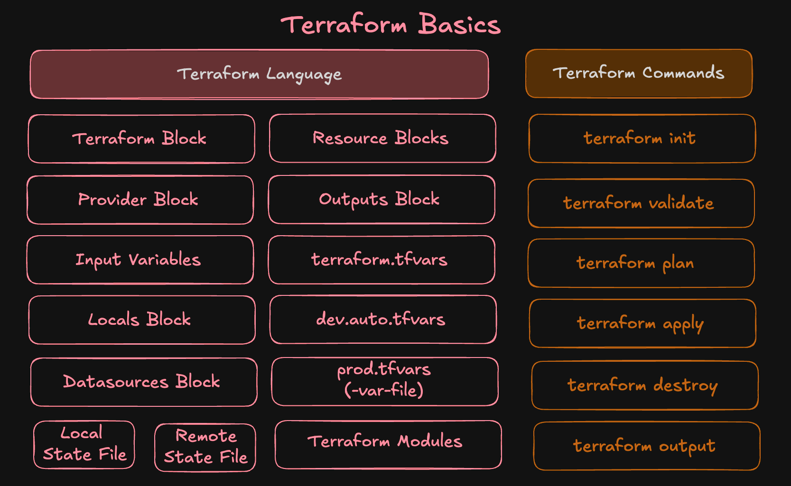
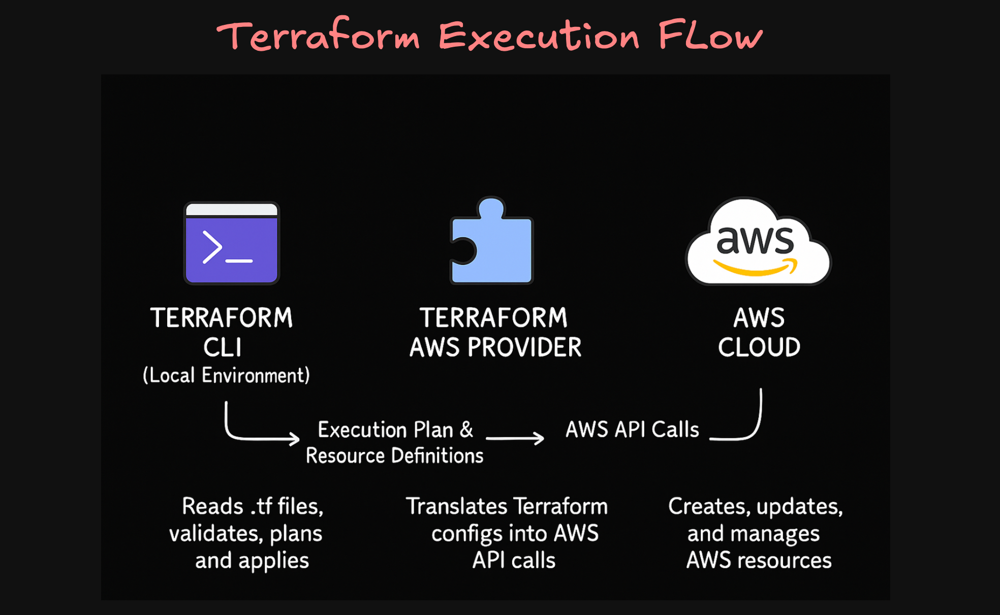
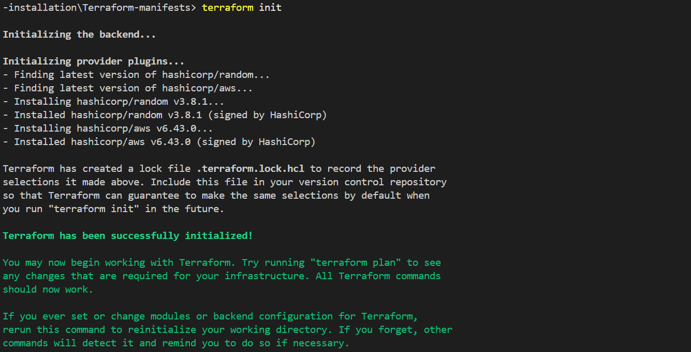
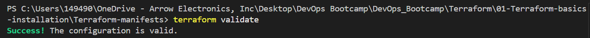
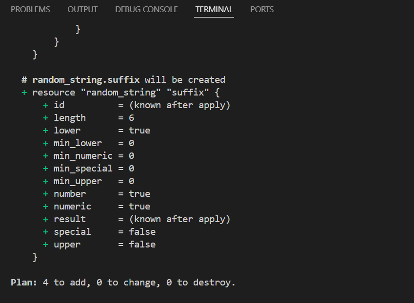
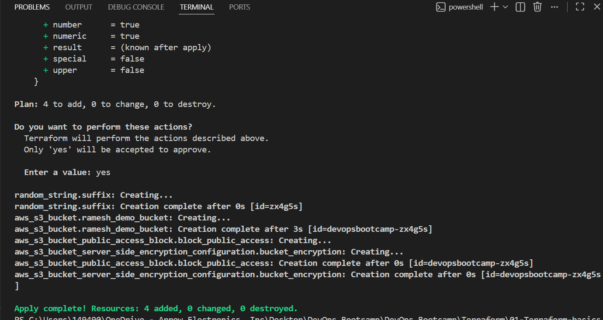
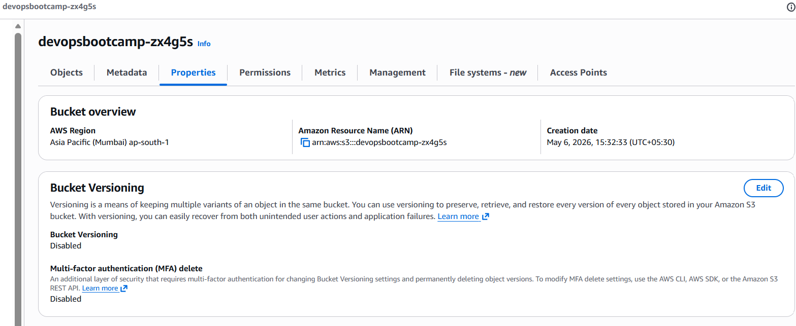
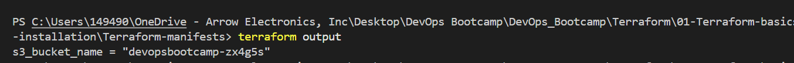
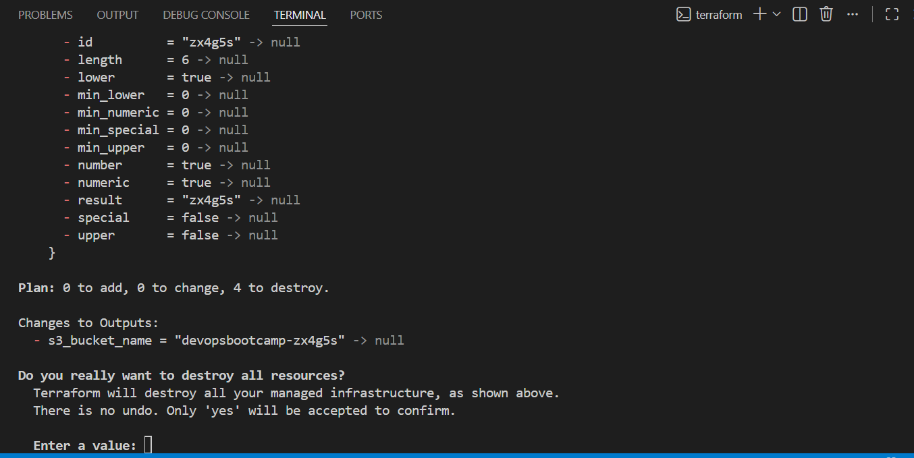

# Terraform Basics and S3 creation

## What is Terraform?
Terraform is an Infrastructure as Code (IaC) tool used to create, manage, update, and destroy infrastructure resources using code instead of manually creating them from the cloud console.

Terraform allows us to automate infrastructure provisioning across multiple cloud providers such as:
1. Amazon Web Services
2. Microsoft
3. Google
4. Kubernetes
5. Many other platforms

## Why Terraform?

| Benefit | Description |
|---|---|
| Automation | Infrastructure can be created automatically using code |
| Consistency |  |
| Reusability | Same code can be reused across environments |
| Version Control | Infrastructure code can be stored in GitHub/GitLab |
| Faster Deployments | Infrastructure can be provisioned within minutes |
| Collaboration | Teams can work together using shared code |
| Multi-Cloud Support | Supports AWS, Azure, GCP, Kubernetes, and more |

## Infrastructure as Code (IaC)
Instead of manually creating resources from the AWS Console:
```text
Create VPC → Create Subnet → Create EC2 → Attach Security Group
```

we write everything in Terraform code:
```bash
resource "aws_instance" "example" {
  ami           = "ami-xxxxxxxx"
  instance_type = "t2.micro"
}
```
Terraform then creates the infrastructure automatically.
 
---

## Terraform concepts


### Terraform Language Components
#### 1. Terraform Block: 
The Terraform block is used to define the Terraform version and provider requirements for the project. It helps ensure compatibility by specifying which Terraform version and provider plugin versions should be used. This block is usually written once in the project and acts as the foundation configuration for Terraform.

#### 2. Provider Block:
The provider block tells Terraform which cloud or platform it should connect to, such as AWS, Azure, or GCP. It acts as a bridge between Terraform and the target platform APIs. In AWS, the provider block commonly includes details like the region where resources should be created.

#### 3. Resource Block:
A resource block is used to create and manage infrastructure resources. Every infrastructure component such as an EC2 instance, S3 bucket, VPC, or Security Group is defined using a resource block. This is the most important block in Terraform because it represents the actual infrastructure being provisioned.

#### 4. Output Block:
The output block is used to display important information after Terraform successfully creates resources. Outputs are useful for retrieving values like EC2 public IP addresses, VPC IDs, or S3 bucket names. These values can also be shared between Terraform modules.

### Terraform Commands
#### 1. terraform init:
The terraform init command initializes the Terraform working directory. It downloads the required provider plugins, creates the .terraform directory, and prepares the project for execution. This is usually the first command executed in any Terraform project.

#### 2. terraform validate:
The terraform validate command checks whether the Terraform configuration files are syntactically valid. It helps identify configuration mistakes before infrastructure deployment. This command is useful for verifying code correctness during development.

#### 3. terraform plan:
The terraform plan command generates an execution plan by comparing the Terraform configuration with the current infrastructure state. It shows what resources will be created, modified, or deleted before applying changes. This helps avoid unintended infrastructure updates.

#### 4. terraform apply:
The terraform apply command executes the changes defined in the Terraform plan. It creates, updates, or deletes infrastructure resources in the target environment. Terraform asks for confirmation before making actual changes unless auto-approve is used.

#### 5. terraform outputs:
Displays output values
#### 6. terraform destroy:
Deletes infrastructure

---

## Terraform execution flow


### Terraform follows the below execution process:

#### Step 1 — Terraform CLI
The user runs Terraform commands from the local machine:
```bash
terraform init
terraform plan
terraform apply
```

#### Step 2 — Terraform AWS Provider
The AWS Provider acts as a bridge between Terraform and AWS.

Responsibilities:
1. Understands Terraform configuration
2. Converts Terraform code into AWS API calls
3. Sends requests to AWS services

Example: Terraform resource → AWS API request

#### Step 3 — AWS Cloud
AWS receives API requests from the Terraform provider and creates resources such as:
1. EC2 Instances
2. S3 Buckets
3. VPCs
4. Security Groups
5. IAM Roles

Terraform then stores the infrastructure state in a state file.


### End-to-End Workflow Example
```text
Developer writes Terraform code
            ↓
terraform init
            ↓
terraform plan
            ↓
Terraform reads .tf files
            ↓
AWS Provider converts code into API calls
            ↓
AWS creates infrastructure resources
            ↓
Terraform stores state in terraform.tfstate
```

---

## Terraform Manifests

### versions.tf: Defines Terraform and AWS provider requirements
```bash
terraform {
  required_version = ">= 1.0.0"
  required_providers {
    aws = {
      source  = "hashicorp/aws"
      version = ">= 6.0"
    }
    random = {
      source  = "hashicorp/random"
      version = "~> 3.0"
    }    
  }
}

provider "aws" {
  region = "us-east-1"
}
```

### s3bucket.tf: Contains Random String + S3 Bucket resources
```bash
# Resouruce Block: Random String
resource "random_string" "suffix" {
  length  = 6
  upper   = false
  special = false
}

# Resource Block: AWS S3 Bucket
resource "aws_s3_bucket" "demo_bucket" {
  bucket = "devopsdemo-${random_string.suffix.result}"  # must be globally unique
  tags = {
    Name        = "DevOps Demo Bucket"
    Environment = "Dev"
  }  
}
```

### outputs.tf: Declares output values
```bash
# Output Block
output "s3_bucket_name" {
  value = aws_s3_bucket.demo_bucket.bucket
}
```

---

## Terraform Commands

### Backend initialization
```bash
# Initialize Terraform (downloads provider plugins)
terraform init
```


### Validate configuration
```bash
terraform validate
```


### See execution plan
```bash
terraform plan
```


### Create resources
```bash
terraform apply -auto-approve
```


### Verify in AWS Console or using CLI
S3 bucket created


### Display output
```bash
terraform output
```


### Destroy resources
```bash
terraform destroy
or
terraform destroy -auto-approve
```



## Author
Ramesh

