# VPC creation using Terraform

## Overview
This section demonstrates how to provision a custom AWS VPC using Terraform. The infrastructure includes public and private subnets, Internet Gateway, NAT Gateway, route tables, and subnet associations.

The goal is to understand Terraform fundamentals while learning AWS networking concepts such as VPC architecture, traffic flow, and subnet routing.

## What is a VPC?
A VPC (Virtual Private Cloud) is a logically isolated virtual network inside AWS where we can launch and manage AWS resources securely.

A VPC allows us to:

- Define our own private IP address range
- Create public and private subnets
- Control internet access
- Configure routing rules
- Isolate applications securely
- Design production-grade cloud infrastructure

A VPC acts like a private data center network inside AWS.

---

## AWS VPC Architecture
The following architecture represents a VPC with public and private networking components.

### Architecture
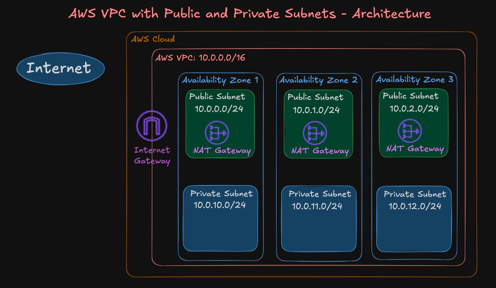
### VPC Traffic flow
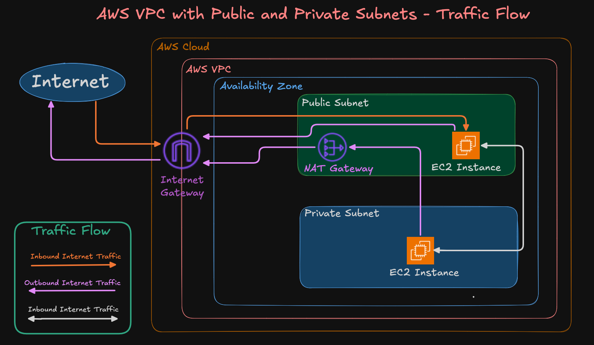
### Public and Private subnet routes
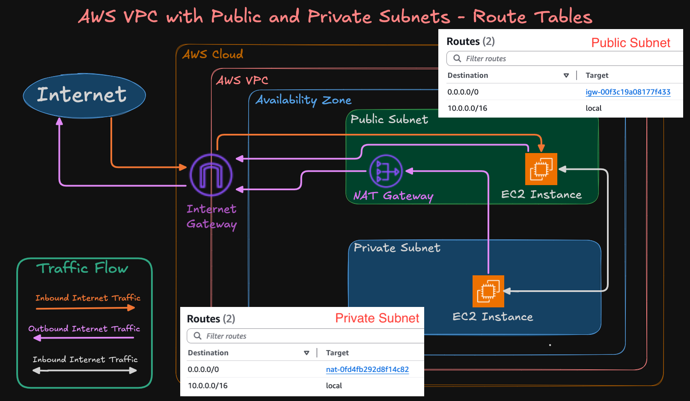

---

## Concepts covered
### Public and Private Subnets
#### Public Subnet
A public subnet is a subnet that has direct internet access through the Internet Gateway.

Resources inside the public subnet:

- Can access the internet
- Can be accessed from the internet (if security groups allow)

Common resources placed in public subnet:

- Bastion Host
- Load Balancer
- NAT Gateway
- Public Web Servers

Public subnet route example:
```text
0.0.0.0/0 → Internet Gateway
```
#### Private Subnet
A private subnet does not have direct internet access through the Internet Gateway.

Resources inside the private subnet:

- Cannot be directly accessed from internet
- Can access internet outbound using NAT Gateway
- Are more secure for internal workloads

Common resources placed in private subnet:

- Application Servers
- Databases
- Internal Services
- Backend APIs

Private subnet route example:
```text
0.0.0.0/0 → NAT Gateway
```

#### Internet Gateway (IGW)
An Internet Gateway is attached to the VPC and enables communication between the VPC and the internet.

The Internet Gateway is mainly used by:
- Public subnets
- Internet-facing resources

Without an Internet Gateway:
- Public subnet resources cannot communicate with the internet.

#### NAT Gateway
A NAT Gateway allows resources in the private subnet to access the internet for outbound communication.

Example:
- Downloading software updates
- Accessing external APIs
- Pulling Docker images

Important:
- Internet cannot directly initiate inbound connections to private subnet resources through NAT Gateway.
- NAT Gateway only allows outbound internet access.

NAT Gateway is usually deployed inside a public subnet.

### Traffic Flow Understanding
#### Public Subnet Traffic Flow
```text
EC2 Instance
     ↓
Route Table
     ↓
Internet Gateway
     ↓
Internet
```
Resources in the public subnet communicate directly with the internet through the Internet Gateway.

#### Private Subnet Traffic Flow
```text
EC2 Instance
     ↓
Route Table
     ↓
NAT Gateway
     ↓
Internet Gateway
     ↓
Internet
```
Resources in the private subnet use the NAT Gateway for outbound internet access.

### Route Tables
Route tables define how traffic moves inside and outside the VPC.

Each subnet must be associated with a route table.

#### Public Route Table
Contains route:
```text
0.0.0.0/0 → Internet Gateway
```
This enables internet access for public subnet resources.

#### Private Route Table
Contains route:
```text
0.0.0.0/0 → NAT Gateway
```
This enables outbound internet access for private subnet resources.

---

## Terraform Concepts Covered
| Concept | Purpose |
|---|---|
| Terraform Block | Defines Terraform version and and provider requirements |
| Provider Block | Connects Terraform to AWS |
| Variables | Makes configuration reusable and dynamic |
| LOcals | Stores reusable local values |
| Data Sources | Fetches existing AWS information |
| Resource Blocks | Creates AWS infrastructure resources |
| Outputs | Displays useful output values |
| Local State | Stores Terraform state locally |

---

## Project Structure
``` text
terraform-manifests/
├── 01-versions.tf
├── 02-variables.tf
├── 03-datasources-and-locals.tf
├── 04-vpc.tf
└── 05-outputs.tf
```

### File Explanation
#### 01-versions.tf
This file contains:
- Terraform version configuration
- Required provider versions
- AWS provider configuration

This ensures the correct Terraform and provider versions are used for the project.

#### 02-variables.tf
This file defines input variables used throughout the project.

Variables help make Terraform configurations reusable and flexible across different environments.

Examples:
- AWS Region
- VPC CIDR
- Subnet CIDRs
- Environment tags

#### 03-datasources-and-locals.tf

This file contains:
- Data Sources
- Local values

#### Data Sources
Used to fetch information from AWS dynamically.

Example:
- Current AWS region
- Availability Zones

#### Locals
Used to define reusable local values and naming conventions.


#### 04-vpc.tf
This is the main infrastructure file.

It provisions:
- VPC
- Subnets
- Internet Gateway
- NAT Gateway
- Route Tables
- Route Table Associations

This file contains the actual AWS infrastructure resource blocks.

#### 05-outputs.tf
This file defines output values displayed after Terraform deployment.

Examples:
- VPC ID
- Subnet IDs
- Route Table IDs

Outputs help retrieve important infrastructure information easily.


## VPC Creation (Terraform Commands used)
```bash
# Change Directory
cd terraform-manifests

# Terraform Initialize
terraform init 

# Terraform Validate
terraform validate

# Terraform Plan
terraform plan

# Terraform Apply
terraform apply -auto-approve
```
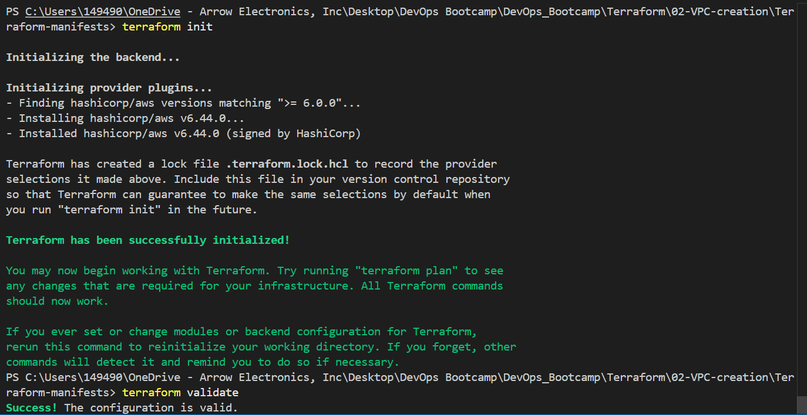
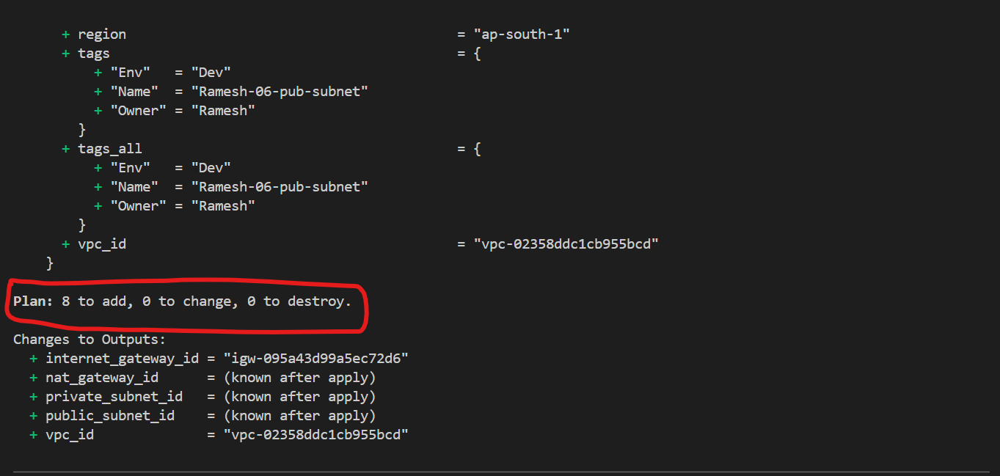
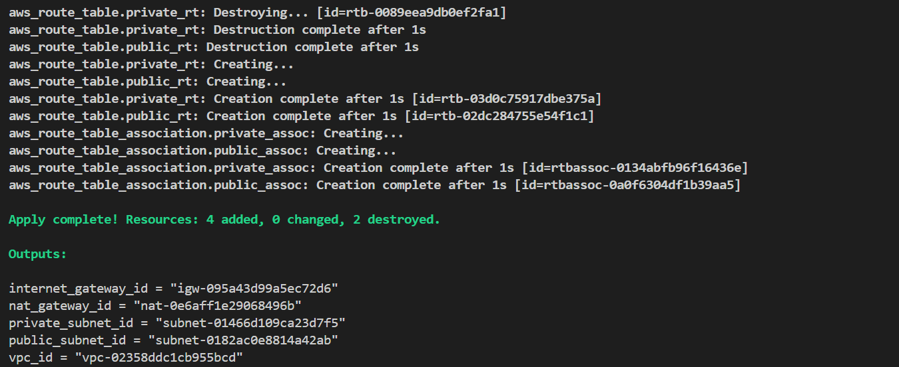
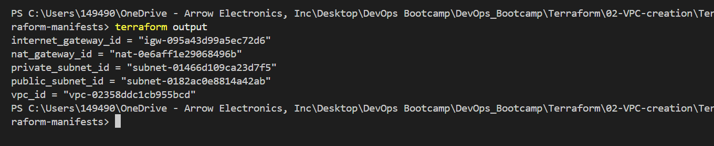

### Validate Resource creation from AWS console
VPC, Subnets, NAT GW and RTs are created
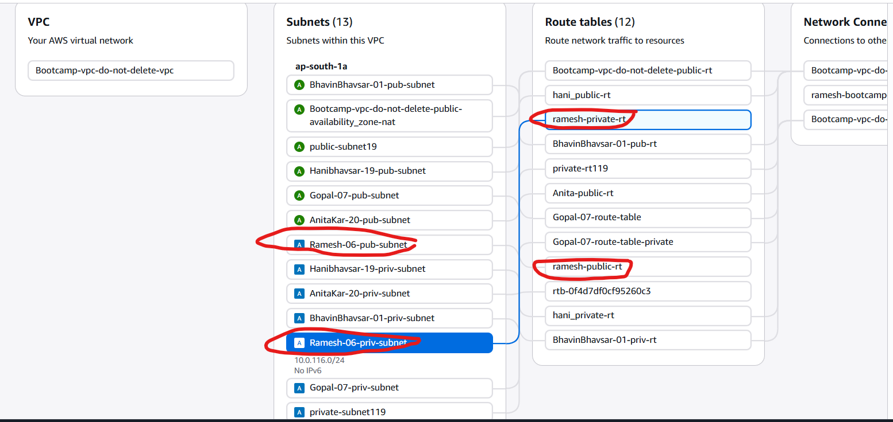

---


## State Management
Terraform stores infrastructure metadata inside the terraform.tfstate file.

The state file helps Terraform:
- Track created resources
- Compare current infrastructure with desired configuration
- Detect infrastructure changes
- Plan future updates

Without the state file, Terraform cannot properly manage infrastructure lifecycle.

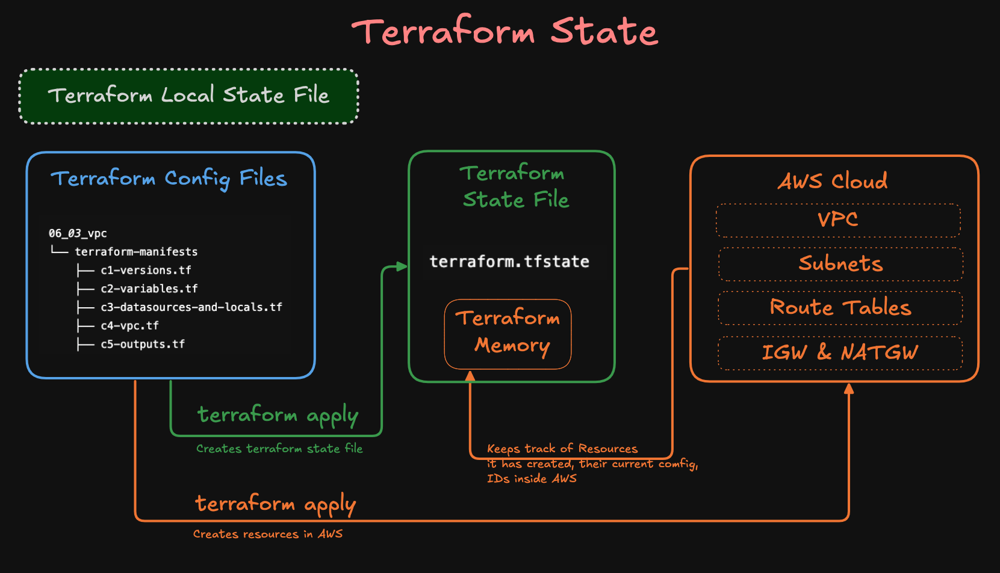

### Terraform State Commands
#### terraform show
Used to inspect Terraform state in a readable format.

This helps in:
- Debugging
- Verifying created resources
- Viewing stored resource attributes

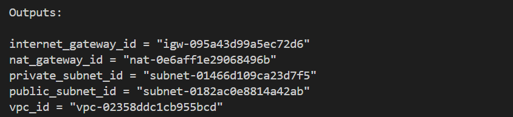
---

### terraform state list
Displays all resources currently tracked by Terraform.

Example output:
```text
aws_vpc.main
aws_subnet.public
aws_subnet.private
aws_internet_gateway.main
```
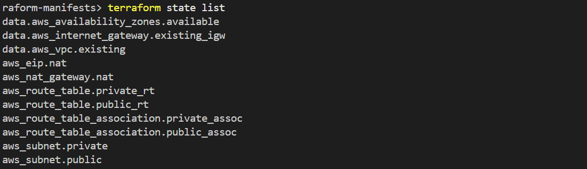
This command is useful for understanding how Terraform internally references resources.

### Verift terraform state created
```bash
# Change Directory
cd terraform-manifests

# List Files
ls -lrt
Observation: You will find the file `terraform.tfstate`

# Review terraform.tfstate
cat terraform.tfstate
```
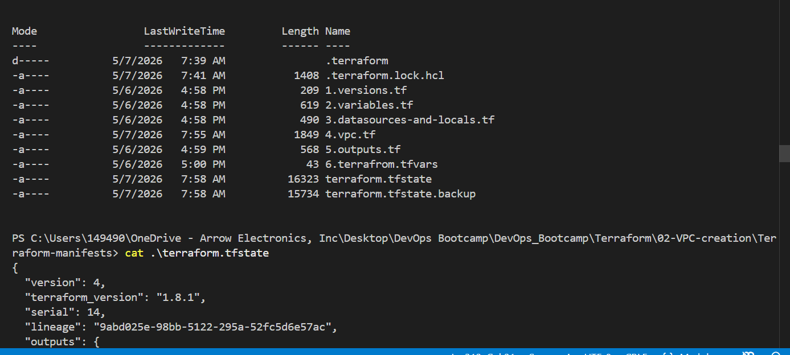

## Resource cleanup
```bash
terraform destroy
```
result
```text
 terraform destroy
var.existing_vpc_id
  Existing shared VPC ID

  Enter a value: vpc-02358ddc1cb955bcd

data.aws_vpc.existing: Reading...
data.aws_availability_zones.available: Reading...
aws_eip.nat: Refreshing state... [id=eipalloc-0b6d364d045efec19]
data.aws_availability_zones.available: Read complete after 0s [id=ap-south-1]
data.aws_vpc.existing: Read complete after 0s [id=vpc-02358ddc1cb955bcd]
data.aws_internet_gateway.existing_igw: Reading...
aws_route_table.public_rt: Refreshing state... [id=rtb-02dc284755e54f1c1]
aws_route_table.private_rt: Refreshing state... [id=rtb-03d0c75917dbe375a]
aws_subnet.private: Refreshing state... [id=subnet-01466d109ca23d7f5]
aws_subnet.public: Refreshing state... [id=subnet-0182ac0e8814a42ab]
data.aws_internet_gateway.existing_igw: Read complete after 1s [id=igw-095a43d99a5ec72d6]
aws_route_table_association.private_assoc: Refreshing state... [id=rtbassoc-0134abfb96f16436e]
aws_route_table_association.public_assoc: Refreshing state... [id=rtbassoc-0a0f6304df1b39aa5]
aws_nat_gateway.nat: Refreshing state... [id=nat-0e6aff1e29068496b]

Terraform used the selected providers to generate the following execution plan. Resource actions are indicated with the
following symbols:
  - destroy

Terraform will perform the following actions:

  # aws_eip.nat will be destroyed
  - resource "aws_eip" "nat" {
      - allocation_id            = "eipalloc-0b6d364d045efec19" -> null
      - arn                      = "arn:aws:ec2:ap-south-1:454143665149:elastic-ip/eipalloc-0b6d364d045efec19" -> null
      - association_id           = "eipassoc-0573205887c26a457" -> null
      - domain                   = "vpc" -> null
      - id                       = "eipalloc-0b6d364d045efec19" -> null
      - network_border_group     = "ap-south-1" -> null
      - network_interface        = "eni-03acc855301de09a0" -> null
      - private_dns              = "ip-10-0-16-229.ap-south-1.compute.internal" -> null
      - private_ip               = "10.0.16.229" -> null
      - public_dns               = "ec2-13-205-60-105.ap-south-1.compute.amazonaws.com" -> null
      - public_ip                = "13.205.60.105" -> null
      - public_ipv4_pool         = "amazon" -> null
      - region                   = "ap-south-1" -> null
      - tags                     = {
          - "Env"   = "Dev"
          - "Name"  = "ramesh-bootcamp-nat-eip"
          - "Owner" = "Ramesh"
        } -> null
      - tags_all                 = {
          - "Env"   = "Dev"
          - "Name"  = "ramesh-bootcamp-nat-eip"
          - "Owner" = "Ramesh"
        } -> null
        # (6 unchanged attributes hidden)
    }

  # aws_nat_gateway.nat will be destroyed
  - resource "aws_nat_gateway" "nat" {
      - allocation_id                      = "eipalloc-0b6d364d045efec19" -> null
      - association_id                     = "eipassoc-0573205887c26a457" -> null
      - availability_mode                  = "zonal" -> null
      - connectivity_type                  = "public" -> null
      - id                                 = "nat-0e6aff1e29068496b" -> null
      - network_interface_id               = "eni-03acc855301de09a0" -> null
      - private_ip                         = "10.0.16.229" -> null
      - public_ip                          = "13.205.60.105" -> null
      - region                             = "ap-south-1" -> null
      - regional_nat_gateway_address       = [] -> null
      - secondary_allocation_ids           = [] -> null
      - secondary_private_ip_address_count = 0 -> null
      - secondary_private_ip_addresses     = [] -> null
      - subnet_id                          = "subnet-0182ac0e8814a42ab" -> null
      - tags                               = {
          - "Env"   = "Dev"
          - "Name"  = "ramesh-bootcamp-nat"
          - "Owner" = "Ramesh"
        } -> null
      - tags_all                           = {
          - "Env"   = "Dev"
          - "Name"  = "ramesh-bootcamp-nat"
          - "Owner" = "Ramesh"
        } -> null
      - vpc_id                             = "vpc-02358ddc1cb955bcd" -> null
    }

  # aws_route_table.private_rt will be destroyed
  - resource "aws_route_table" "private_rt" {
      - arn              = "arn:aws:ec2:ap-south-1:454143665149:route-table/rtb-03d0c75917dbe375a" -> null
      - id               = "rtb-03d0c75917dbe375a" -> null
      - owner_id         = "454143665149" -> null
      - propagating_vgws = [] -> null
      - region           = "ap-south-1" -> null
      - route            = [] -> null
      - tags             = {
          - "Env"   = "Dev"
          - "Name"  = "ramesh-private-rt"
          - "Owner" = "Ramesh"
        } -> null
      - tags_all         = {
          - "Env"   = "Dev"
          - "Name"  = "ramesh-private-rt"
          - "Owner" = "Ramesh"
        } -> null
      - vpc_id           = "vpc-02358ddc1cb955bcd" -> null
    }

  # aws_route_table.public_rt will be destroyed
  - resource "aws_route_table" "public_rt" {
      - arn              = "arn:aws:ec2:ap-south-1:454143665149:route-table/rtb-02dc284755e54f1c1" -> null
      - id               = "rtb-02dc284755e54f1c1" -> null
      - owner_id         = "454143665149" -> null
      - propagating_vgws = [] -> null
      - region           = "ap-south-1" -> null
      - route            = [] -> null
      - tags             = {
          - "Env"   = "Dev"
          - "Name"  = "ramesh-public-rt"
          - "Owner" = "Ramesh"
        } -> null
      - tags_all         = {
          - "Env"   = "Dev"
          - "Name"  = "ramesh-public-rt"
          - "Owner" = "Ramesh"
        } -> null
      - vpc_id           = "vpc-02358ddc1cb955bcd" -> null
    }

  # aws_route_table_association.private_assoc will be destroyed
  - resource "aws_route_table_association" "private_assoc" {
      - id             = "rtbassoc-0134abfb96f16436e" -> null
      - region         = "ap-south-1" -> null
      - route_table_id = "rtb-03d0c75917dbe375a" -> null
      - subnet_id      = "subnet-01466d109ca23d7f5" -> null
        # (1 unchanged attribute hidden)
    }

  # aws_route_table_association.public_assoc will be destroyed
  - resource "aws_route_table_association" "public_assoc" {
      - id             = "rtbassoc-0a0f6304df1b39aa5" -> null
      - region         = "ap-south-1" -> null
      - route_table_id = "rtb-02dc284755e54f1c1" -> null
      - subnet_id      = "subnet-0182ac0e8814a42ab" -> null
        # (1 unchanged attribute hidden)
    }

  # aws_subnet.private will be destroyed
  - resource "aws_subnet" "private" {
      - arn                                            = "arn:aws:ec2:ap-south-1:454143665149:subnet/subnet-01466d109ca23d7f5" -> null
      - assign_ipv6_address_on_creation                = false -> null
      - availability_zone                              = "ap-south-1a" -> null
      - availability_zone_id                           = "aps1-az1" -> null
      - cidr_block                                     = "10.0.116.0/24" -> null
      - enable_dns64                                   = false -> null
      - enable_lni_at_device_index                     = 0 -> null
      - enable_resource_name_dns_a_record_on_launch    = false -> null
      - enable_resource_name_dns_aaaa_record_on_launch = false -> null
      - id                                             = "subnet-01466d109ca23d7f5" -> null
      - ipv6_native                                    = false -> null
      - map_customer_owned_ip_on_launch                = false -> null
      - map_public_ip_on_launch                        = false -> null
      - owner_id                                       = "454143665149" -> null
      - private_dns_hostname_type_on_launch            = "ip-name" -> null
      - region                                         = "ap-south-1" -> null
      - tags                                           = {
          - "Env"   = "Dev"
          - "Name"  = "Ramesh-06-priv-subnet"
          - "Owner" = "Ramesh"
        } -> null
      - tags_all                                       = {
          - "Env"   = "Dev"
          - "Name"  = "Ramesh-06-priv-subnet"
          - "Owner" = "Ramesh"
        } -> null
      - vpc_id                                         = "vpc-02358ddc1cb955bcd" -> null
        # (4 unchanged attributes hidden)
    }

  # aws_subnet.public will be destroyed
  - resource "aws_subnet" "public" {
      - arn                                            = "arn:aws:ec2:ap-south-1:454143665149:subnet/subnet-0182ac0e8814a42ab" -> null
      - assign_ipv6_address_on_creation                = false -> null
      - availability_zone                              = "ap-south-1a" -> null
      - availability_zone_id                           = "aps1-az1" -> null
      - cidr_block                                     = "10.0.16.0/24" -> null
      - enable_dns64                                   = false -> null
      - enable_lni_at_device_index                     = 0 -> null
      - enable_resource_name_dns_a_record_on_launch    = false -> null
      - enable_resource_name_dns_aaaa_record_on_launch = false -> null
      - id                                             = "subnet-0182ac0e8814a42ab" -> null
      - ipv6_native                                    = false -> null
      - map_customer_owned_ip_on_launch                = false -> null
      - map_public_ip_on_launch                        = true -> null
      - owner_id                                       = "454143665149" -> null
      - private_dns_hostname_type_on_launch            = "ip-name" -> null
      - region                                         = "ap-south-1" -> null
      - tags                                           = {
          - "Env"   = "Dev"
          - "Name"  = "Ramesh-06-pub-subnet"
          - "Owner" = "Ramesh"
        } -> null
      - tags_all                                       = {
          - "Env"   = "Dev"
          - "Name"  = "Ramesh-06-pub-subnet"
          - "Owner" = "Ramesh"
        } -> null
      - vpc_id                                         = "vpc-02358ddc1cb955bcd" -> null
        # (4 unchanged attributes hidden)
    }

Plan: 0 to add, 0 to change, 8 to destroy.

Changes to Outputs:
  - internet_gateway_id = "igw-095a43d99a5ec72d6" -> null
  - nat_gateway_id      = "nat-0e6aff1e29068496b" -> null
  - private_subnet_id   = "subnet-01466d109ca23d7f5" -> null
  - public_subnet_id    = "subnet-0182ac0e8814a42ab" -> null
  - vpc_id              = "vpc-02358ddc1cb955bcd" -> null

Do you really want to destroy all resources?
  Terraform will destroy all your managed infrastructure, as shown above.
  There is no undo. Only 'yes' will be accepted to confirm.

  Enter a value: yes

aws_route_table_association.public_assoc: Destroying... [id=rtbassoc-0a0f6304df1b39aa5]
aws_route_table_association.private_assoc: Destroying... [id=rtbassoc-0134abfb96f16436e]
aws_nat_gateway.nat: Destroying... [id=nat-0e6aff1e29068496b]
aws_route_table_association.private_assoc: Destruction complete after 0s
aws_route_table_association.public_assoc: Destruction complete after 0s
aws_route_table.public_rt: Destroying... [id=rtb-02dc284755e54f1c1]
aws_route_table.private_rt: Destroying... [id=rtb-03d0c75917dbe375a]
aws_subnet.private: Destroying... [id=subnet-01466d109ca23d7f5]
aws_subnet.private: Destruction complete after 1s
aws_route_table.private_rt: Destruction complete after 1s
aws_route_table.public_rt: Destruction complete after 1s
aws_nat_gateway.nat: Still destroying... [id=nat-0e6aff1e29068496b, 10s elapsed]
aws_nat_gateway.nat: Still destroying... [id=nat-0e6aff1e29068496b, 20s elapsed]
aws_nat_gateway.nat: Still destroying... [id=nat-0e6aff1e29068496b, 30s elapsed]
aws_nat_gateway.nat: Still destroying... [id=nat-0e6aff1e29068496b, 40s elapsed]
aws_nat_gateway.nat: Still destroying... [id=nat-0e6aff1e29068496b, 50s elapsed]
aws_nat_gateway.nat: Still destroying... [id=nat-0e6aff1e29068496b, 1m0s elapsed]
aws_nat_gateway.nat: Destruction complete after 1m0s
aws_eip.nat: Destroying... [id=eipalloc-0b6d364d045efec19]
aws_subnet.public: Destroying... [id=subnet-0182ac0e8814a42ab]
aws_subnet.public: Destruction complete after 1s
aws_eip.nat: Destruction complete after 1s

Destroy complete! Resources: 8 destroyed.
```

---
## Author
Ramesh Mahipathi