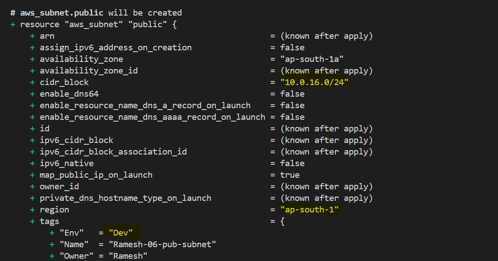
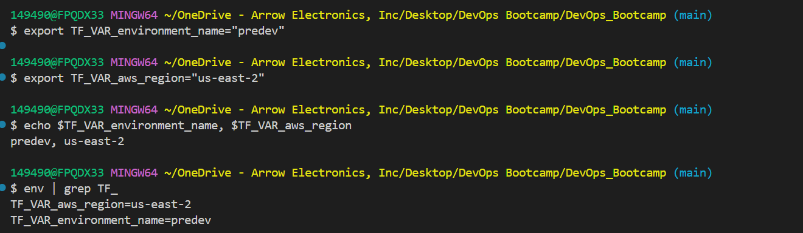
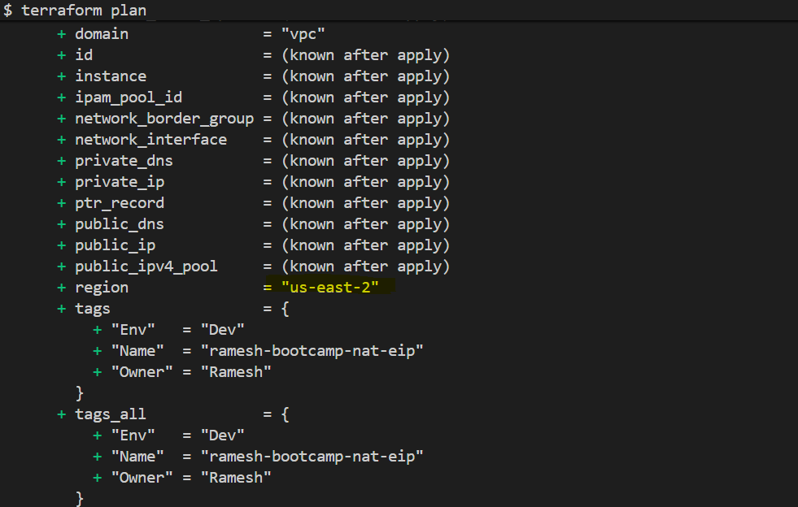

# Terraform Variable Files (`tfvars`)

---

# Step-01: Introduction

Terraform variables help us make the infrastructure code reusable and flexible.

Instead of hardcoding values directly in Terraform files, we can pass values dynamically using:

- variable defaults
- environment variables
- tfvars files
- CLI arguments

This helps us use the same Terraform code for multiple environments like:

- Dev
- Test
- Prod

without changing the actual infrastructure code.

---

# Why Variable Files Are Needed

Without variable files:

- we must edit Terraform code every time,
- code becomes difficult to maintain,
- and environment management becomes messy.

Using variable files helps separate:

- Terraform logic
- and environment-specific values.

---

# Example

Same Terraform code can be used for:

| Environment | Region | Instance Type |
|---|---|---|
| Dev | ap-south-1 | t3.micro |
| Test | us-east-1 | t3.small |
| Prod | eu-west-1 | t3.medium |

Only variable values change.

Terraform code remains same.

---

# Terraform Variable Precedence

If same variable is defined in multiple places, Terraform follows precedence order.


Highest precedence value wins.

| Priority | Variable Source |
|---|---|
| 1 (Highest) | CLI `-var` |
| 2 | CLI `-var-file` |
| 3 | `*.auto.tfvars` |
| 4 | `terraform.tfvars` |
| 5 | Environment Variables (`TF_VAR_*`) |
| 6 (Lowest) | Default values in `variables.tf` |

---

# Step-02: Default Values (`variables.tf`)

```bash
# Terraform Initialize
terraform init

# Terraform Validate
terraform validate

# Terraform Plan
terraform plan
```
### Observation:
- Default values defined in c2-variables.tf are used for any variables that don’t have values from higher-precedence sources.


## Step-03: Environment Variables (TF_VAR_variable_name)
```bash
# Set environment variables (same shell where you will run Terraform)
export TF_VAR_environment_name="predev"
export TF_VAR_aws_region="us-east-2"

# Verify if env variable is set
echo $TF_VAR_environment_name, $TF_VAR_aws_region
env | grep TF_

# Terraform Plan
terraform plan
```



---
## Author
Ramesh Mahipathi