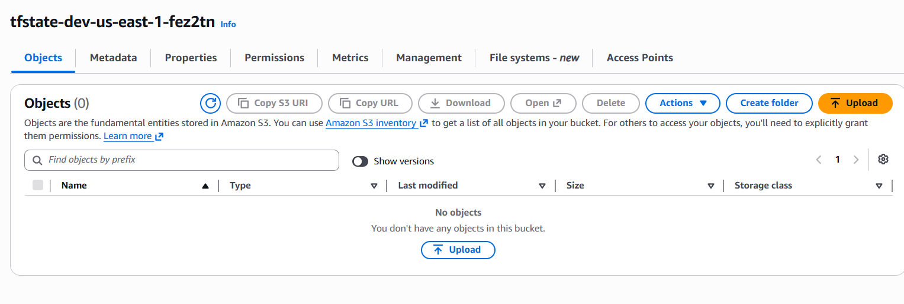
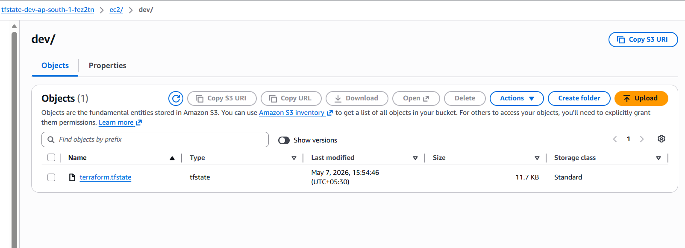

# Terraform Remote Backend using AWS S3
This section demonstrates how to configure a Terraform Remote Backend using AWS S3 for centralized Terraform state management.

Instead of storing the Terraform state file (terraform.tfstate) locally on a laptop, we store it securely in an S3 bucket so that multiple engineers and CI/CD pipelines can safely collaborate on the same infrastructure.

---
# Why Remote Backend is Important
By default, Terraform stores the state file locally:
```text
terraform.tfstate
```
This works fine for learning or small personal projects, but it creates multiple problems in real-world production environments.

## Problems with Local State
- State file exists only on one machine
- Difficult for team collaboration
- No centralized storage
- Risk of accidental deletion
- State corruption issues
- No proper version recovery
- Multiple admins may overwrite each other’s changes
- State file may contain sensitive information

# What Remote Backend Solves
Using a remote backend provides:
| Feature             | Benefit                             |
| ------------------- | ----------------------------------- |
| Centralized Storage | Shared state across teams           |
| Collaboration       | Multiple engineers can work safely  |
| State Locking       | Prevents simultaneous modifications |
| Versioning          | Recover previous state versions     |
| Security            | Encrypts and protects state         |
| Automation Support  | Required for CI/CD pipelines        |

---
# Remote Backend Architecture
Admin-1  ───────────────┐
                        │
                        ▼
                AWS S3 Bucket
             terraform.tfstate
                        ▲
                        │
Admin-2  ───────────────┘

Both admins use the same centralized state file stored in S3.

---
# Terraform Backend Basics
A backend in Terraform defines:

- Where Terraform state is stored
- How Terraform operations are executed

Terraform supports multiple backends:
| Backend | Usage                 |
| ------- | --------------------- |
| local   | Default local storage |
| s3      | AWS remote backend    |
| azurerm | Azure Storage backend |
| gcs     | Google Cloud Storage  |
| remote  | Terraform Cloud       |

In this project, we use:
```hcl
backend "s3"
```
---
# Remote Backend Components
## 1. S3 Bucket
Stores Terraform state file remotely.
```hcl
terraform.tfstate
```

## 2. State Locking
Prevents multiple users from modifying infrastructure simultaneously.

Without locking:
- Two admins may run terraform apply
- State corruption may occur
- Infrastructure drift can happen

## 3. Versioning
S3 bucket versioning helps:

- Recover deleted state
- Rollback corrupted state
- Maintain state history

---
# Project structure
```text
Terraform/
└── 04-Terraform-remote-backend/
    ├── README.md
    └── Terraform-manifests/
        ├── 01-versions.tf
        ├── 02-variables.tf
        ├── 03-s3bucket.tf
        ├── 04-dynamodb.tf
        └── 05-outputs.tf
```
## Step-01: Provider and Terraform Version
file:
```hcl
01-versions.tf
```
Purpose:
- Defines Terraform version
- Defines AWS provider version
- Configures backend block

Example:
```hcl
terraform {
  required_version = ">= 1.0.0"

  required_providers {
    aws = {
      source  = "hashicorp/aws"
      version = ">= 6.0"
    }
  }
}

provider "aws" {
  region = var.aws_region
}
```

## Step-02: Input Variables
file:
```hcl
02-variables.tf
```
Purpose:
- Makes configuration reusable
- Avoids hardcoding values

Example variables:
- AWS region
- Bucket name
- Environment
- Tags

Example:
```hcl
variable "aws_region" {
  default = "ap-south-1"
}
```

## Step-03: Create S3 Bucket for Backend
file:
```hcl
03-s3bucket.tf
```
Purpose:
- Creates remote backend S3 bucket
- Enables versioning
- Enables encryption
- Blocks public access

Example:
```hcl
resource "aws_s3_bucket" "tfstate" {
  bucket = "ramesh-terraform-backend-demo"
}
```
# Best Practices for S3 Backend Bucket
## Enable Versioning:
```hcl
resource "aws_s3_bucket_versioning" "versioning" {
  bucket = aws_s3_bucket.tfstate.id

  versioning_configuration {
    status = "Enabled"
  }
}
```
Why?
- Protects from accidental deletion
- Helps rollback state

## Enable Encryption
```hcl
resource "aws_s3_bucket_server_side_encryption_configuration" "encryption" {
  bucket = aws_s3_bucket.tfstate.id

  rule {
    apply_server_side_encryption_by_default {
      sse_algorithm = "AES256"
    }
  }
}
```
Why?
- Protects sensitive state data

## Block Public Access
```hcl
resource "aws_s3_bucket_public_access_block" "block_public" {
  bucket = aws_s3_bucket.tfstate.id

  block_public_acls   = true
  block_public_policy = true
}
```
Why?
- State files should never be public

# Step-04: Configure State Locking
file:
```hcl
04-dynamodb.tf
```
Purpose:
- Prevent concurrent Terraform operations
Example:
```hcl
resource "aws_dynamodb_table" "terraform_lock" {
  name         = "terraform-state-lock"
  billing_mode = "PAY_PER_REQUEST"
  hash_key     = "LockID"

  attribute {
    name = "LockID"
    type = "S"
  }
}
```

# Why DynamoDB Locking is Important
Without locking:
```hcl
User-1 -> terraform apply
User-2 -> terraform apply
```
Possible issues:
- State corruption
- Partial resource creation
- Infrastructure mismatch

With locking:
- Only one operation allowed at a time

# Step-05: Backend Configuration
Once S3 bucket is created, configure backend:
```hcl
terraform {
  backend "s3" {
    bucket         = "ramesh-terraform-backend-demo"
    key            = "dev/vpc/terraform.tfstate"
    region         = "ap-south-1"
    dynamodb_table = "terraform-state-lock"
    encrypt        = true
  }
}
```
## Backend Configuration Parameters
| Parameter      | Purpose            |
| -------------- | ------------------ |
| bucket         | S3 bucket name     |
| key            | Path of state file |
| region         | AWS region         |
| dynamodb_table | Locking table      |
| encrypt        | Encrypt state file |

## Understanding Backend Key
Example:
```hcl
key = "dev/vpc/terraform.tfstate"
```
This creates:
```text
S3 Bucket
└── dev/
    └── vpc/
        └── terraform.tfstate
```
Useful for:
- Environment separation
- Organizing projects

# Terraform Commands
## Initialize Backend
```hcl
terraform init
```
Purpose:
- Downloads providers
- Initializes backend
- Connects Terraform to S3

## Validate Configuration
```hcl
terraform validate
```
Purpose:
- Checks terraform syntax

## Preview Changes
```hcl
terraform plan
```
Purpose:
- Shows infrastructure changes before apply

## Apply changes
```hcl
terraform apply
```
Purpose:
- Creates or updates infrastructure

## Important Backend Initialization Behavior
When backend is added later:
```hcl
terraform init
```
Terrafrom asks:
```text
Do you want to copy existing state to the new backend?
```
Choose: yes

Terraform migrates:
- Local state → Remote S3 backend

# Verify Remote State
## Method01 - Check S3 Console
Go to
```text
AWS Console → S3 → Bucket
```
Verify:
```text
terraform.tfstate
```
Exists

## Method-02: Terraform State Pull
```hcl
terraform state pull
```
Pulls latest remote state.

### Backend bucket is created


### Remote statefile is created


---
## Author
Ramesh Mahipathi