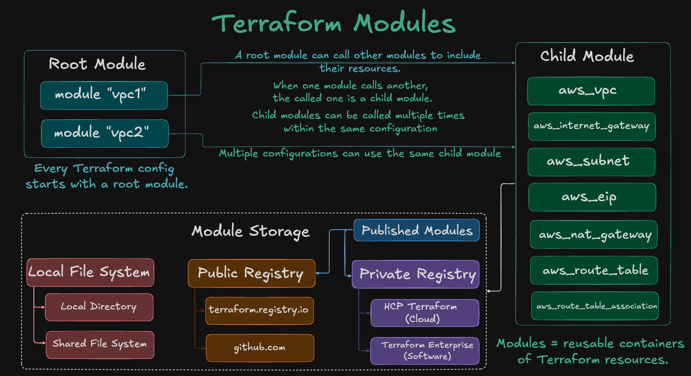
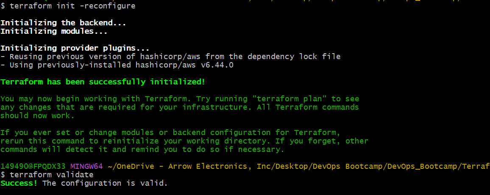
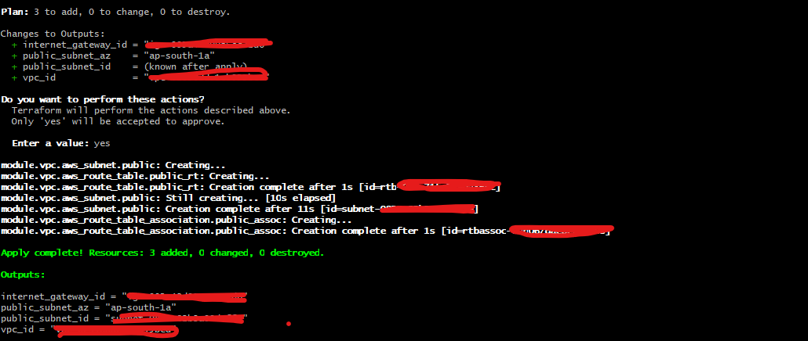
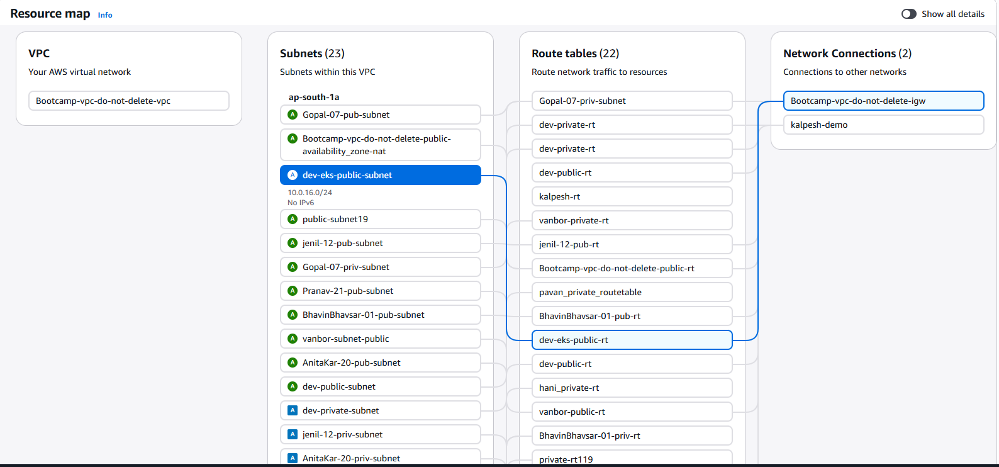

# Terraform Modules
Modules convers Terraform resources to a re-usable Terraform code/modules.

## Overview
This project demonstrates how to convert a normal Terraform VPC configuration into a reusable Terraform module.

Instead of writing the same VPC code multiple times for:
- dev
- test
- prod

we create the VPC logic once inside a module and reuse it across environments.

This approach is widely used in real-time DevOps and Cloud environments to improve:
- reusability,
- maintainability,
- scalability,
- consistency.

## What is a Terraform Module?
A Terraform module is a collection of Terraform resources grouped together for a specific purpose.

Example:
- VPC module
- EC2 module
- EKS module
- Security Group module

A module helps avoid repeating the same infrastructure code again and again.

## Types of Terraform Modules


1. Root Module
The folder where Terraform commands are executed.

Example:
```hcl
terraform init
terraform plan
terraform apply
```

The root module:
- calls child modules,
- passes input variables,
- manages environment-specific values.

2. Child module
Reusable module called from the root module.

Example:
```hcl
module "vpc" {
  source = "./modules/vpc"
}
```
The child module contains actual reusable infrastructure logic.

## Why Use Terraform Modules?
Without modules:
- duplicated code,
- difficult maintenance,
- inconsistent environments,
- large Terraform files.

With modules:
- reusable code,
- cleaner structure,
- easier troubleshooting,
- better scalability.

## Real-Time Example
Instead of creating separate VPC code for:
- dev,
- test,
- prod,

We create
```hcl
modules/vpc
```
and call it multiple times with different values.

# Project Structure
```text
terraform-manifests/
│
├── modules/
│   └── vpc/
│       ├── datasources-and-locals.tf
│       ├── main.tf
│       ├── outputs.tf
│       ├── variables.tf
│       └── README.md
│
├── c1-versions.tf
├── c2-variables.tf
├── c3-vpc.tf
├── c4-outputs.tf
├── terraform.tfvars
└── README.md
```

## Understanding the Structure

### Root Module Files
#### c1-versions.tf

Defines: 
- Terraform version,
- provider version,
- remote backend configuration.

Example responsibilities:
- AWS provider setup,
- S3 backend setup.

#### c2-variables.tf

Contains root-level variables such as:
- environment name,
- region,
- subnet CIDRs,
- tags.

These values are passed into the child module.

#### c3-vpc.tf

Calls the reusable VPC module.

Example:
```hcl
module "vpc" {
  source = "./modules/vpc"
}
```
This file acts as the entry point for module execution.

#### c4-outputs.tf

Displays outputs from the child module.

Example:
- subnet IDs,
- VPC ID,
- route table IDs.

### Child Module Files

#### modules/vpc/main.tf

Contains reusable VPC resources such as:
- subnets,
- route tables,
- NAT Gateway,
- internet gateway.

This is the actual reusable infrastructure logic. 

#### modules/vpc/variables.tf

Defines module input variables.

Example:
- VPC CIDR,
- subnet CIDRs,
- tags.

#### modules/vpc/outputs.tf

Exports values from the module.

Example:

VPC ID,
subnet IDs,
NAT Gateway ID.

#### modules/vpc/datasources-and-locals.tf

Contains:

AWS data sources,
locals,
dynamic calculations.

Example:

availability zones,
subnet calculations,
naming conventions.

## Module Execution Flow

Terraform execution flow:
```text
Root Module
    ↓
Calls Child Module
    ↓
Child Module Creates Resources
    ↓
Outputs Returned to Root Module
```

## Module Reusability

Same module can be reused multiple times.
```hcl
module "dev_vpc" {
  source = "./modules/vpc"
}

module "prod_vpc" {
  source = "./modules/vpc"
}
```
Only input values change.

Infrastructure logic remains same.

## Module Sources

Terraform modules can be stored in:
| Source Type        | Example            |
| ------------------ | ------------------ |
| Local Path         | `./modules/vpc`    |
| GitHub             | Git repositories   |
| Terraform Registry | terraform.io       |
| Private Registry   | Enterprise modules |

## Local Module Example
```hcl
module "vpc" {
  source = "./modules/vpc"
}
```

## GitHub Module example
```hcl
module "vpc" {
  source = "github.com/org/vpc-module"
}
```

## Terraform registry example
```hcl
module "vpc" {
  source = "terraform-aws-modules/vpc/aws"
}
```

## Benefits of Modularization
1. Reusability

- Same module reused across:
- - dev,
- - test,
- - prod.

2. Better Maintenance

- Fixing module updates all environments.

3. Cleaner Code

- Infrastructure becomes organized and readable.

4. Scalability

- Easy to extend with:
- - EC2,
- - ALB,
- - EKS,
- - RDS.

5. Standardization

- Teams follow same infrastructure patterns.

6. Collaboration

- Different teams can work independently using modules.


## Root Module vs Child Module
| Root Module                 | Child Module            |
| --------------------------- | ----------------------- |
| Executes Terraform commands | Contains reusable logic |
| Passes variables            | Creates resources       |
| Environment-specific        | Generic/reusable        |
| Calls modules               | Used by root module     |


## VPC creation
1. Init and Validate


2. Terraform plan
```hcl
$ terraform plan
module.vpc.data.aws_vpc.existing: Reading...
module.vpc.data.aws_availability_zones.available: Reading...
module.vpc.data.aws_availability_zones.available: Read complete after 0s [id=ap-south-1]
module.vpc.data.aws_vpc.existing: Read complete after 1s [id=vpc-02358ddc1cb955bcd]
module.vpc.data.aws_internet_gateway.existing_igw: Reading...
module.vpc.data.aws_internet_gateway.existing_igw: Read complete after 0s [id=igw-095a43d99a5ec72d6]

Terraform used the selected providers to generate the following execution plan. Resource actions are indicated with the following symbols:
  + create

Terraform will perform the following actions:

  # module.vpc.aws_route_table.public_rt will be created
  + resource "aws_route_table" "public_rt" {
      + arn              = (known after apply)
      + id               = (known after apply)
      + owner_id         = (known after apply)
      + propagating_vgws = (known after apply)
      + region           = "ap-south-1"
      + route            = [
          + {
              + cidr_block                 = "0.0.0.0/0"
              + gateway_id                 = "igw-095a43d99a5ec72d6"
                # (11 unchanged attributes hidden)
            },
        ]
      + tags             = {
          + "BU"          = "IA"
          + "DM"          = "Bharath Advani"
          + "EndDate"     = "2026-05-31"
          + "Environment" = "dev"
          + "Name"        = "dev-eks-public-rt"
          + "Owner"       = "Ramesh"
          + "Project"     = "EKS Bootcamp"
          + "Terraform"   = "true"
        }
      + tags_all         = {
          + "BU"          = "IA"
          + "DM"          = "Bharath Advani"
          + "EndDate"     = "2026-05-31"
          + "Environment" = "dev"
          + "Name"        = "dev-eks-public-rt"
          + "Owner"       = "Ramesh"
          + "Project"     = "EKS Bootcamp"
          + "Terraform"   = "true"
        }
      + vpc_id           = "vpc-02358ddc1cb955bcd"
    }

  # module.vpc.aws_route_table_association.public_assoc will be created
  + resource "aws_route_table_association" "public_assoc" {
      + id             = (known after apply)
      + region         = "ap-south-1"
      + route_table_id = (known after apply)
      + subnet_id      = (known after apply)
    }

  # module.vpc.aws_subnet.public will be created
  + resource "aws_subnet" "public" {
      + arn                                            = (known after apply)
      + assign_ipv6_address_on_creation                = false
      + availability_zone                              = "ap-south-1a"
      + availability_zone_id                           = (known after apply)
      + cidr_block                                     = "10.0.16.0/24"
      + enable_dns64                                   = false
      + enable_resource_name_dns_a_record_on_launch    = false
      + enable_resource_name_dns_aaaa_record_on_launch = false
      + id                                             = (known after apply)
      + ipv6_cidr_block                                = (known after apply)
      + ipv6_cidr_block_association_id                 = (known after apply)
      + ipv6_native                                    = false
      + map_public_ip_on_launch                        = true
      + owner_id                                       = (known after apply)
      + private_dns_hostname_type_on_launch            = (known after apply)
      + region                                         = "ap-south-1"
      + tags                                           = {
          + "BU"          = "IA"
          + "DM"          = "Bharath Advani"
          + "EndDate"     = "2026-05-31"
          + "Environment" = "dev"
          + "Name"        = "dev-eks-public-subnet"
          + "Owner"       = "Ramesh"
          + "Project"     = "EKS Bootcamp"
          + "Terraform"   = "true"
        }
      + tags_all                                       = {
          + "BU"          = "IA"
          + "DM"          = "Bharath Advani"
          + "EndDate"     = "2026-05-31"
          + "Environment" = "dev"
          + "Name"        = "dev-eks-public-subnet"
          + "Owner"       = "Ramesh"
          + "Project"     = "EKS Bootcamp"
          + "Terraform"   = "true"
        }
      + vpc_id                                         = "vpc-02358ddc1cb955bcd"
    }

Plan: 3 to add, 0 to change, 0 to destroy.

Changes to Outputs:
  + internet_gateway_id = "igw-095a43d99a5ec72d6"
  + public_subnet_az    = "ap-south-1a"
  + public_subnet_id    = (known after apply)
  + vpc_id              = "vpc-02358ddc1cb955bcd"

```

3. Terraform apply


4. Confirm resource creation from console


---
## Important Real-Time Best Practices
1. Keep Modules Small

One module = one responsibility.

Examples:
- VPC module,
- EC2 module,
- EKS module.

2. Avoid Circular Dependencies

Bad:
```hcl
Module-A → Module-B
Module-B → Module-A
```
Always maintain
```hcl
one-way dependency flow
```

3. Version Modules

Production teams version modules.

Example:
```hcl
source = "git::ssh://repo/vpc-module?ref=v1.0.0"
```

4. Separate State Files

Avoid one huge shared state.

Better:
- network state,
- compute state,
- security state.


---
## Author
Ramesh Mahipathi