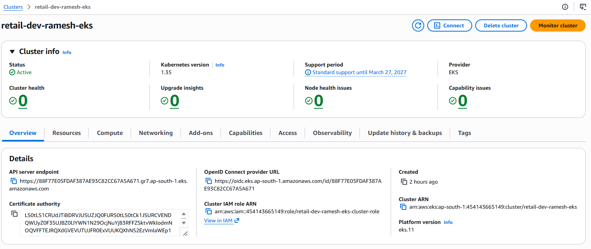
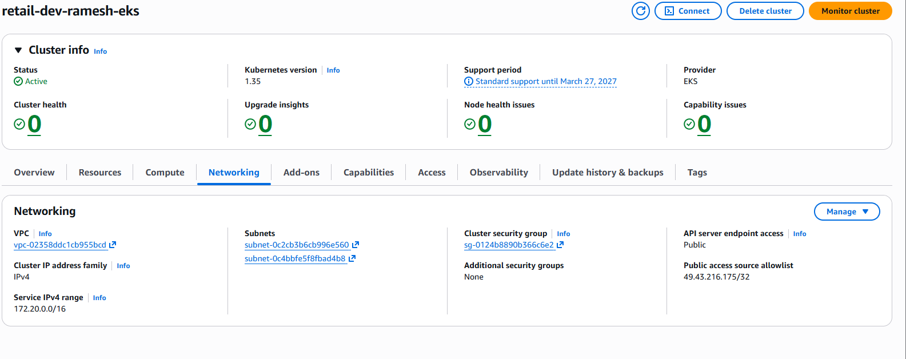
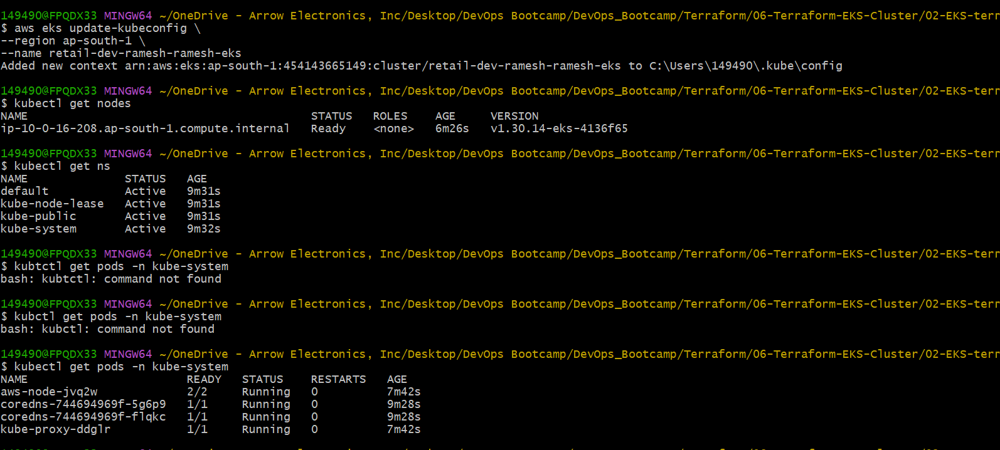
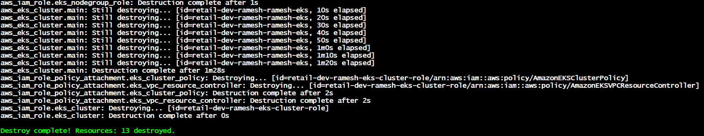
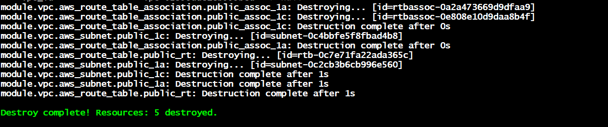

# AWS EKS Cluster Creation using Terraform
## Overview
This project demonstrates how to provision an Amazon EKS (Elastic Kubernetes Service) cluster using Terraform.

The project covers:
- Kubernetes fundamentals
- EKS architecture
- Terraform remote backend integration
- IAM roles
- Node groups
- Networking
- Kubernetes access using kubectl
- Infrastructure automation using Terraform
This is a production-style Terraform implementation of Kubernetes on AWS.

# What is Kubernetes?
Kubernetes (K8s) is a container orchestration platform used to:
- deploy containers,
- manage containers,
- scale applications,
- recover failed containers automatically.
Kubernetes helps run applications reliably across multiple servers.

# Why Kubernetes?
Containers solve packaging problems.

Kubernetes solves container management problems.

Without Kubernetes:
- containers are managed manually,
- scaling is difficult,
- recovery is manual,
- deployments become complex.

Kubernetes automates:
- scaling,
- load balancing,
- healing,
- deployments,
- networking.

# Kubernetes Core Features
| Feature                  | Purpose                                 |
| ------------------------ | --------------------------------------- |
| Auto Scaling             | Automatically increase/decrease pods    |
| Self Healing             | Restarts failed containers              |
| Load Balancing           | Distributes traffic                     |
| Rolling Updates          | Zero downtime deployments               |
| High Availability        | Applications run across multiple nodes  |
| Service Discovery        | Pods communicate easily                 |
| Desired State Management | Maintains expected infrastructure state |


# Why Kubernetes and Not Docker?

Docker and Kubernetes solve different problems.

## Docker
Docker is mainly:
- a container runtime,
- used to build and run containers.

Docker alone works well for:
- local development,
- small applications,
- testing.

But Docker alone has limitations:
- manual scaling,
- no orchestration,
- limited automation,
- weak high availability.

## Kubernetes
Kubernetes is:
a container orchestration platform.

It manages:
- thousands of containers,
- multiple servers,
- production workloads.

Kubernetes provides:
- scaling,
- orchestration,
- recovery,
- intelligent scheduling,
- enterprise-grade deployments.

## Docker Vs Kubernetes
| Docker                     | Kubernetes                    |
| -------------------------- | ----------------------------- |
| Builds and runs containers | Manages containers at scale   |
| Single host focused        | Cluster focused               |
| Limited scaling            | Auto scaling                  |
| Manual recovery            | Self healing                  |
| Basic networking           | Advanced networking           |
| Good for small apps        | Good for enterprise workloads |


## Why Kubernetes and Not Docker Swarm?
Docker Swarm is simpler than Kubernetes, but Kubernetes is more powerful.

### Docker Swarm Advantages
- Simple setup
- Easy learning curve
- Good for small environments

### Docker Swarm Limitations
- Limited ecosystem
- Limited scalability
- Basic networking
- Less enterprise adoption
- Fewer advanced features

### Why Kubernetes is Preferred
Kubernetes provides:
- massive scalability,
- advanced networking,
- self healing,
- intelligent scheduling,
- huge ecosystem,
- cloud-native integrations.
Kubernetes became the industry standard for container orchestration.

---
# Kubernetes Architecture

Kubernetes consists of:
- Control Plane (Master Nodes)
- Worker Nodes

## Kubernetes Control Plane Components

### kube-apiserver
Main entry point for Kubernetes.

Handles:
- kubectl requests,
- API communication,
- authentication.

### etcd
Key-value database storing cluster state.

Stores:
- pods,
- services,
- secrets,
- cluster configuration.

### kube-scheduler
Decides:
- which node should run a pod.

### kube-controller-manager
Runs controllers responsible for:
- replication,
- node health,
- desired state management.

### cloud-controller-manager
Integrates Kubernetes with cloud providers like:
- AWS,
- Azure,
- GCP.

## Worker Node Components

### kubelet
Agent running on each worker node.

Responsible for:
- communicating with control plane,
- managing pods.

### kube-proxy
Handles:
- networking,
- service communication,
- traffic forwarding.

### Container Runtime
Responsible for running containers.

Examples:
- containerd,
- Docker,
- CRI-O.

---
## What is Amazon EKS?
Amazon EKS is AWS managed Kubernetes service.

AWS manages:
- Kubernetes control plane,
- availability,
- scaling,
- upgrades.

Users manage:
- worker nodes,
- applications,
- Kubernetes resources.

### Benefits of EKS
- Fully managed Kubernetes
- High availability
- AWS integration
- Auto scaling
- Secure IAM integration
- Production-ready architecture

## AWS EKS Architecture

## Main Components

### VPC
EKS runs inside a custom AWS VPC.

The VPC contains:
- public subnets,
- private subnets,
- NAT gateways,
- route tables.

### Public Subnets
Used for:
- load balancers,
- NAT gateways,
- external communication.

### Private Subnets
Used for:
- worker nodes,
- application workloads.

Best practice:
- keep worker nodes private.

### EKS Control Plane
Managed entirely by AWS.

Runs:
- Kubernetes API server,
- scheduler,
- etcd,
- controllers.

### Worker Nodes
EC2 instances where:
- pods run,
- applications are deployed.

### kubectl
- CLI tool used to interact with Kubernetes cluster.

---
## Terraform Remote State Datasource
This project uses Terraform remote state datasource.

Purpose:
share outputs between Terraform projects.

Example:
- VPC project exports subnet IDs,
- EKS project reads them remotely.

### Why Remote State Datasource?
Without remote state:
- duplicate configuration,
- manual copying,
- inconsistent infrastructure.

With remote state:
- projects remain independent,
- infrastructure can still share outputs safely.

---
# Step-01 Project Structure
```text
terraform-manifests/
│
├── c1_versions.tf
├── c2_variables.tf
├── c3_remote-state.tf
├── c4_datasources_and_locals.tf
├── c5_eks_tags.tf
├── c6_eks_cluster_iamrole.tf
├── c7_eks_cluster.tf
├── c8_eks_nodegroup_iamrole.tf
├── c9_eks_nodegroup_private.tf
├── c10_eks_outputs.tf
└── terraform.tfvars
```

## File Explanation
1. c1_versions.tf
Defines:
- Terraform version,
- AWS provider version,
- backend configuration.

2. c2_variables.tf
Contains:
- cluster name,
- region,
- node group settings,
- tags.

3. c3_remote-state.tf
Reads outputs from remote Terraform state.

Example:
- subnet IDs,
- VPC ID.

4. c4_datasources_and_locals.tf
Contains:
- AWS data sources,
- local variables,
- reusable values.

5. c5_eks_tags.tf
Defines common tags for all AWS resources.

6. c6_eks_cluster_iamrole.tf
Creates IAM role for EKS control plane.

Required permissions:
- cluster management,
- AWS integrations.

7. c7_eks_cluster.tf
Creates:
- EKS cluster,
- networking integration,
- Kubernetes control plane.

8. c8_eks_nodegroup_iamrole.tf
Creates IAM role for worker nodes.

Allows nodes to:
- join cluster,
- pull container images,
- communicate with AWS services.

9. c9_eks_nodegroup_private.tf
Creates private worker node groups.

Best practice:
- worker nodes in private subnets.

10. c10_eks_outputs.tf
Displays outputs such as:
- cluster name,
- endpoint,
- kubeconfig details.

## Step-02 Terraform Workflow
```hcl
# Terraform Initialize
terraform init

# Terraform Validate
terraform validate

# Terraform Plan
terraform plan

# Terraform Apply
terraform apply -auto-approve
```

## Step-03 Configure kubectl cli to access EKS cluster
```hcl
# EKS kubeconfig
aws eks update-kubeconfig --name <cluster_name> --region <aws_region>

# List Kubernetes Nodes
kubectl get nodes

# List Kubernetes Pods 
kubectl get pods -n kube-system
```

## Step-04 Browse EKS Cluster features on AWS Console
1. Go to AWS Console -> EKS
2. Review Tabs
- Overview
- Resources
- Compute
- Networking
- Add-ons
- Access
- Observability
- Update history
- Tags

## Validation
1. [subnets-creation](screenshots/11-subnets-creation.png)
2. [eks-init-and-validate](screenshots/eks-tf-init-validate.png)
3. [eks-plan](screenshots/03-eks-tf-plan.png)
4. [eks-outputs](screenshots/05-eks-tf-output.png)

## EKS validation
1. Console validation

2. EKS networking

3. Kubectl comands


## Resource clean-up
1. EKS cluster destroy

2. VPC (subnets) destroy


---
## Author
Ramesh Mahipathi